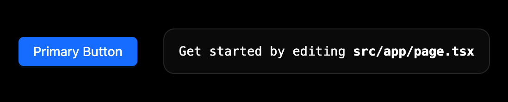
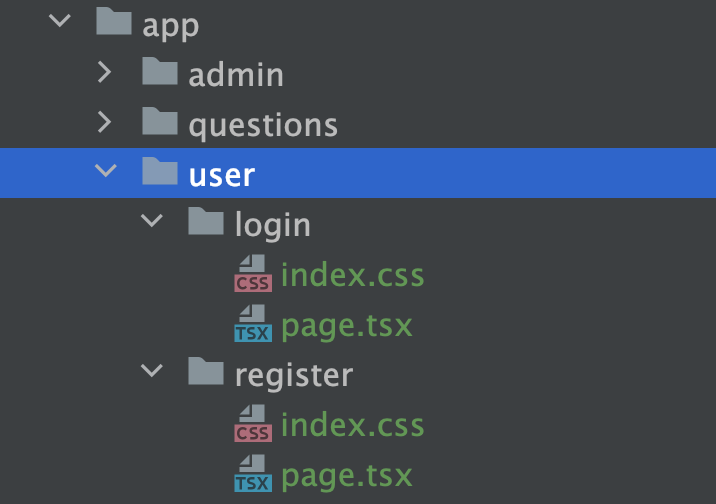
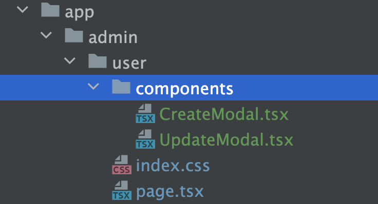
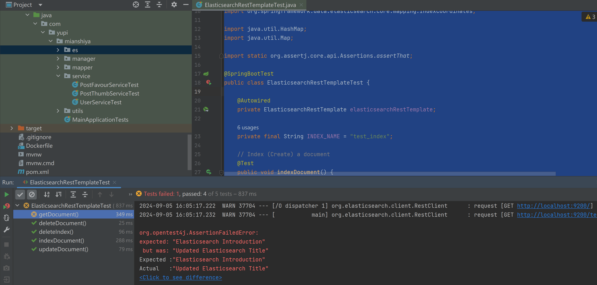

# 1 - 项目总览

## 一、项目介绍

面试鸭是一款基于 Next.js + Spring Boot + Redis + MySQL + Elasticsearch 的 **面试刷题平台**，运用 Druid + HotKey + Sa-Token + Sentinel 提高了系统的性能和安全性。

成品项目参考：[https://mianshiya.com](https://mianshiya.com/)


管理员可以创建题库、题目和题解；用户可以注册登录、分词检索题目、在线刷题并查看刷题记录日历图。

此外，系统使用数据库连接池、热 Key 探测、缓存、高级数据结构等来提升性能。通过流量控制、熔断、动态 IP 黑白名单过滤、同端登录冲突检测、分级反爬虫策略来提升系统和内容的安全性。从 0 到 1 的真实企业级项目设计开发，绝对让你收获满满！1792126029868675074_0.7193462892981979

### 项目三大阶段

为了帮大家循序渐进地学习，鱼皮将项目设计为三个阶段，可以根据自己的时间和水平按需学习。

1）第一阶段，开发基础的刷题平台，带大家熟悉项目开发流程，实战 Next.js 服务端渲染 + Spring Boot 应用的快速开发。1792126029868675074_0.34252407337973034

2）第二阶段，对项目功能进行扩展，精选 4 个真实业务场景，实战企业主流后端技术如 Redis 缓存和高级数据结构、Elasticsearch 搜索引擎、Druid 连接池、并发编程、热 key 探测的应用。

3）第三阶段，对项目安全性进行优化，比如基于 Sentinel 进行网站流量控制和熔断、基于 Nacos 实现动态的 IP 黑白名单、基于 Sa-Token 实现同端登录冲突检测、基于 Redis 实现分级反爬虫策略等。最终将项目上线并保证可用性。

## 二、项目优势

### 项目收获

本项目是线上刷题网站[《面试鸭》](https://mianshiya.com/)的教学版本，业务真实典型，基于主流的前端 Next.js 服务端渲染和后端经典技术栈实现。区别于增删改查的 “烂大街” 项目，本项目中鱼皮会带你实战大量新技术和企业级场景、掌握系统设计和优化方案，给你的简历大幅增加竞争力。

鱼皮给大家讲的都是 **通用的项目开发方法和架构设计套路**，从这个项目中你可以学到：

- 如何拆解复杂业务，从 0 开始设计实现系统？
- 如何快速构建 Next.js 服务端渲染网站和后端项目？
- 如何结合 Redis + Caffeine + Hotkey 构建高性能实时缓存？
- 如何利用 Elasticsearch 实现灵活高效的内容搜索？
- 如何巧用 Redisson 高级数据结构，实现高性能的接口？
- 如何实现流量控制和动态 IP 黑白名单，增强网站安全性？
- 如何实现登录冲突检测和分级反爬虫策略，保护网站内容？
- 如何快速上线项目并增强可用性？

此外，还能学会很多作图、思考问题、对比方案的方法，提升排查问题、自主解决 Bug 的能力。

## 三、核心业务流程

如下图：


## 四、项目功能梳理

### 基础功能

- 用户模块
- - 用户注册
  - 用户登录（账号密码）
  - 【管理员】管理用户 - 增删改查
- 题库模块
- - 查看题库列表
  - 查看题库详情（展示题库下的题目）
  - 【管理员】管理题库 - 增删改查
- 题目模块
- - 题目搜索
  - 查看题目详情（进入刷题页面）
  - 【管理员】管理题目 - 增删改查（比如按照题库查询题目、修改题目所属题库等）

### 高级功能

- 题目批量管理
- - 【管理员】批量向题库添加题目
  - 【管理员】批量从题库移除题目
  - 【管理员】批量删除题目
- 分词题目搜索
- 用户刷题记录日历图
- 自动缓存热门题目
- 网站流量控制和熔断
- 动态 IP 黑白名单过滤
- 同端登录冲突检测
- 分级题目反爬虫策略

## 五、技术选型

### 前端

- React 18 框架
- ⭐️ Next.js 服务端渲染
- ⭐️ Redux 状态管理
- Ant Design 组件库
- 富文本编辑器组件
- ⭐️ 前端工程化：ESLint + Prettier + TypeScript
- ⭐️ OpenAPI 前端代码生成

### 后端

- Java Spring Boot 框架 + Maven 多模块构建
- MySQL 数据库 + MyBatis-Plus 框架 + MyBatis X
- Redis 分布式缓存 + Caffeine 本地缓存
- Redission 分布式锁 + BitMap + BloomFilter
- ⭐️ Elasticsearch 搜索引擎
- ⭐️ Druid 数据库连接池 + 并发编程
- ⭐️ Sa-Token 权限控制
- ⭐️ HotKey 热点探测
- ⭐️ Sentinel 流量控制
- ⭐️ Nacos 配置中心
- ⭐️ 多角度项目优化：性能、安全性、可用性

## 六、架构设计


## 环境准备

后端 JDK 版本需要使用 8、11 或 17，**不能超过 17！**

推荐使用 11 版本，因为 Caffeine 缓存要求使用 11 版本。

前端 Node.js 版本 >= 18.18。

## 新建代码仓库

搭建仓库，点 star 的都是精神股东

代码仓库：https://github.com/liyupi/mianshiya-next

## 教程计划

### 第一阶段 - 基础功能

第 1 期：项目介绍。包括介绍项目背景、项目优势、核心业务流程、项目功能、技术选型、架构设计、教程计划等。1792126029868675074_0.5940351310062546

第 2 期：平台后端开发

- 需求分析
- 库表设计
- 后端项目初始化（万用模板讲解）后端基础功能开发（增删改查）
- 后端核心业务流程开发

第 3 期：平台前端模板开发

- 需求分析
- Web 前端技术选型（服务端渲染讲解）
- 前端项目初始化（Next.js 前端万用模板开发）
- 前端基础页面开发
- - 用户模块
  - 管理页面

第 4 期：平台前端核心开发

- 核心页面开发
- - 主页
  - 题库列表页
  - 题库详情页
  - 题目详情页
  - 题目搜索页
- 前后端联调，跑通核心业务流程

### 第二阶段 - 功能扩展

第 5 期：面向用户的扩展功能

- 用户刷题记录日历：需求分析 + 方案设计 + 前后端开发 + 性能优化
- 分词题目搜索：需求分析 + 方案设计 + 前后端开发

第 6 期：面向管理的扩展功能

- 题目批量管理：需求分析 + 方案设计 + 前后端开发 + 性能优化
- 自动缓存热门题目：需求分析 + 方案设计 + 前后端开发

### 第三阶段 - 优化上线

第 7 期：流量安全性优化

- 网站流量控制和熔断
- 动态 IP 黑白名单过滤

第 8 期：内容安全性优化

- 同端登录冲突检测
- 分级题目反爬虫策略

第 9 期：部署上线

- 前后端部署
- 可用性优化


# 2 - 后端开发

[程序员鱼皮](https://www.code-nav.cn/user/1601072287388278786)

2024-08-25 13:04

阅读 4.6k

## 本节重点

开发面试刷题平台后端，包括：

- 需求分析
- 库表设计
- 后端项目初始化（万用模板讲解）
- 后端基础功能开发（增删改查）
- 后端核心业务流程开发

## 一、需求分析

目标是明确要做的需求，并且给需求设置优先级，从而明确开发计划。

### 项目功能梳理

#### 基础功能

- 用户模块
- - 用户注册
  - 用户登录（账号密码）
  - 【管理员】管理用户 - 增删改查
- 题库模块
- - 查看题库列表
  - 查看题库详情（展示题库下的题目）
  - 【管理员】管理题库 - 增删改查
- 题目模块
- - 题目搜索
  - 查看题目详情（进入刷题页面）
  - 【管理员】管理题目 - 增删改查（比如按照题库查询题目、修改题目所属题库等）

#### 高级功能

- 题目批量管理
- - 【管理员】批量向题库添加题目
  - 【管理员】批量从题库移除题目
  - 【管理员】批量删除题目
- 分词题目搜索
- 用户刷题记录日历图
- 自动缓存热门题目
- 网站流量控制和熔断
- 动态 IP 黑白名单过滤
- 同端登录冲突检测
- 分级题目反爬虫策略

### 核心业务流程

如下图：


### 需求优先级

根据核心业务业务流程，明确需求开发的优先级。

- P0 为核心，非做不可
- P1 为重点功能，最好做
- P2 为实用功能，有空就做
- P3 可做可不做，时间充裕再做

排好优先级的需求列表如下，其实用表格的形式整理更好：

#### 基础功能（均为 P0）

- 用户模块
- - 用户注册
  - 用户登录（账号密码）
  - 【管理员】管理用户 - 增删改查
- 题库模块
- - 查看题库列表
  - 查看题库详情（展示题库下的题目）
  - 【管理员】管理题库 - 增删改查
- 题目模块
- - 题目搜索
  - 查看题目详情（进入刷题页面）
  - 【管理员】管理题目 - 增删改查（比如按照题库查询题目、修改题目所属题库等）

#### 高级功能（均为 P1 ~ P2）

- 题目批量管理 P1
- - 【管理员】批量向题库添加题目
  - 【管理员】批量从题库移除题目
  - 【管理员】批量删除题目
- 分词题目搜索 P1
- 用户刷题记录日历图 P1
- 自动缓存热门题目 P2
- 网站流量控制和熔断 P2
- 动态 IP 黑白名单过滤 P2
- 同端登录冲突检测 P2
- 分级题目反爬虫策略 P2

排好优先级后，后端和前端同学就可以根据优先级去设计接口和页面了。

企业中一般使用专业的系统或者表格来管理需求。下图仅为示例，使用腾讯文档的智能表实现：


## 二、库表设计

对应需求分析中的功能梳理的模块，有 4 张核心表。

库名：mianshiya

数据库初始化文件：见下方

每个表鱼皮都给出了基础版和可扩展字段，便于大家学习。

### 1、用户表

#### 核心设计

用户表的核心是用户登录凭证（账号密码）和个人信息，SQL 如下：

```sql
-- 用户表
create table if not exists user
(
    id           bigint auto_increment comment 'id' primary key,
    userAccount  varchar(256)                           not null comment '账号',
    userPassword varchar(512)                           not null comment '密码',
    unionId      varchar(256)                           null comment '微信开放平台id',
    mpOpenId     varchar(256)                           null comment '公众号openId',
    userName     varchar(256)                           null comment '用户昵称',
    userAvatar   varchar(1024)                          null comment '用户头像',
    userProfile  varchar(512)                           null comment '用户简介',
    userRole     varchar(256) default 'user'            not null comment '用户角色：user/admin/ban',
    editTime     datetime     default CURRENT_TIMESTAMP not null comment '编辑时间',
    createTime   datetime     default CURRENT_TIMESTAMP not null comment '创建时间',
    updateTime   datetime     default CURRENT_TIMESTAMP not null on update CURRENT_TIMESTAMP comment '更新时间',
    isDelete     tinyint      default 0                 not null comment '是否删除',
    index idx_unionId (unionId)
) comment '用户' collate = utf8mb4_unicode_ci;
```

其中，unionId、mpOpenId 是为了实现公众号登录的，也可以省略。每个微信用户在同一家公司（主体）的 unionId 是唯一的，在同一个公众号的 mpOpenId 是唯一的。

editTime 和 updateTime 的区别是：editTime 表示用户编辑个人信息的时间（需要业务代码来更新），而 updateTime 表示这条用户记录任何字段发生修改的时间（由数据库自动更新）。

#### 扩展设计

1）如果要实现会员功能，可以对表进行如下扩展：

1. 给 userRole 字段新增枚举值 `vip`，表示会员用户，可根据该值判断用户权限
2. 新增会员过期时间字段，可用于记录会员有效期
3. 新增会员兑换码字段，可用于记录会员的开通方式
4. 新增会员编号字段，可便于定位用户并提供额外服务，并增加会员归属感

对应的 SQL 如下：

```sql
vipExpireTime datetime     null comment '会员过期时间',
vipCode       varchar(128) null comment '会员兑换码',
vipNumber     bigint       null comment '会员编号'
```

2）如果要实现用户邀请功能，可以对表进行如下扩展：

1. 新增 shareCode 分享码字段，用于记录每个用户的唯一邀请标识，可拼接到邀请网址后面，比如 https://mianshiya.com/?shareCode=xxx
2. 新增 inviteUser 字段，用于记录该用户被哪个用户邀请了，可通过这个字段查询某用户邀请的用户列表。

对应的 SQL 如下：

```sql
shareCode     varchar(20)  DEFAULT NULL COMMENT '分享码',
inviteUser    bigint       DEFAULT NULL COMMENT '邀请用户 id'
```

### 2、题库表

#### 核心设计

题库表的核心是题库信息（标题、描述、图片），SQL 如下：

```sql
-- 题库表
create table if not exists question_bank
(
    id          bigint auto_increment comment 'id' primary key,
    title       varchar(256)                       null comment '标题',
    description text                               null comment '描述',
    picture     varchar(2048)                      null comment '图片',
    userId      bigint                             not null comment '创建用户 id',
    editTime    datetime default CURRENT_TIMESTAMP not null comment '编辑时间',
    createTime  datetime default CURRENT_TIMESTAMP not null comment '创建时间',
    updateTime  datetime default CURRENT_TIMESTAMP not null on update CURRENT_TIMESTAMP comment '更新时间',
    isDelete    tinyint  default 0                 not null comment '是否删除',
    index idx_title (title)
) comment '题库' collate = utf8mb4_unicode_ci;
```

其中，picture 存储的是图片的 url 地址，而不是完整图片文件。通过 userId 和用户表关联，在本项目中只有管理员才能创建题库。

由于用户很可能按照标题搜索题库，所以给 title 字段增加索引。

#### 扩展设计

1）如果要实现题库审核功能，可以对表进行如下扩展：

1. 新增审核状态字段，用枚举值表示待审核、通过和拒绝
2. 新增审核信息字段，用于记录未过审的原因等
3. 新增审核人 id 字段，便于审计操作。比如出现了违规内容过审的情况，可以追责到审核人。
4. 新增审核时间字段，也是便于审计。

对应的 SQL 如下：

```sql
reviewStatus  int      default 0  not null comment '状态：0-待审核, 1-通过, 2-拒绝',
reviewMessage varchar(512)        null comment '审核信息',
reviewerId    bigint              null comment '审核人 id',
reviewTime    datetime            null comment '审核时间'
```

2）如果要实现题库排序功能，可以新增整型的优先级字段，并且根据该字段排序。

该字段还可以用于快速实现题库精选和置顶功能，比如优先级 = 1000 的题库表示精选，优先级 = 10000 的题库表示置顶。

对应的 SQL 如下：

```sql
priority  int  default 0  not null comment '优先级'
```

3）如果要实现题库浏览功能，可以新增题库浏览数字段，每次进入题目详情页时该字段的值 +1，还可以根据该字段对题库进行排序。

对应的 SQL 如下：

```sql
viewNum  int  default 0  not null comment '浏览量'
```

如果要实现用户浏览数（同一个用户浏览数最多 +1），还需要额外的题库浏览记录表。

### 3、题目表

题目表的核心是题目信息（标题、详细内容、标签），SQL 如下：

```sql
-- 题目表
create table if not exists question
(
    id         bigint auto_increment comment 'id' primary key,
    title      varchar(256)                       null comment '标题',
    content    text                               null comment '内容',
    tags       varchar(1024)                      null comment '标签列表（json 数组）',
    answer     text                               null comment '推荐答案',
    userId     bigint                             not null comment '创建用户 id',
    editTime   datetime default CURRENT_TIMESTAMP not null comment '编辑时间',
    createTime datetime default CURRENT_TIMESTAMP not null comment '创建时间',
    updateTime datetime default CURRENT_TIMESTAMP not null on update CURRENT_TIMESTAMP comment '更新时间',
    isDelete   tinyint  default 0                 not null comment '是否删除',
    index idx_title (title),
    index idx_userId (userId)
) comment '题目' collate = utf8mb4_unicode_ci;
```

几个重点：

1. 题目标题 title 和题目创建人 userId 是常用的题目搜索条件，所以添加索引提升查询性能。
2. 题目可能有多个标签，为了简化设计，没有采用关联表，而是以 JSON 数组字符串的方式存储，比如 `["Java", "Python"]`。
3. 题目内容（详情）和题目答案可能很长，所以使用 text 类型。

#### 扩展设计

题目表有很多可以扩展的方法，下面举一些例子。

1）如果要实现题目审核功能，可以参考上述题库审核功能，新增 4 个字段即可：

```sql
reviewStatus  int      default 0  not null comment '状态：0-待审核, 1-通过, 2-拒绝',
reviewMessage varchar(512)        null comment '审核信息',
reviewerId    bigint              null comment '审核人 id',
reviewTime    datetime            null comment '审核时间'
```

2）可能有很多评价题目的指标，比如浏览数、点赞数、收藏数，参考字段如下：

```sql
viewNum       int      default 0    not null comment '浏览量',
thumbNum      int      default 0    not null comment '点赞数',
favourNum     int      default 0    not null comment '收藏数'
```

3）如果要实现题目排序、精选和置顶功能，可以参考上述题库表的设计，新增整型的优先级字段，并且根据该字段排序。对应的 SQL 如下：

```sql
priority  int  default 0  not null comment '优先级'
```

4）如果题目是从其他网站或途径获取到的，担心有版权风险，可以增加题目来源字段。最简单的实现方式就是直接存来源名称：

```sql
source   varchar(512)  null comment '题目来源'
```

5）如果想设置部分题目仅会员可见，可以给题目表加上一个 “是否仅会员可见” 的字段，本质上是个布尔类型，用 1 表示仅会员可见。参考 SQL 如下：

```sql
needVip  tinyint  default 0  not null comment '仅会员可见（1 表示仅会员可见）'
```

### 4、题库题目关系表

#### 核心设计

由于一个题库可以有多个题目，一个题目可以属于多个题库，所以需要关联表来实现。

实现基础功能的 SQL 如下：

```sql
-- 题库题目表（硬删除）
create table if not exists question_bank_question
(
    id             bigint auto_increment comment 'id' primary key,
    questionBankId bigint                             not null comment '题库 id',
    questionId     bigint                             not null comment '题目 id',
    userId         bigint                             not null comment '创建用户 id',
    createTime     datetime default CURRENT_TIMESTAMP not null comment '创建时间',
    updateTime     datetime default CURRENT_TIMESTAMP not null on update CURRENT_TIMESTAMP comment '更新时间',
    UNIQUE (questionBankId, questionId)
) comment '题库题目' collate = utf8mb4_unicode_ci;
```

几个重点：

1. 上述代码中的 userId 表示添加题目到题库的用户 id，仅管理员可操作
2. 由于关联表中的数据记录并没有那么重要（一般由管理员维护），所以直接采用硬删除的方式，如果将题目移出题库，直接删掉对应的数据即可。按照这种设计，createTime 就是题目加入到题库的时间。
3. 通过给题库 id 和题目 id 添加 **联合唯一索引** ，防止题目被重复添加到同一个题库中。而且要注意，将 questionBankId 放到前面，因为数据库中的查询大多是基于 `questionBankId` 进行的，比如查找某个题库中的所有问题，或者在一个题库中查找特定问题，将 `questionBankId` 放在前面符合查询模式，会使得这些查询更加高效（索引的最左前缀原则）。

#### 扩展设计

1）如果要对题库内的题目进行排序，可以增加题目顺序字段（整型）。对应的 SQL 如下：

```sql
questionOrder  int  default 0  not null comment '题目顺序（题号）'
```

需要注意，如果要实现任意移动题目顺序的功能，可能每次要更新多条记录的顺序，比较影响性能。如果追求更高性能的话，可以先在内存中计算出要变更的题目顺序，以减少更新的记录数。比如将第 100 题移动到第 98 题，只需要修改几条记录的顺序，不影响前面的题目。


## 三、后端项目初始化

1）后端万用模板介绍，核心能力讲解

可以参考万用模板项目的 READMD.md 文件来了解模板的功能和启动方法。

后端万用模板介绍和源码下载：https://www.code-nav.cn/course/1826803928691945473/section/1826872096558985217?contentType=text&type=

2）准备依赖

- MySQL 必须准备 8.x 版本
- Redis 默认不开启（后续教程会用到）
- Elasticsearch 默认不开启（后续教程会用到）
- COS 对象存储，不影响运行

3）执行模板的初始化 SQL 脚本，创建数据库表：


然后可以尝试运行项目。

4）模板改造

1. 全局替换模块名，由 springboot-init 改为 mianshiya-next-backend（或者自定义）
2. 全局修改包名，重构 `com.yupi.springbootinit` + 全局替换 `springbootinit` 为 `mianshiya`
3. 按需移除不必要的模块，比如 Elasticsearch、微信开发、表格处理、定时任务相关代码。不移除也不影响项目运行。
4. 执行本项目的数据库初始化文件，修改 `application.yml` 配置，更改数据库等配置为自己的（比如将 my_db 改为 mianshiya）

自己做项目的话，一定要用 Git 进行托管，可以看到改动的文件记录。而且修改代码后可以提交一下代码，万一改错了也可以很方便地回滚。

5）启动项目，执行 MainApplication 主类文件即可。

推荐用 Debug 来启动项目，启动成功后，可以通过内置的 Swagger 接口文档来分析接口的请求参数和响应。

地址：http://localhost:8101/api/doc.html#/home

## 四、后端基础开发 - 增删改查

根据需求分析阶段整理好的项目功能，基础开发就是完成几张核心数据库表的增删改查，**先不包含任何复杂的业务逻辑**。

每个模块都要遵循如下的开发流程：

### 1、数据访问层代码生成

使用 MyBatisX 代码生成插件快速得到 mapper 和数据库实体类，生成后移动到项目对应位置（mapper 和 model.entity 包）。

 

然后更改生成的数据库实体类的字段配置，指定主键策略和逻辑删除。

比如题目表，id 默认是连续生成的，容易被爬虫抓取，所以更换策略为 `ASSIGN_ID` 雪花算法生成。示例代码：

```java
public class Question implements Serializable {
    /**
     * id（要指定主键策略）
     */
    @TableId(type = IdType.ASSIGN_ID)
    private Long id;

    // ...
    
    /**
     * 是否删除（逻辑删除）
     */
    @TableLogic
    private Integer isDelete;
}
```

使用框架的过程中，有任何疑问，都可以在官方文档查阅，比如了解 MyBatis Plus 的主键生成注解：https://baomidou.com/reference/annotation/#tableid

### 2、业务逻辑代码生成

使用万用模板的代码生成器工具（CodeGenerator）生成代码，包括：Controller、Service 接口和实现类、数据模型包装类。

修改生成参数即可使用（用户表可以不生成，因为万用模板已经自带了用户业务逻辑代码）：


比如修改配置代码如下，生成题库相关的业务逻辑代码：

```java
// 指定生成参数
String packageName = "com.yupi.mianshiya";
String dataName = "题库";
String dataKey = "questionBank";
// 注意，这里需要保持首字母大写
String upperDataKey = "QuestionBank";
```

生成之后，将生成的文件从 generator 包移动到对应的位置即可，包括 controller、service、model.dto、model.vo。

想了解生成代码的原理，自己也做一个生成器，可以学习鱼皮编程导航的 [代码生成器共享平台项目](https://www.code-nav.cn/course/1790980795074654209) 。

### 3、数据模型开发

需要编写数据模型包装类（dto 包的请求类和 vo 包的视图类）、JSON 结构对应的类、枚举类。

**其中，包装类需要根据前端实际传递的请求参数或需要的响应结果自行修改。**

以创建题目请求包装类 QuestionAddRequest 为例，需要保留前端需要的字段，并且将 JSON 字符串字段转换为前端更好理解的数据类型（比如 tags 由 String 转为 List），还有一些由后端自动生成的字段（比如 userId、createTime）就不用写到类里了。代码如下：

```java
@Data
public class QuestionAddRequest implements Serializable {

    /**
     * 标题
     */
    private String title;

    /**
     * 内容
     */
    private String content;

    /**
     * 标签列表
     */
    private List<String> tags;

    /**
     * 推荐答案
     */
    private String answer;

    private static final long serialVersionUID = 1L;
}
```

其他的请求包装类同理，目前我们只实现基本的增删改查包装类，需要仔细地依次过一遍生成的代码，不需要用到的请求类可以移除。比如移除 QuestionBankQuestionEditRequest 类，因为不需要让用户编辑题库和题目的关系。

💡 小技巧：可以结合具体的业务、实体类（比如 Question）、以及创建表的 DDL 语句去编写请求包装类。

#### 扩展

目前的表设计不涉及枚举字段的编写。

如果需要给题目增加审核功能，那么审核状态就是一个枚举字段。作为示例，给大家提供审核状态枚举类代码：

```java
package com.yupi.yudada.model.enums;

import cn.hutool.core.util.ObjectUtil;

import java.util.Arrays;
import java.util.List;
import java.util.stream.Collectors;

/**
 * 审核状态枚举
 *
 * @author <a href="https://github.com/liyupi">程序员鱼皮</a>
 * @from <a href="https://www.code-nav.cn">编程导航学习圈</a>
 */
public enum ReviewStatusEnum {

    REVIEWING("待审核", 0),
    PASS("通过", 1),
    REJECT("拒绝", 2);

    private final String text;

    private final int value;

    ReviewStatusEnum(String text, int value) {
        this.text = text;
        this.value = value;
    }

    /**
     * 根据 value 获取枚举
     *
     * @param value
     * @return
     */
    public static ReviewStatusEnum getEnumByValue(Integer value) {
        if (ObjectUtil.isEmpty(value)) {
            return null;
        }
        for (ReviewStatusEnum anEnum : ReviewStatusEnum.values()) {
            if (anEnum.value == value) {
                return anEnum;
            }
        }
        return null;
    }

    /**
     * 获取值列表
     *
     * @return
     */
    public static List<Integer> getValues() {
        return Arrays.stream(values()).map(item -> item.value).collect(Collectors.toList());
    }

    public int getValue() {
        return value;
    }

    public String getText() {
        return text;
    }
}
```

其中，getEnumByValue 是通过循环找到枚举值，可以用 Map 缓存所有枚举值来加速查找。

### 4、接口开发

修改生成的 Controller 接口，不需要包含业务逻辑，处理字段不一致的问题、并且将无用的接口移除掉，能跑通就行。

生成的 Controller 接口结构都是一致的，只需要理解一个 Controller，其他的都很简单。

### 5、服务开发

修改生成的 Service 接口和实现类，处理字段不一致的问题，略微调整数据校验、查询条件等代码，能跑通就行。

生成的 Service 结构都是一致的，只需要理解一个，其他的都很简单。

### 6、Swagger 接口文档测试

运行项目，通过访问 Swagger 接口文档来测试增删改查接口能否正常执行。

地址：http://localhost:8101/api/doc.html#/home

## 五、后端核心业务流程开发

### 核心业务接口梳理

根据之前整理的功能列表，分析核心业务流程需要调用的接口：

1）用户模块

- 用户注册：已完成 ✅ 万用模板自带
- 用户登录（账号密码）：已完成 ✅ 万用模板自带
- 【管理员】管理用户 - 增删改查：已完成 ✅ 万用模板自带

2）题库模块

- 查看题库列表：分页获取题库接口，⏰ 已通过生成器生成，需要确认
- 查看题库详情（展示题库下的题目）：⏰ 根据 id 获取题库详情接口，需要开发
- 【管理员】管理题库 - 增删改查：⏰ 已通过生成器生成，需要确认

3）题目模块

- 题目搜索：分页获取题目接口，⏰ 已通过生成器生成，需要确认
- 查看题目详情（进入刷题页面）：⏰ 根据 id 获取题目详情接口，需要确认
- 【管理员】管理题目 - 增删改查：⏰ 已通过生成器生成，需要确认
- 【管理员】按照题库查询题目：⏰ 根据题库 id 获取题目列表，需要开发
- 【管理员】修改题目所属题库等：⏰ 修改题目所属题库接口，需要开发

然后通过接口文档来完整测试一遍业务流程即可。

### 1、确认和完善接口

1）查看题库列表：分页获取题库接口

需要修改题库的校验规则（validQuestionBank）和查询条件（getQueryWrapper）

2）题目搜索：分页获取题目接口

需要修改题库的校验规则（validQuestion）和查询条件（getQueryWrapper）

3）【管理员】管理题库 - 增删改查

创建、删除、编辑接口需要补充仅管理员可用的注解

```java
@AuthCheck(mustRole = UserConstant.ADMIN_ROLE)
```

4）【管理员】管理题目 - 增删改查

创建、删除、编辑接口需要补充仅管理员可用的注解

5）查看题目详情（进入刷题页面）：根据 id 获取题目详情接口

该接口正常，不用修改

### 2、根据题库查询题目列表接口

#### 分析

需求：根据题库 id 查询题目列表

分析：由于同一个题库内的题目不会很多，为了简化实现，可以直接获取全部题目。注意，这个功能要抽象成 service 方法，便于后续的获取题库详情接口复用。

由于题目和题库是通过关联表维护关系的，所以在查询时，要先通过查询关联表得到题目 id，再根据 id 从题目表查询到题目的完整信息。

有 2 种实现方式：

1）通过 SQL 的 join 联表查询

示例 SQL 如下：

```sql
SELECT 
    q.id,
    q.title,
    q.content,
    q.tags,
    q.answer,
    q.userId,
    q.createTime,
    q.updateTime
FROM 
    question_bank_question qbq
JOIN 
    question q 
ON 
    qbq.questionId = q.id
WHERE 
    qbq.questionBankId = ?;  -- 在这里替换 ? 为具体的题库 id
```

2）业务层分步查询

要先通过查询关联表得到题目 id，再把 id 放到集合中，根据 id 使用 in 查询从题目表查询到题目的完整信息。

此处选择第二种方式，因为关联逻辑并不复杂、数据量也不大，业务层实现更灵活，也便于组合其他条件去过滤题目列表。

注意，如果要对题目题库关联表和题目表同时进行过滤和分页查询，那么考虑使用 SQL 的 join 实现，因为业务层处理多表分页比较麻烦。

#### 开发

1）请求参数为 questionBankId，直接补充到题目查询请求类 QuestionQueryRequest：

```java
public class QuestionQueryRequest extends PageRequest implements Serializable {

    // 省略其他字段。。。
    
    /**
     * 题库 id
     */
    private Long questionBankId;
}
```

2）该接口本质上还是查询题目列表，可以把题库 id 当做一个过滤题目的查询条件，所以应该在 QuestionService 中编写一个通用的分页获取题目列表的方法。

代码如下：

```java
public Page<Question> listQuestionByPage(QuestionQueryRequest questionQueryRequest) {
    long current = questionQueryRequest.getCurrent();
    long size = questionQueryRequest.getPageSize();
    // 题目表的查询条件
    QueryWrapper<Question> queryWrapper = this.getQueryWrapper(questionQueryRequest);
    // 根据题库查询题目列表接口
    Long questionBankId = questionQueryRequest.getQuestionBankId();
    if (questionBankId != null) {
        // 查询题库内的题目 id
        LambdaQueryWrapper<QuestionBankQuestion> lambdaQueryWrapper = Wrappers.lambdaQuery(QuestionBankQuestion.class)
                .select(QuestionBankQuestion::getQuestionId)
                .eq(QuestionBankQuestion::getQuestionBankId, questionBankId);
        List<QuestionBankQuestion> questionList = questionBankQuestionService.list(lambdaQueryWrapper);
        if (CollUtil.isNotEmpty(questionList)) {
            // 取出题目 id 集合
            Set<Long> questionIdSet = questionList.stream()
                    .map(QuestionBankQuestion::getQuestionId)
                    .collect(Collectors.toSet());
            // 复用原有题目表的查询条件
            queryWrapper.in("id", questionIdSet);
        }
    }
    // 查询数据库
    Page<Question> questionPage = this.page(new Page<>(current, size), queryWrapper);
    return questionPage;
}
```

上述代码中，有几个学习重点：

1. 查询关联表的时候，不要 select 所有字段，只取 questionId 就够了，可以提升性能。
2. 注意判断通过关联表查询到的题目数量，如果为空，不用再作为查询条件。
3. 从关联表查到的虽然只有一个字段，但返回的还是对象，所以需要使用 Lambda 表达式转换成题目 id 集合。
4. 把题库 id 通过关联表转换为了多个题目 id，巧妙地复用了原有的题目过滤条件（QueryWrapper），可以同时支持按照题库 id 和标题等其他条件来搜索题目。

### 3、获取题库详情接口

#### 分析

需求：根据题库 id 获取题库详情，同时可能需要查询到题库内的题目列表。

分析：可以用一个字段来控制是否要关联查询题目列表，前端可以根据不同的场景，给该字段传入不同的值。这样一来，对于有些不需要关联查询题目列表的页面，就能减少性能损耗。

实现过程比较简单，先从题库表查询出题库信息，然后复用上一步中已开发好的“根据题库 id 获取题目列表”的 Service 获取到题目列表，再封装返回值即可。

#### 开发

1）因为获取题库详情接口其实也是对题库的查询，所以可以给 QuestionBankQueryRequest 增加字段 needQueryQuestionList，用于控制是否要关联查询题目列表。默认为 false，表示不查询。

代码如下：

```java
public class QuestionBankQueryRequest extends PageRequest implements Serializable {
    // 省略其他字段...
    
    /**
     * 是否要关联查询题目列表
     */
    private boolean needQueryQuestionList;

    private static final long serialVersionUID = 1L;
}
```

2）封装题库详情响应类，补充题目列表分页。代码如下：

```java
public class QuestionBankVO implements Serializable {
    // 省略其他字段...
    
    /**
     * 题库里的题目列表（分页）
     */
    Page<Question> questionPage;
}
```

此处也可以改为补充列表而不是分页，根据自己后续的实际需求调整即可。

3）在 QuestionBankController 中修改“根据 id 获取题库”封装类的接口，代码如下：

```java
@GetMapping("/get/vo")
public BaseResponse<QuestionBankVO> getQuestionBankVOById(QuestionBankQueryRequest questionBankQueryRequest, HttpServletRequest request) {
    ThrowUtils.throwIf(questionBankQueryRequest == null, ErrorCode.PARAMS_ERROR);
    Long id = questionBankQueryRequest.getId();
    ThrowUtils.throwIf(id <= 0, ErrorCode.PARAMS_ERROR);
    // 查询数据库
    QuestionBank questionBank = questionBankService.getById(id);
    ThrowUtils.throwIf(questionBank == null, ErrorCode.NOT_FOUND_ERROR);
    // 查询题库封装类
    QuestionBankVO questionBankVO = questionBankService.getQuestionBankVO(questionBank, request);
    // 是否要关联查询题库下的题目列表
    boolean needQueryQuestionList = questionBankQueryRequest.isNeedQueryQuestionList();
    if (needQueryQuestionList) {
        QuestionQueryRequest questionQueryRequest = new QuestionQueryRequest();
        questionQueryRequest.setQuestionBankId(id);
        Page<Question> questionPage = questionService.listQuestionByPage(questionQueryRequest);
        questionBankVO.setQuestionPage(questionPage);
    }
    // 获取封装类
    return ResultUtils.success(questionBankVO);
}
```

注意，这段逻辑如果觉得过于复杂，也可以考虑封装到 getQuestionBankVO 方法中。

### 4、修改题目所属题库接口

#### 分析

需求：根据题目 id 和题库 id，修改题目所属题库。

分析：修改的本质是添加和删除，是两个动作。

- 如果题目未加入到该题库，则管理员可以添加题目到题库，在题库题目关联表中加一条记录。
- 如果题目已加入到该题库，则管理员可以从题库移除题目，需要将关联表已有的记录删除。

所以需要分别开发 2 个接口：创建题库题目关联、移除题库题目关联。

由于题库题目关联表已经添加了 `题库 id、题目 id` 的唯一性约束，不用担心重复添加脏数据，做好异常处理即可。

#### 创建题库题目关联

1）之前已经通过生成器得到了创建关联的 Controller 接口代码，只需要补充数据不存在的校验。修改 QuestionBankQuestionServiceImpl 的 validQuestionBankQuestion 方法，进行校验。代码如下：

```java
@Override
public void validQuestionBankQuestion(QuestionBankQuestion questionBankQuestion, boolean add) {
    ThrowUtils.throwIf(questionBankQuestion == null, ErrorCode.PARAMS_ERROR);
    // 题目和题库必须存在
    Long questionId = questionBankQuestion.getQuestionId();
    if (questionId != null) {
        Question question = questionService.getById(questionId);
        ThrowUtils.throwIf(question == null, ErrorCode.NOT_FOUND_ERROR, "题目不存在");
    }
    Long questionBankId = questionBankQuestion.getQuestionBankId();
    if (questionBankId != null) {
        QuestionBank questionBank = questionBankService.getById(questionBankId);
        ThrowUtils.throwIf(questionBank == null, ErrorCode.NOT_FOUND_ERROR, "题库不存在");
    }
}
```

因为 QuestionService 和 QuestionBankQuestionService 互相引用，会导致循环依赖问题，让项目无法启动。可以通过给 QuestionBankQuestionServiceImpl 中引用 QuestionService 的位置加上 `@Lazy` 注解解决。

```java
@Resource
@Lazy
private QuestionService questionService;
```

2）注意，需要给创建关联接口补充“仅管理员”的权限：

```java
@PostMapping("/add")
@AuthCheck(mustRole = UserConstant.ADMIN_ROLE)
public BaseResponse<Long> addQuestionBankQuestion(
    @RequestBody QuestionBankQuestionAddRequest questionBankQuestionAddRequest,
    HttpServletRequest request) {}
```

#### 移除题库题目关联

1）编写请求类：

```java
/**
 * 删除题目题库关系请求
 */
@Data
public class QuestionBankQuestionRemoveRequest implements Serializable {
    /**
     * 题库 id
     */
    private Long questionBankId;

    /**
     * 题目 id
     */
    private Long questionId;

    private static final long serialVersionUID = 1L;
}
```

2）编写接口：

```java
@PostMapping("/remove")
@AuthCheck(mustRole = UserConstant.ADMIN_ROLE)
public BaseResponse<Boolean> removeQuestionBankQuestion(
        @RequestBody QuestionBankQuestionRemoveRequest questionBankQuestionRemoveRequest
) {
    // 参数校验
    ThrowUtils.throwIf(questionBankQuestionRemoveRequest == null, ErrorCode.PARAMS_ERROR);
    Long questionBankId = questionBankQuestionRemoveRequest.getQuestionBankId();
    Long questionId = questionBankQuestionRemoveRequest.getQuestionId();
    ThrowUtils.throwIf(questionBankId == null || questionId == null, ErrorCode.PARAMS_ERROR);
    // 构造查询
    LambdaQueryWrapper<QuestionBankQuestion> lambdaQueryWrapper = Wrappers.lambdaQuery(QuestionBankQuestion.class)
            .eq(QuestionBankQuestion::getQuestionId, questionId)
            .eq(QuestionBankQuestion::getQuestionBankId, questionBankId);
    boolean result = questionBankQuestionService.remove(lambdaQueryWrapper);
    return ResultUtils.success(result);
}
```

逻辑并不复杂，所以就直接在 Controller 编写了。有时间的话，可以再移动到 Service 中。

#### 扩展

1）如果用同样的参数多次调用“创建题库题目关联接口”，会因为数据库的唯一性约束导致 `org.springframework.dao.DuplicateKeyException` 异常，然后会被全局异常处理器处理返回“系统错误”。可以针对这种情况进行异常捕获，并优化报错文案，比如“不能重复加入”。

2）如果给题库表增加题目总数字段，则修改题目所属题库时，要同时更新题库表的题目总数，涉及多表操作，需要使用事务实现。

------

开发完所有接口后，使用 Swagger 对整个流程进行测试即可。


# 3 - 前端模板开发

## 本节重点

学习前端服务端渲染网站模板的开发，并且完成面试刷题平台 Web 前端的部分基础页面，包括：

- 需求分析
- Web 前端技术选型
- Next.js 前端万用模板开发（Web 前端项目初始化）

## 一、需求分析

### 需求列表

#### 基础功能（均为 P0）

- 用户模块
- - 用户注册
  - 用户登录（账号密码）
  - 【管理员】管理用户 - 增删改查
- 题库模块
- - 查看题库列表
  - 查看题库详情（展示题库下的题目）
  - 【管理员】管理题库 - 增删改查
- 题目模块
- - 题目搜索
  - 查看题目详情（进入刷题页面）
  - 【管理员】管理题目 - 增删改查（比如按照题库查询题目、修改题目所属题库等）

#### 高级功能（均为 P1 ~ P2）

- 题目批量管理 P1
- - 【管理员】批量向题库添加题目
  - 【管理员】批量从题库移除题目
  - 【管理员】批量删除题目
- 分词题目搜索 P1
- 用户刷题记录日历图 P1
- 自动缓存热门题目 P2
- 网站流量控制和熔断 P2
- 动态 IP 黑白名单过滤 P2
- 同端登录冲突检测 P2
- 分级题目反爬虫策略 P2

### 本节预期完成的需求

不涉及复杂的业务，仅开发通用的用户注册登录和数据管理能力。

- 用户模块
- - 用户注册 ✅
  - 用户登录（账号密码）✅
  - 【管理员】管理用户 - 增删改查 ✅
- 题库模块
- - 【管理员】管理题库 - 增删改查 ✅
- 题目模块
- - 【管理员】管理题目 - 增删改查 ✅

## 二、Web 前端技术选型

### 本项目选型

- React 18 框架
- ⭐️ Next.js 服务端渲染
- ⭐️ Redux 状态管理
- Ant Design 组件库
- 富文本编辑器组件
- ⭐️ 前端工程化：ESLint + Prettier + TypeScript
- ⭐️ OpenAPI 前端代码生成

其中，Next.js 服务端渲染技术是本项目学习的重点，也是前端开发的技术亮点。

### 服务端渲染介绍

#### 1、什么是客户端和服务端渲染？

网站渲染可以在服务端和客户端两种环境下进行。


在客户端渲染（Client-Side Rendering，CSR）中，客户端（浏览器）会先向服务器请求 HTML 文件，服务器会返回一个基础的 HTML 文件，其中包含必要的 JavaScript 脚本。这些脚本在浏览器端运行，动态请求后端的数据、生成网页内容并渲染到页面上。

服务端渲染（Server-Side Rendering，SSR） 是一种将网页在 **服务器端** 生成并渲染为 HTML 内容的技术。在这种方式下，当用户请求一个网页时，服务器会提前调用后端能获取数据并生成完整的 HTML 文档，然后将其发送到客户端（浏览器）。浏览器接收到 HTML 后，直接展示页面内容，不用再动态地向后端发送请求来获取数据。

服务端渲染的工作流程通常如下：

1. 用户发送请求到服务器
2. 服务器处理请求，调用后端获取数据，并生成完整的 HTML 页面
3. 服务器将生成的 HTML 页面返回给客户端（浏览器）
4. 浏览器接收到 HTML 后，直接渲染页面

#### 2、客户端和服务端渲染的区别？

客户端渲染和服务端渲染的主要区别在于渲染过程发生的地点。

由于 Ajax、Vue、React 等新技术的崛起，大多数学前端的同学开发的网站都是基于客户端渲染实现的，客户端渲染的优点主要是：

1. 开发方便灵活：开发者不需要区分哪些数据要在服务端加载、哪些数据要在客户端加载，也不用担心哪些 API 无法在服务端使用。便于实现更加复杂和动态的用户界面，适合构建单页应用（SPA）和需要频繁交互的应用。
2. 减少服务器压力：由于渲染工作由客户端（用户自己的电脑）完成，因此服务器的负载相对较小，只需要提供静态资源（比如使用 Nginx 就能完成部署）。

以我们的 [编程导航网站](https://www.code-nav.cn/) 为例，就使用了客户端渲染，可以看到刚开始加载的 HTML 文档并不包含网站的数据，只有一个标题、以及一个 JS 脚本。


浏览器会执行该脚本，并触发后续的数据加载流程，逐渐加载显示整个页面，所以看到请求的过程是断断续续的。


而我们的 [面试刷题网站 - 面试鸭](https://www.mianshiya.com/) 使用的是服务端渲染，可以看到，服务端返回的 HTML 文档中，就已经有完整的网站数据和样式了：


服务端渲染的好处是：

1. 减少初始加载时间：SSR 页面可以在首次加载时展示完整内容，减少白屏时间，而 CSR 通常需要等待 JavaScript 加载和执行后才能展示内容。
2. SEO 友好：SSR 更有利于 SEO，因为搜索引擎爬虫能够直接抓取完整页面的内容，而不依赖于 JavaScript 执行。

但相应的，SSR 将渲染任务交给服务器，可能会增加服务器的负载和压力。所以 SSR 更适合追求性能和 SEO 的企业级项目。

能够实现服务端渲染的技术很多，以前有 Java 的 JSP、PHP 等等，现在有基于 React 的 Next.js 和基于 Vue 的 Nuxt.js 框架，可以让你直接用前端的语法开发服务端渲染项目。

#### 3、其他渲染方式 - 静态网站生成

静态网站生成（Static Site Generation，SSG）是一种在构建阶段生成静态 HTML 文件的技术。与服务端渲染不同，静态网站生成是在构建时（而不是用户请求时）生成页面，所有页面都以静态文件的形式存在。

这种方式本质上也是客户端渲染，但是不需要由客户端再动态地向后端发送请求来获取数据，这些静态文件可以直接由内容分发网络（CDN）或静态服务器提供。

优点：

1. 高性能：由于服务器仅需提供静态文件，性能极高；而且由于数据不变化，特别适合通过 CDN 缓存加速。
2. SEO 友好：搜索引擎最喜欢的就是静态 HTML 文件，可以轻松索引并提升 SEO 效果。
3. 简化基础设施：无需复杂的前后端交互逻辑，静态文件的部署和维护成本较低。

缺点：

1. 动态内容有限：SSG 适合内容变化不频繁的场景，对于需要实时更新内容的网站，生成静态页面可能不够灵活。
2. 构建时间：生成大量静态页面时，构建时间可能较长，特别是数据量大的时候。

基于这些优缺点，静态网站生成适合内容数量有限的、内容基本不变的网站，比如个人博客。像 VuePress、Hugo、Hexo、Astro 都是主流的静态网站生成器。

[鱼皮的编程宝典](https://www.codefather.cn/) 就是基于 VuePress 开发的，模板也开源到了 GitHub 上：https://github.com/liyupi/codefather


随着静态网站内容越来越多，每次构建会越来越慢，这种情况下，可以采用增量静态生成技术。

增量静态生成（Incremental Static Regeneration，ISR）允许部分页面在构建之后进行更新，而无需重新构建整个站点。这种技术适用于那些大多数内容不变、但某些部分需要动态更新的网站。

工作流程：

1. 在构建阶段，生成初始的静态页面。
2. 当页面内容更新时，通过配置的再生成间隔，静态页面可以增量更新，而不是重新生成整个站点，大幅减少构建时间。
3. 用户请求时，如果页面内容过期或更新，则后台自动生成新的静态页面并缓存。

这样一来，可以在享受静态网站高性能、SEO 友好特性的同时，及时更新网站的内容，并减少构建时间。

不过缺点就是架构更复杂、维护成本更高。但值得一提的是，很多大型网站为了做 SEO 优化，专门把动态网站转为静态 HTML（静态化）。

#### 4、结合使用（推荐）

实际情况下，前面讲到的几种方式可以结合使用。

比如 **部分预渲染**（Partial Prerendering，PPR）是一种将服务端渲染（或静态生成）与客户端渲染结合的技术。

工作流程：

1. 在构建阶段或请求阶段，页面的静态部分预先渲染（如导航栏、页脚等）。
2. 页面加载时，静态部分直接显示，动态部分由 JavaScript 在客户端加载并渲染。
3. 通过水合（Hydration）过程，客户端的 JavaScript 接管已经渲染的静态内容，并继续处理动态交互。

这样一来，兼具了 SSR 的 SEO 友好和快速初始加载、以及 CSR 灵活动态交互的优点。


还有一个跟部分预渲染相似的概念叫 **同构渲染** ，是指同一套代码可以在服务端和客户端运行，并在服务端渲染页面的初始内容，然后在客户端接管渲染和交互。

实际情况下鱼皮也更推荐用这种方式，本项目鱼皮也会带大家使用主流的、新版本的 Next.js 框架实现同构渲染。下面先从 0 开始带大家做一个基于 Next.js 的前端万用项目模板。

## 三、Next.js 前端万用模板开发

自主打造一套前端开发项目模板！

### 确认环境！！！

打开 Next.js 的官方文档：https://nextjs.org/docs/getting-started/installation （注意不要看成国内的文档了，不够新）

本次我们要使用的是 14 版本的 Next.js，可以看到 Node.js 的版本要求必须 >= 18.18，一定要注意！

检测命令：

```shell
node -v
```

切换和管理 node 版本的工具：https://github.com/nvm-sh/nvm

```shell
npm -v
```

Next.js 有 2 种开发模式，注意，本项目用的是新的开发模式 App Router，不要看错了文档：


### 创建项目

直接按照官方文档的指引，使用 Npm 自带的 Npx 脚手架工具 `create-next-app` 来自动安装 Next.js 初始化项目：https://nextjs.org/docs/getting-started/installation#automatic-installation

执行安装命令：

```shell
npx create-next-app@latest
```

其中，latest 表示当前脚手架的最新版本。鱼皮使用的 `create-next-app` 脚手架版本是 `14.2.6`，可以在 [npm 包管理器网站](https://www.npmjs.com/package/create-next-app?activeTab=versions) 查看版本情况。如果 latest 版本安装失败或者后续跟鱼皮的项目不一致，建议把命令中的 latest 替换为 `14.2.6`。


如果报了 “找不到命令” 错误，那么建议去 Node.js 官网重新安装 Npm，自动重新帮你配置环境变量。

脚手架可以帮我们自动整合 React、Next.js、TypeScript 语法、ESLint 校验等库，按下面的方式选择即可：


脚手架会自动生成代码并安装依赖，如果安装依赖卡住，可能需要更换 Npm 镜像为国内源：

```shell
npm config set registry https://registry.npmmirror.com/
```

然后用 WebStorm 打开项目，在终端执行 `npm run dev` 命令，能访问到网页就成功了。


运行效果如图：


生成的项目代码已经默认使用 Git 版本控制系统进行托管，建议大家在后续开发模板和项目的过程中，多分步骤提交，便于回顾开发进度、除了问题也能快速回滚。

### 前端工程化配置

脚手架已经帮我们配置了 ESLint 自动校验、TypeScript 类型校验，但一般情况下，我们还需要代码自动格式化插件 Prettier，需要手动整合。

整合多个工具时，很容易出现版本冲突的问题，尤其是 ESlint 和 Prettier 整合时，校验规则可能也会存在冲突。所以最好按照官方文档的指引，比如：https://nextjs.org/docs/app/building-your-application/configuring/eslint#prettier

先去官网安装 prettier（ https://prettier.io/docs/en/install ），执行命令：

```shell
npm install --save-dev --save-exact prettier
```

然后通过命令安装整合包 eslint-config-prettier：


然后修改项目文件 `.eslintrc.json` 的配置：


最后需要在 Webstorm 里开启代码美化插件：


在任意一个 tsx 文件中执行格式化快捷键（Ctrl + Alt + L），不报错，表示配置工程化成功。

修改 .eslintrc.json 文件可以改变校验规则，一般自己做项目不需要修改，具体可以到 ESLint 和 Prettier 的官方文档查看。

如果不使用脚手架，就需要自己按照下面这些文档整合这些工具：

- 代码规范：https://eslint.org/docs/latest/use/getting-started
- 代码美化：https://prettier.io/docs/en/install.html
- 直接整合：https://github.com/prettier/eslint-plugin-prettier#recommended-configuration （包括了 https://github.com/prettier/eslint-config-prettier#installation ）

### 引入组件库

1）Ant Design 是 React 项目主流的组件库，Ant Design Procomponents 是在此基础上进一步封装的高级业务组件库，一般的项目使用这两个就足够了，我们的 [面试鸭](https://www.mianshiya.com/) 用的就是这些，完全满足需求。

参考官方文档在 Next.js 项目中引入 Ant Design 5.x 版本的组件库：https://ant-design.antgroup.com/docs/react/use-with-next-cn

执行安装：

```shell
npm install antd --save
```

针对 App Router 模式的 Next.js，需要处理页面闪动的情况：

```shell
npm install @ant-design/nextjs-registry --save
```

修改页面全局布局文件 `app/layout.tsx`：

```tsx
import { AntdRegistry } from "@ant-design/nextjs-registry";
import "./globals.css";

export default function RootLayout({
  children,
}: Readonly<{
  children: React.ReactNode;
}>) {
  return (
    <html lang="en">
      <body>
        <AntdRegistry>{children}</AntdRegistry>
      </body>
    </html>
  );
}
```

测试一下，随便在 `app/page.tsx` 引入一个组件，如果显示出来，就表示引入成功。


效果如图：



注意，引入 Ant Design 后，个人不建议再引入 Tailwind CSS 了，可能会有样式冲突问题。

2）引入 Ant Design 后，我们还可以引入 Ant Design Procomponents，参考 [官方文档](https://procomponents.ant.design/docs) 执行下列命令即可：

```tsx
npm i @ant-design/pro-components --save
```

当前 ProComponents **每一个组件都是一个独立的包**，需要在你的项目中安装对应的 npm 包并使用。比如使用 ProTable 表格组件，还需要安装 `@ant-design/pro-table`。

3）引入组件库后，可以清理掉 `app/globals.css` 中的样式，减少样式冲突。

修改为如下样式，减少浏览器默认样式的影响：

```css
* {
  box-sizing: border-box;
  padding: 0;
  margin: 0;
}

html,
body {
  max-width: 100vw;
  max-height: 100vh;;
}
```

### Next.js 开发规范

对于一个新项目，定义统一的开发规范是至关重要的。一般我们可以通过使用的技术框架的官方文档找到官方推荐的 **最佳实践**。比如可以在 Next.js 官方文档搜索 “best practices”：


这种方式适合有一定水平和文档阅读能力的同学，下面鱼皮给大家分享一些开发规范。

#### 1、约定式路由

Next.js 使用 **约定式路由**，根据文件夹的结构和名称，自动将对应的 URL 地址映射到页面文件。

常见的几种路由规则如下：

1）基础规则：以 app 目录作为根路径，根据文件夹的名称和嵌套层级，自动映射为 URL 地址。注意，只有目录下直接包含 page 文件（js、jsx、ts、tsx 都支持），才会被识别为路由。


2）路由组：可以通过 `(xxx)` 语法，创建一个路由组，不会被转化为路径，可用于对路由进行分组管理，比如同组路由使用同一套布局。


3）动态路由：可以通过 `[xxx]` 语法，让多个不同参数的 URL 复用同一个页面，比如 `app/question/[questionId]/page.tsx` 中 questionId 就是动态路由参数，可以匹配 `/question/1`、`/question/2` 等 URL 地址，在页面中可以获取到 questionId 并加载不同的题目。

```tsx
export default function Page({ params }: { params: { questionId: string } }) {
  return <div>我的题目: {params.questionId}</div>
}
```

以上只是 Next.js 的几种常用路由规则，还有其他的规则，详情可以见 Next.js 的官方文档：https://nextjs.org/docs/app/building-your-application/routing

#### 2、静态资源

Next.js 约定在 `/public` 目录下存放静态资源。在其中新建 assets 目录，可以在里面存放图片等静态资源文件，比如网站的 Logo。

对应官方文档：https://nextjs.org/docs/app/building-your-application/optimizing/static-assets


然后就可以用 Next.js 的 `Image` 组件加载静态资源，比如：

```tsx
<Image src={`/assets/logo.png`} alt={alt} width="64" height="64" />
```

Next.js 会针对该组件进行特定的图像优化，提升性能。

注意，某些特殊的、常用的元信息文件不是放在 public 目录下，而是应该根据特定规则放在 app 目录下！

对应官方文档：https://nextjs.org/docs/app/api-reference/file-conventions/metadata

比如将 favicon.ico 放到 app 的根目录下，可展示站点小图标：


[📎favicon.ico.zip](https://yuyuanweb.yuque.com/attachments/yuque/0/2024/zip/398476/1724944134674-94e22dc4-f7cc-4f78-b32a-94ddabf66520.zip)

将 robots.txt 放到 app 的根目录下，可用于告诉搜索引擎爬虫能否访问特定的页面、以及站点地图的地址，比如：

```tsx
User-Agent: *
Allow: /
Disallow: /private/

Sitemap: https://mianshiya.com/sitemap.xml
```

#### 3、文件组织形式

首先，项目中的每个页面和组件都是单独的文件夹。

基于 Next.js 的约定式路由，我们每个页面目录内需要添加 `page.tsx` 页面文件和 index.css 样式文件；每个组件目录内添加 `index.tsx` 页面文件和 index.css 样式文件。

对于项目中多页面公用的组件，放在 `src/components` 目录下；对于某个页面私有的组件，放在该页面的 components 目录下。

#### 4、页面开发规范

Next.js 支持 React 的语法，可以用函数的方式声明页面和组件。每个页面的根元素必须有 id、每个组件根元素必须有 className，用于控制样式和快速定位。

**为了区分服务端和客户端渲染，每个页面（或组件）都必须在开头显示编写 "use client" 或 "use server"**

比如定义一个客户端渲染的页面，代码如下：

```tsx
"use client";
// 引入样式
import "./index.css";

// 主页
export default function HomePage() {
  return (
    <main id="homePage">
      <div>
        程序员鱼皮x编程导航的项目教程
      </div>
    </main>
  );
}
```

2）定义组件的时候，需要使用 TypeScript 声明组件属性的类型，比如：

```tsx
"use client";
import { Viewer } from "@bytemd/react";
import "./index.css";

interface Props {
  value?: string;
}

const MdViewer = (props: Props) => {
  const { value = "" } = props;

  return (
    <div className="md-viewer">
      <Viewer value={value} plugins={plugins} />
    </div>
  );
};

export default MdViewer;
```

#### 5、其他注意事项

1）开发时要严格注意 TypeScript 的类型和编辑器的错误提示，并且定期打包构建。因为 Next.js 的构建要求非常严格，稍有不慎就会报错。构建报错的话，注意查看和处理构建中的报错信息。

2）在项目中慎用 window 等浏览器环境才支持的对象，服务端无法使用。注意保证客户端渲染页面和服务端渲染页面的一致性，否则会出现水合错误。

### 全局通用布局

所谓的布局，是指在多个页面间复用的 UI 元素，比如导航栏。

Next.js 支持全局根布局（每个页面都会生效）以及嵌套布局（可以只对部分页面生效），详情可 [参考文档](https://nextjs.org/docs/app/building-your-application/routing/layouts-and-templates#layouts)。


#### 基础布局结构

在 src 下新建 layouts 目录，用于存放项目中的各种布局。在该目录下新建一个布局 `BasicLayout`， 是一个文件夹，包括 index.tsx 页面和 index.css 样式文件。

可以直接使用 [Ant Design Procomponents 的布局组件](https://procomponents.ant.design/components/layout) 快速实现包含导航栏、内容、底部栏的响应式布局。

找一个和自己预期最符合的组件 Demo，复制代码并按需修改即可，比如 [基础布局示例](https://procomponents.ant.design/components/layout?tab=api#packages-layout-src-components-layout-tab-api-demo-base)：


在 app 目录下的 layout.tsx 全局布局文件（可以理解为页面入口）中引入 BasicLayout：

```typescript
export default function RootLayout({
  children,
}: Readonly<{
  children: React.ReactNode;
}>) {
  return (
    <html lang="zh">
      <body>
        <AntdRegistry>
          <BasicLayout>{children}</BasicLayout>
        </AntdRegistry>
      </body>
    </html>
  );
}
```

💡 可以将 lang="en" 改为 lang="zh"，适配国内用户访问。

然后按需精简和修改 BasicLayout 中复制来的布局代码，直到项目可以正常运行并符合预期。

整个过程中，需要注意下面这些事项：

1）页面开头添加 "use client" 声明，表示客户端渲染

2）移除 useState、将获取 pathname 改为使用 Next.js 的 usePathname 钩子获取

3）移除无用代码，比如 token、siderMenuType

4）定义布局的 children 属性：

```typescript
interface Props {
  children: React.ReactNode;
}

export default function BasicLayout({ children }: Props) {
  // ...
}
```

5）修改菜单渲染函数：

```typescript
// 菜单渲染
menuItemRender={(item, dom) => (
  <Link href={item.path || "/"} target={item.target}>
    {dom}
  </Link>
)}
```

6）移除 window 对象的使用，解决服务端和客户端水合不一致的问题

#### 全局底部栏

在 src 下新建 components 目录，表示全局公用组件。

创建全局底部栏 GlobalFooter，通常用于展示版权信息，简单一点就好：

```tsx
import React from "react";
import "./index.css";

/**
 * 全局底部栏组件
 *
 * @author yupi
 */
export default function GlobalFooter() {
  const currentYear = new Date().getFullYear();

  return (
    <div className="global-footer">
      <div>© {currentYear} 面试刷题平台</div>
      <div>
        <a href="https://www.code-nav.cn" target="_blank">
          作者：编程导航 - 程序员鱼皮
        </a>
      </div>
    </div>
  );
}
```

样式代码如下：

```css
.global-footer {
  position: absolute;
  bottom: 0;
  width: 100%;
  background: #efefef;
  text-align: center;
  padding: 16px;
}
```

然后可以在 ProLayout 中渲染：

```tsx
footerRender={() => <GlobalFooter />}
```

需要在 BasicLayout 的样式文件中补充底部内边距，否则有些内容可能会被底部栏遮挡住。示例样式如下：

```css
.ant-pro-layout .ant-pro-layout-content {
  padding-bottom: 96px !important;
}
```

#### 全局顶部导航栏

可以直接利用 Ant Design Procomponents 的 ProLayout 组件实现，不用自己编写。

将 ProLayout 的 layout 属性设置为 top，可开启顶部导航栏：

```tsx
<ProLayout
  layout="top"
/>
```

ProLayout 将顶部导航栏从左到右分为几个区：标题区、菜单区、操作区、头像区


1）标题区：用于展示网站图标和标题

对应 ProLayout 的代码如下：

```tsx
// 标题渲染
headerTitleRender={(logo, title, _) => {
  return (
    <a href="https://www.mianshiya.com" target="_blank">
      {logo}
      {title}
    </a>
  );
}}
```

该渲染函数有 logo 和 title 参数，可以在 ProLayout 中添加对应的属性，以展示网站图标和标题。

```tsx
<ProLayout
  title="面试鸭刷题平台"
  logo={
    <Image
      src="/assets/logo.png"
      alt="面试鸭刷题网站"
      width={32}
      height={32}
    />
  }
>
```

效果如下：


2）菜单区：用于展示导航栏的菜单，供用户切换页面

对应 ProLayout 的代码如下：

```tsx
// 菜单项数据
menuDataRender={() => {
  return [
    {
      path: "/",
      name: "主页",
    },
    {
      path: "/banks",
      name: "题库",
    },
  ];
}}
// 菜单渲染
menuItemRender={(item, dom) => (
  <Link href={item.path || "/"}>{dom}</Link>
)}
```

上述代码提供了两个函数，分别用于指定菜单项数据、菜单的渲染元素。

效果如下：


3）操作区：可用于配置右侧的操作栏，比如搜索条、小按钮等。

移动端可以不展示操作，对应 ProLayout 的代码如下：

```tsx
// 操作渲染
actionsRender={(props) => {
  if (props.isMobile) return [];
  return [
    <SearchInput key="search" />,
    <a
      key="github"
      href="https://github.com/liyupi/mianshiya-next"
      target="_blank"
    >
      <GithubFilled key="GithubFilled" />
    </a>,
  ];
}}
```

效果如下：


4）头像区：用于展示登录用户头像、用户昵称，鼠标悬浮上去还可以展示更多用户有关的操作按钮

对应 ProLayout 的代码如下：

```tsx
avatarProps={{
  src: "/assets/logo.png",
  size: "small",
  title: "鱼皮鸭",
  render: (props, dom) => {
    return (
      <Dropdown
        menu={{
          items: [
            {
              key: "logout",
              icon: <LogoutOutlined />,
              label: "退出登录",
            },
          ],
        }}
      >
        {dom}
      </Dropdown>
    );
  },
}}
```

整个顶部栏的效果如图：


#### 导航菜单配置

可以通过独立的配置文件更方便地修改导航菜单项，不用每次都修改布局代码。

实现步骤如下：

1）在 `/config` 目录下编写通用配置文件 `menus.tsx`，核心是菜单项数组，可以用 ProLayout 提供的 TypeScript 类型来规范：

```tsx
import { MenuDataItem } from "@ant-design/pro-layout";
import { CrownOutlined } from "@ant-design/icons";

// 菜单列表
const menus = [
  {
    path: "/",
    name: "主页",
  },
  {
    path: "/banks",
    name: "题库",
  },
  {
    path: "/questions",
    name: "题目",
  },
  {
    name: "面试鸭",
    path: "https://mianshiya.com",
    target: "_blank",
  },
  {
    path: "/admin",
    name: "管理",
    icon: <CrownOutlined />,
    children: [
      {
        path: "/admin/user",
        name: "用户管理",
      }
    ],
  },
] as MenuDataItem[];

// 导出
export default menus;
```

2）在全局布局的 ProLayout 中引入菜单数据：

```tsx
// 菜单项数据
menuDataRender={() => {
  return menus;
}}
```

可以看到如下效果：


3）同步路由的更新到菜单项高亮

同步高亮原理：可以使用 `usePathname` 客户端钩子函数获取到当前页面路径，然后传递给 ProLayout 的 location 属性即可自动匹配到对应 path 的菜单项。

代码如下：

```tsx
const pathname = usePathname();

<ProLayout
  layout="top"
  title="面试鸭刷题平台"
  location={{
    pathname,
  }}
/>
```

4）扩展能力：在 ProLayout 的菜单渲染函数中可以根据菜单项的属性来自定义菜单项渲染逻辑，比如支持配置超链接是否在新页面打开。

菜单项配置如下，target 的值为 `_blank` 表示在新页面打开：

```json
{
  name: "面试鸭",
  path: "https://mianshiya.com",
  target: "_blank",
}
```

修改菜单渲染函数，支持控制页面打开方式：

```tsx
// 菜单渲染
menuItemRender={(item, dom) => (
  <Link href={item.path || "/"} target={item.target}>{dom}</Link>
)}
```

💡 还可以按需补充更多能力，比如根据配置控制菜单的显隐，建议参考知名的菜单组件实现。

### 请求

前后端需要通过请求进行交互，本项目引入主流 Axios 请求库，并通过 OpenAPI 前端代码生成，大大提高开发效率。

注意，由于 Next.js 使用客户端和服务端同构渲染，需要选择一个同时支持 Node.js 和浏览器环境的请求库，而 Axios 是支持的。

#### 1、请求工具库

Axios 官方文档：https://axios-http.com/docs/intro

安装请求工具类 Axios，代码：

```shell
npm install axios
```

#### 2、全局自定义请求

需要自定义全局请求地址等，参考 Axios 官方文档，在 `/src/libs` 目录下编写请求配置文件 `request.ts`。包括全局接口请求地址、超时时间、自定义请求响应拦截器等。

比如可以在全局响应拦截器中，读取出结果中的 data，并校验 code 是否合法，如果是未登录状态，则自动登录。

示例代码如下，其中 `withCredentials: true` 一定要写，否则无法在发请求时携带 Cookie，就无法完成登录。

代码如下：

```typescript
import axios from "axios";

// 创建 Axios 示例
const myAxios = axios.create({
  baseURL: "http://localhost:8101",
  timeout: 10000,
  withCredentials: true,
});

// 创建请求拦截器
myAxios.interceptors.request.use(
  function (config) {
    // 请求执行前执行
    return config;
  },
  function (error) {
    // 处理请求错误
    return Promise.reject(error);
  },
);

// 创建响应拦截器
myAxios.interceptors.response.use(
  // 2xx 响应触发
  function (response) {
    // 处理响应数据
    const { data } = response;
    // 未登录
    if (data.code === 40100) {
      // 不是获取用户信息接口，或者不是登录页面，则跳转到登录页面
      if (
        !response.request.responseURL.includes("user/get/login") &&
        !window.location.pathname.includes("/user/login")
      ) {
        window.location.href = `/user/login?redirect=${window.location.href}`;
      }
    } else if (data.code !== 0) {
      // 其他错误
      throw new Error(data.message ?? "服务器错误");
    }
    return data;
  },
  // 非 2xx 响应触发
  function (error) {
    // 处理响应错误
    return Promise.reject(error);
  },
);

export default myAxios;
```

#### 3、自动生成请求代码

传统情况下，每个请求都要单独编写代码，很麻烦。

推荐使用 OpenAPI 工具，直接自动生成即可：https://www.npmjs.com/package/@umijs/openapi

按照官方文档的步骤，先安装：

```shell
npm i --save-dev @umijs/openapi
```

在 **项目根目录** 新建 `openapi.config.ts`，根据自己的需要定制生成的代码：

```typescript
const { generateService } = require("@umijs/openapi");

generateService({
  requestLibPath: "import request from '@/libs/request'",
  schemaPath: "http://localhost:8101/api/v2/api-docs",
  serversPath: "./src",
});
```

在 package.json 的 script 中添加 `"openapi": "ts-node openapi.config.ts"`

如果 ts-node 无法运行，改为 node

执行该命令，可以在 `/src/api` 目录看到生成的请求代码。


#### 4、测试请求代码

可以在 `app/page.tsx` 和 BasicLayout 中分别测试请求代码，分别在服务端和客户端执行请求：

```typescript
listQuestionBankVoByPageUsingPost({}).then((res) => {
    console.log(res);
});
```

查看编辑器控制台，可以看到 page.tsx 中服务端渲染执行的请求响应：


查看 F12 网络控制台，可以看到 BasicLayout 中客户端渲染执行的请求响应：


### 全局初始化逻辑

可以在 `app/layout.tsx` 中预留一个可以编写全局初始化逻辑的代码：

```tsx
/**
 * 全局初始化函数，有全局单次调用的代码，都可以写到这里
 */
const doInit = useCallback(() => {
  console.log("hello 欢迎来到我的项目");
}, []);

// 只执行一次
useEffect(() => {
  doInit();
}, []);
```

💡 注意，开发环境中可能会看到 useEffect 执行了 2 次，这是正常现象，生产环境不会出现这个问题。

可以封装出一层 InitLayout，而不要把初始化逻辑直接写到 RootLayout 中，可以更好地维护初始化逻辑，防止后续扩展代码时出现执行时机的冲突。（比如引入全局状态管理后，要先执行 RootLayout 的 Provider 组件，才能获取到 useDispatch）

```tsx
/**
 * 执行初始化逻辑的布局（多封装一层）
 * @param children
 * @constructor
 */
const InitLayout: React.FC<
  Readonly<{
    children: React.ReactNode;
  }>
> = ({ children }) => {
  /**
   * 全局初始化函数，有全局单次调用的代码，都可以写到这里
   */
  const doInit = useCallback(() => {
    console.log("hello 欢迎来到我的项目");
  }, []);
  
  // 只执行一次
  useEffect(() => {
    doInit();
  }, []);

  return <>{children}</>;
};
```

### 全局状态管理

#### 1、什么是全局状态管理？

是指多个页面需要共享或者跟踪变化的变量，可以放到全局来统一维护，而不是每个页面分别维护和获取。

适合作为全局状态的数据：已登录用户信息（每个页面几乎都要用）

在 Vue 中，主流的状态管理库有 Vuex 和 Pinia；在 React 项目中，主流的状态管理库是 Redux，本项目也将使用它。

#### 2、Redux 基本概念

React Redux 官方文档：https://react-redux.js.org/

Redux 中有一些常用的核心概念，不用理解，简单了解一下即可。

1）Store：整个应用状态（state）的容器，负责存储应用的状态，并提供访问状态、派发（dispatch）动作以及注册监听器等功能。

2）Action：一个普通的 JavaScript 对象，描述了状态变化的意图。每个 `action` 必须包含一个 `type` 字段，表示动作类型。

一般开发中，我们会用一个字符串常量（Action Types）来标识不同的动作类型。比如改变计数器需要的 increment 或 decrement：

```tsx
const INCREMENT = 'INCREMENT';
const DECREMENT = 'DECREMENT';
```

还会用 Action Creators 动作创建器函数来生成 action 对象，比如：

```tsx
const increment = () => ({
  type: INCREMENT,
});

const decrement = () => ({
  type: DECREMENT,
});
```

3）Dispatch：用于发送 action，触发状态更新。

4）Reducer：俗称状态处理器，根据当前状态和传入的 action 返回新的状态的函数。比如：

```tsx
const initialState = { count: 0 };

function counterReducer(state = initialState, action) {
  switch (action.type) {
    case INCREMENT:
      return { ...state, count: state.count + 1 };
    case DECREMENT:
      return { ...state, count: state.count - 1 };
    default:
      return state;
  }
}
```

可以通过一张图更好地理解这几个组件的关系：


更多核心概念可以在官方文档了解：https://redux.js.org/tutorials/essentials/part-1-overview-concepts

#### 3、状态管理实战

React Redux 官方入门文档：https://react-redux.js.org/tutorials/quick-start

由于我们使用的是 TypeScript，还要参考 TypeScript 的快速启动文档：https://react-redux.js.org/tutorials/typescript-quick-start 。对于新手，上面两个文档最好按顺序阅读。

其实以前 Redux 的使用成本还是稍微有点高的，但官方提供了 Redux Toolkit，可以简化使用 Redux 的开发。

1）安装

```shell
npm install @reduxjs/toolkit react-redux
```

2）配置 Store

Store 是整个应用状态（state）的容器，负责存储应用的状态，并提供访问状态、派发（dispatch）动作以及注册监听器等功能。

在项目的 src 目录下新建 `stores` 目录，用于存放所有的状态。然后在 `stores` 目录下新建 `index.ts` 文件，创建一个空的 Redux Store：

```tsx
import { configureStore } from "@reduxjs/toolkit";

const store = configureStore({
  reducer: {
    // 在这里存放状态
  },
});

// 用于类型推断和提示
export type RootState = ReturnType<typeof store.getState>
export type AppDispatch = typeof store.dispatch

export default store;
```

3）在项目中引入 Redux Store，修改 `app/layout.tsx` 项目全局入口文件即可：

```typescript
import store from '@/stores'
import { Provider } from 'react-redux'

export default function RootLayout({
  children,
}: Readonly<{
  children: React.ReactNode;
}>) {

  return (
    <html lang="en">
      <body>
        <AntdRegistry>
          <Provider store={store}>
            <BasicLayout>{children}</BasicLayout>
          </Provider>
        </AntdRegistry>
      </body>
    </html>
  );
}
```

4）定义 Slice

Slice 是 Redux Toolkit 中的概念，它将状态和相关的 reducer 逻辑组织在一起，便于模块化管理。每个 slice 通常代表应用中的一部分状态（如用户、产品、购物车等）。

💡 在没有 Redux Toolkit 和 Slice 之前，传统的 Redux 开发需要定义 action types、action creators 和 reducer 函数，所有这些通常需要在不同的文件中编写，增加了代码的复杂性和维护成本。

在 `stores` 目录下新建 `loginUser.ts`，创建一个 slice 用于存储当前登录用户的信息。代码如下：

```tsx
▼import { createSlice, PayloadAction } from "@reduxjs/toolkit";
import { RootState } from "@/stores/index";

// 默认用户
const DEFAULT_USER: API.LoginUserVO = {
  userName: "未登录",
  userProfile: "暂无简介",
  userAvatar: "/assets/notLoginUser.png",
  userRole: "guest",
};

/**
 * 登录用户全局状态
 */
export const loginUserSlice = createSlice({
  name: "loginUser",
  initialState: DEFAULT_USER,
  reducers: {
    setLoginUser: (state, action: PayloadAction<API.LoginUserVO>) => {
      return {
        ...action.payload,
      };
    },
  },
});

// 修改状态
export const { setLoginUser } = loginUserSlice.actions;

export default loginUserSlice.reducer;
```

上述代码中，我们需要提供给未登录用户一个头像，放到 `/public/assets` 目录下，名称为 `notLoginUser.png`。如图：


5）在 Store 中引入新创建的 Slice，写在 reducer 里：

```tsx
import loginUser from "./loginUser";

const store = configureStore({
  reducer: {
    loginUser,
  },
});
```

6）获取状态

注意，状态是维护在客户端的，可以在任意 **客户端渲染** 页面（或组件）中使用状态，服务端渲染无法使用。

使用下列语法获取状态：

```tsx
const loginUser = useSelector((state: RootState) => state.loginUser);
```

比如可以在 BasicLayout 中添加上述代码，然后在页面中直接展示：

```typescript
{ JSON.stringify(loginUser) }
```

能够看到状态的初始值：


顶部导航栏右侧展示登录状态。修改 BasicLayout 中 ProLayout 的 avatarProps 的值即可。

```tsx
avatarProps={{
  src: loginUser.userAvatar || "/assets/logo.png",
  size: "small",
  title: loginUser.userName || "鱼皮鸭",
}
```

效果如下：


7）修改状态

修改状态也很方便，可以在 **首次进入到页面** 时，尝试获取登录用户信息。修改 `app/layout.tsx` 的全局初始化逻辑，编写远程获取登录用户数据的代码：

```typescript
/**
 * 初始化布局（多封装一层，使得能调用 useDispatch）
 * @param children
 * @constructor
 */
const InitLayout: React.FC<
  Readonly<{
    children: React.ReactNode;
  }>
> = ({ children }) => {
  const dispatch = useDispatch<AppDispatch>();

  // 初始化全局用户状态
  const doInitLoginUser = useCallback(async () => {
    // 获取用户信息
    const res = await getLoginUserUsingGet();
    if (res.data) {
      dispatch(setLoginUser(res.data));
    } else {
      // todo 测试代码，实际可删除
      setTimeout(() => {
        const testUser = { userName: "测试登录", id: 1 };
        dispatch(setLoginUser(testUser));
      }, 3000);
    }
  }, []);

  useEffect(() => {
    doInitLoginUser();
  }, []);

  return <>{children}</>;
};
```

其中，通过 dispatch 触发全局状态的更新：

```typescript
// 先获取 dispatch
const dispatch = useDispatch<AppDispatch>();
// 触发更新
dispatch(setLoginUser({...}));
```

效果如下：


测试完成后可以移除登录按钮。

#### 扩展

有些页面可以不用获取全局初始化状态，比如用户登录和用户注册页，可以根据 pathname 判断：

```typescript
// 获取当前页面路径
const pathname = usePathname();

// 登录和注册页不用获取登录信息
if (
  !pathname.startsWith("/user/login") &&
  !pathname.startsWith("/user/register")
) {
  ...
}
```

### 全局权限管理

需求：能够灵活配置每个页面所需要的用户权限，由全局权限管理系统自动校验和拦截，而不需要在每个页面中编写权限校验代码，提高开发效率。

还要能够根据权限控制导航菜单的显隐，只有具有权限的菜单，才对用户可见。

#### 实现方案

1. 在路由配置文件， 定义某个路由的访问权限。由于 Next.js 项目是约定式路由，只有我们自定义的菜单配置文件，可以在菜单配置文件中定义权限。
2. 每次访问页面时，根据用户要访问页面的路由权限信息，判断用户是否有对应的访问权限，并进行相应的拦截处理。这是一个全局逻辑，可以在项目根布局 `app/layout.tsx` 中添加。
3. 导航栏展示菜单时，可以过滤掉登录用户没有权限的菜单项，从而实现根据权限控制导航菜单的显隐。

#### 开发实现

1）在 app 目录下新建 forbidden 无权限页面，内容随便写，比如：

```tsx
import { Result, Button } from "antd";
import React from "react";

/**
 * 无权限访问
 * @constructor
 */
const Forbidden = () => {
  return (
    <Result
      status="403"
      title="403"
      subTitle="抱歉，您无权访问此页面。 "
      extra={
        <Button type="primary" href="/">
          返回主页
        </Button>
      }
    />
  );
};

export default Forbidden;
```

2）在 src 下新建 access 目录，所有权限管理相关的代码都放在该目录下，模块化。只要不引入，就不会生效。

先在目录中定义权限枚举文件 accessEnum.ts：

```typescript
/**
 * 权限定义
 */
const ACCESS_ENUM = {
  NOT_LOGIN: "notLogin",
  USER: "user",
  ADMIN: "admin",
};

export default ACCESS_ENUM;
```

有了枚举类后，可以将全局状态中的默认用户权限改为 “未登录”：

```typescript
const DEFAULT_USER: API.LoginUserVO = {
  userName: "未登录",
  userProfile: "暂无简介",
  userAvatar: "/assets/notLoginUser.png",
  userRole: AccessEnum.NOT_LOGIN,
};
```

3）在菜单配置文件 menus.tsx 中补充对于权限的配置。比如：

```typescript
{
  path: "/admin",
  name: "管理",
  icon: <CrownOutlined />,
  access: ACCESS_ENUM.ADMIN,
  children: [
    {
      path: "/admin/user",
      name: "用户管理",
      access: ACCESS_ENUM.ADMIN,
    },
  ],
},
```

4）编写通用的权限校验方法。

为什么？因为菜单组件中要判断权限、权限拦截也要用到权限判断功能，所以抽离成公共模块。

新建 checkAccess.ts 文件，代码如下：

```typescript
import ACCESS_ENUM from "@/access/accessEnum";

/**
 * 检查权限（判断当前登录用户是否具有某个权限）
 * @param loginUser 当前登录用户
 * @param needAccess 需要有的权限
 * @return boolean 有无权限
 */
const checkAccess = (loginUser: API.LoginUserVO, needAccess = ACCESS_ENUM.NOT_LOGIN) => {
  // 获取当前登录用户具有的权限（如果没有 loginUser，则表示未登录）
  const loginUserAccess = loginUser?.userRole ?? ACCESS_ENUM.NOT_LOGIN;
  if (needAccess === ACCESS_ENUM.NOT_LOGIN) {
    return true;
  }
  // 如果用户登录才能访问
  if (needAccess === ACCESS_ENUM.USER) {
    // 如果用户没登录，那么表示无权限
    if (loginUserAccess === ACCESS_ENUM.NOT_LOGIN) {
      return false;
    }
  }
  // 如果需要管理员权限
  if (needAccess === ACCESS_ENUM.ADMIN) {
    // 如果不为管理员，表示无权限
    if (loginUserAccess !== ACCESS_ENUM.ADMIN) {
      return false;
    }
  }
  return true;
};

export default checkAccess;
```

可以根据自己的需要，修改判断权限的逻辑。

5）新增权限校验布局 AccessLayout.tsx，逻辑如下：

1. 获取到 pathname 和 loginUser
2. 根据 pathname 获取到对应的菜单项配置，并获取到所需的权限
3. 调用 checkAccess 函数检测是否具有权限。如果有，则正常返回内容；如果没有，返回到无权限页面。

可以先在 menus.tsx 中编写 “根据 pathname 获取到菜单项配置” 的函数，使用递归实现：

```tsx
// 根据路径查找所有菜单
export const findAllMenuItemByPath = (path: string): MenuDataItem | null => {
  return findMenuItemByPath(menus, path);
};

// 根据路径查找菜单
export const findMenuItemByPath = (
  menus: MenuDataItem[],
  path: string,
): MenuDataItem | null => {
  for (const menu of menus) {
    if (menu.path === path) {
      return menu;
    }
    if (menu.children) {
      const matchedMenuItem = findMenuItemByPath(menu.children, path);
      if (matchedMenuItem) {
        return matchedMenuItem;
      }
    }
  }
  return null;
};
```

由于该文件导出了多个函数，需要将 export default menus 改为 export menus：

```tsx
// 修改菜单项导出方式为 export
export const menus = [...];
```

并且同时修改 BasicLayout 中的引入代码：

```tsx
import { menus } from "../../../config/menus";
```

然后就可以编写权限校验布局 AccessLayout.tsx，代码如下：

```tsx
import { useSelector } from "react-redux";
import { RootState } from "@/stores";
import { usePathname } from "next/navigation";
import checkAccess from "@/access/checkAccess";
import Forbidden from "@/app/forbidden";
import React from "react";
import { findAllMenuItemByPath } from "../../config/menus";
import AccessEnum from "@/access/accessEnum";

/**
 * 统一权限校验拦截器
 * @param children
 * @constructor
 */
const AccessLayout: React.FC<
  Readonly<{
    children: React.ReactNode;
  }>
> = ({ children }) => {
  const pathname = usePathname();
  const loginUser = useSelector((state: RootState) => state.loginUser);
  // 权限校验
  const menu = findAllMenuItemByPath(pathname) || {};
  const needAccess = menu?.access ?? AccessEnum.NOT_LOGIN;
  const canAccess = checkAccess(loginUser, needAccess);
  if (!canAccess) {
    return <Forbidden />;
  }
  return <>{children}</>;
};

export default AccessLayout;
```

可以在 RootLayout 中引入，嵌入到 BasicLayout 中：

```tsx
export default function RootLayout({
  children,
}: Readonly<{
  children: React.ReactNode;
}>) {
  return (
    <html lang="zh">
      <body>
        <AntdRegistry>
          <Provider store={store}>
            <InitLayout>
              <BasicLayout>
                <AccessLayout>{children}</AccessLayout>
              </BasicLayout>
            </InitLayout>
          </Provider>
        </AntdRegistry>
      </body>
    </html>
  );
}
```

访问 /admin/user 页面，效果如下：


6）根据权限控制菜单显隐

新建 menuAccess.ts 文件，提供获取可访问菜单的函数：

```typescript
import checkAccess from "@/access/checkAccess";
import { menus } from "../../config/menus";

/**
 * 获取有权限、可访问的菜单
 * @param loginUser
 * @param menuItems
 */
const getAccessibleMenus = (loginUser: API.LoginUserVO, menuItems = menus) => {
  return menuItems.filter((item) => {
    if (!checkAccess(loginUser, item.access)) {
      return false;
    }
    if (item.children) {
      item.children = getAccessibleMenus(loginUser, item.children);
    }
    return true;
  });
};

export default getAccessibleMenus;
```

#### 扩展

还有其他实现权限校验的方法，比如使用高阶组件（HOC）在客户端进行权限校验，这种方法会更灵活。

创建一个 HOC 组件：

```tsx
// components/withAuth.js
import { useRouter } from 'next/router';
import { useEffect } from 'react';
import { useSelector } from 'react-redux'; // 或者使用其他全局状态管理库

export default function withAuth(Component) {
  return function AuthenticatedComponent(props) {
    const router = useRouter();
    const isAuthenticated = useSelector((state) => state.auth.isAuthenticated); // 获取用户登录状态

    useEffect(() => {
      if (!isAuthenticated) {
        // 如果未登录，重定向到登录页面
        router.push('/login');
      }
    }, [isAuthenticated]);

    // 如果未登录，不渲染组件
    if (!isAuthenticated) {
      return null;
    }

    // 如果已登录，渲染组件
    return <Component {...props} />;
  };
}
```

使用这个 HOC 包裹需要进行权限校验的页面：

```tsx
// pages/protected.js
import withAuth from '@/components/withAuth';

function ProtectedPage() {
  return <div>This is a protected page.</div>;
}

export default withAuth(ProtectedPage);
```

### 通用组件 - Markdown 编辑器组件

为什么用 Markdown？

一套通用的文本编辑语法，可以在各大网站上统一标准、渲染出统一的样式，比较简单易学。

推荐的 Md 编辑器：https://github.com/bytedance/bytemd

阅读官方文档，执行命令来安装编辑器主体、以及 gfm（表格支持）插件、highlight 代码高亮插件：

```shell
npm i @bytemd/react
npm i @bytemd/plugin-highlight @bytemd/plugin-gfm
```

在 `/src/components` 目录中新建 MdEditor 组件，编写代码：

```tsx
import { Editor } from "@bytemd/react";
import gfm from "@bytemd/plugin-gfm";
import highlight from "@bytemd/plugin-highlight";
import "bytemd/dist/index.css";
import "highlight.js/styles/vs.css";
import "./index.css";

interface Props {
  value?: string;
  onChange?: (v: string) => void;
  placeholder?: string;
}

const plugins = [gfm(), highlight()];

/**
 * Markdown 编辑器
 * @param props
 * @constructor
 */
const MdEditor = (props: Props) => {
  const { value = "", onChange, placeholder } = props;

  return (
    <div className="md-editor">
      <Editor
        value={value}
        placeholder={placeholder}
        mode="split"
        plugins={plugins}
        onChange={onChange}
      />
    </div>
  );
};

export default MdEditor;
```

上述代码中，我们要把 MdEditor 当前输入的值暴露给父组件，便于父组件去使用，同时也是提高组件的通用性，所以定义了属性和属性类型，把 value 和 onChange 事件交给父组件去管理。

可以按照官方文档对编辑器进行很多定制操作，比如切换语言为中文、切换主题样式、安装更多插件等等。如果发现官方给的操作无法满足定制需求和样式，可以使用覆盖 CSS、自己写 JS 的方式魔改。

比如隐藏编辑器中不需要的操作图标（像 GitHub 图标）：

```css
.bytemd-toolbar-icon.bytemd-tippy.bytemd-tippy-right:last-child {
    display: none;
}
```

有编辑器就有浏览器，MdViewer 示例代码如下：

```tsx
import { Viewer } from "@bytemd/react";
import gfm from "@bytemd/plugin-gfm";
import highlight from "@bytemd/plugin-highlight";
import "bytemd/dist/index.css";
import "highlight.js/styles/vs.css";
import "./index.css";

interface Props {
  value?: string;
}

const plugins = [gfm(), highlight()];

/**
 * Markdown 浏览器
 * @param props
 * @constructor
 */
const MdViewer = (props: Props) => {
  const { value = "" } = props;

  return (
    <div className="md-viewer">
      <Viewer value={value} plugins={plugins} />
    </div>
  );
};

export default MdViewer;
```

可以在任意客户端渲染页面（或组件）引入组件进行测试，这是因为该组件用到了 useRef 之类的仅客户端才支持的函数。比如在 BasicLayout 中引入：

```tsx
const [text, setText] = useState<string>('');

<MdEditor value={text} onChange={setText} />
<MdViewer value={text} />
```

效果如图：


### 清理无用文件

最后，可以再清理一些无用文件，比如没用到的 public 资源、模板自带的页面代码等。

我们的万用基础前端项目模板（和业务无关）就搞定啦！接下来正式进入开发。

## 四、扩展思路

#### 1、前端模板支持多套布局

需求：不是所有页面都能统一布局，比如用户登录注册页可以不需要导航栏，因此模板需要多套布局能力。

实现思路：现在 layouts 目录中新定义一套布局。然后修改 `app/layout.tsx`，将写死的 BasicLayout 布局改为一个 getLayout 函数，函数内根据当前路由地址，返回不同的 Layout 布局。

#### 2、前端模板支持嵌套菜单配置

完善前端项目模板的导航菜单，根据嵌套路由生成嵌套的子菜单，如下图：


#### 3、前端全局错误处理

前端页面出现任何致命错误时，不是白屏，而是返回一个错误提示页面。

可以参考 Next.js 的官方文档实现：https://nextjs.org/docs/app/api-reference/file-conventions/error


# 4 - 前端开发

## 本节重点

前端页面开发，跑通前后端核心业务流程，主要包括：

- 基础页面开发
- - 用户模块
  - 题库管理页面
  - 题目管理页面
- 核心页面开发
- - 主页
  - 题库列表页
  - 题目搜索页
  - 题库详情页
  - 题目详情页
- 题目题库绑定（管理员）
- - 按照题库查询题目
  - 修改题目所属题库

## 准备工作

在本章开始之前，可以先准备一些示例数据，便于前端开发时查看效果。

```sql

-- 用户表初始数据（密码是 12345678）
INSERT INTO user (id, userAccount, userPassword, unionId, mpOpenId, userName, userAvatar, userProfile, userRole)
VALUES (1, 'user1', 'b0dd3697a192885d7c055db46155b26a', 'unionId1', 'mpOpenId1', 'user1',
        'https://www.code-nav.cn/logo.png', '喜欢编程的小白', 'user'),
       (2, 'user2', 'b0dd3697a192885d7c055db46155b26a', 'unionId2', 'mpOpenId2', 'user2',
        'https://www.code-nav.cn/logo.png', '全栈开发工程师', 'user'),
       (3, 'user3', 'b0dd3697a192885d7c055db46155b26a', 'unionId3', 'mpOpenId3', 'user3',
        'https://www.code-nav.cn/logo.png', '前端爱好者', 'user'),
       (4, 'user4', 'b0dd3697a192885d7c055db46155b26a', 'unionId4', 'mpOpenId4', 'user4',
        'https://www.code-nav.cn/logo.png', '后端开发工程师', 'user'),
       (5, 'yupi', 'b0dd3697a192885d7c055db46155b26a', NULL, NULL, '程序员鱼皮', 'https://www.code-nav.cn/logo.png',
        '系统管理员', 'admin');

-- 题库表初始数据
INSERT INTO question_bank (title, description, picture, userId)
VALUES ('JavaScript 基础', '包含 JavaScript 的基础知识题目',
        'https://pic.code-nav.cn/mianshiya/question_bank_picture/1777886594896760834/JldkWf9w_JavaScript.png', 1),
       ('CSS 样式', '包含 CSS 相关的样式问题',
        'https://pic.code-nav.cn/mianshiya/question_bank_picture/1777886594896760834/QatnFmEN_CSS.png', 2),
       ('HTML 基础', 'HTML 标记语言的基本知识', 'https://www.mianshiya.com/logo.png', 3),
       ('前端框架', 'React, Vue, Angular 等框架相关的题目', 'https://www.mianshiya.com/logo.png', 1),
       ('算法与数据结构', '数据结构和算法题目', 'https://www.mianshiya.com/logo.png', 2),
       ('数据库原理', 'SQL 语句和数据库设计', 'https://www.mianshiya.com/logo.png', 3),
       ('操作系统', '操作系统的基本概念', 'https://www.mianshiya.com/logo.png', 1),
       ('网络协议', 'HTTP, TCP/IP 等网络协议题目', 'https://www.mianshiya.com/logo.png', 2),
       ('设计模式', '常见设计模式及其应用', 'https://www.mianshiya.com/logo.png', 3),
       ('编程语言概述', '多种编程语言的基础知识', 'https://www.mianshiya.com/logo.png', 1),
       ('版本控制', 'Git 和 SVN 的使用', 'https://www.mianshiya.com/logo.png', 2),
       ('安全与加密', '网络安全和加密技术', 'https://www.mianshiya.com/logo.png', 3),
       ('云计算', '云服务和架构', 'https://www.mianshiya.com/logo.png', 1),
       ('微服务架构', '微服务的设计与实现', 'https://www.mianshiya.com/logo.png', 2),
       ('容器技术', 'Docker 和 Kubernetes 相关知识', 'https://www.mianshiya.com/logo.png', 3),
       ('DevOps 实践', '持续集成与持续交付', 'https://www.mianshiya.com/logo.png', 1),
       ('数据分析', '数据分析和可视化', 'https://www.mianshiya.com/logo.png', 2),
       ('人工智能', '机器学习与深度学习基础', 'https://www.mianshiya.com/logo.png', 3),
       ('区块链技术', '区块链的基本原理和应用', 'https://www.mianshiya.com/logo.png', 1),
       ('项目管理', '软件开发项目的管理和执行', 'https://www.mianshiya.com/logo.png', 2);

-- 题目表初始数据
INSERT INTO question (title, content, tags, answer, userId)
VALUES ('JavaScript 变量提升', '请解释 JavaScript 中的变量提升现象。', '["JavaScript", "基础"]',
        '变量提升是指在 JavaScript 中，变量声明会被提升到作用域的顶部。', 1),
       ('CSS Flexbox 布局', '如何使用 CSS 实现一个水平居中的盒子？', '["CSS", "布局"]',
        '可以使用 Flexbox 布局，通过设置父容器 display 为 flex，并使用 justify-content: center; 对齐子元素。', 2),
       ('HTML 中的语义化', '什么是 HTML 的语义化？为什么重要？', '["HTML", "语义化"]',
        'HTML 语义化是使用正确的标签来描述内容的意义，能够提高可访问性和 SEO 效果。', 3),
       ('React 中的状态管理', '如何在 React 中管理组件状态？', '["React", "状态管理"]',
        '可以使用 React 的 useState 或 useReducer 钩子来管理组件状态，或使用 Redux 进行全局状态管理。', 1),
       ('算法：二分查找', '请实现一个二分查找算法。', '["算法", "数据结构"]',
        '二分查找是一种在有序数组中查找特定元素的算法，通过不断折半的方式缩小查找范围。', 2),
       ('数据库索引的作用', '什么是数据库索引？它的作用是什么？', '["数据库", "索引"]',
        '数据库索引是用于加快查询速度的数据结构，它通过优化查找路径减少查询时间。', 3),
       ('HTTP 与 HTTPS 的区别', '请解释 HTTP 和 HTTPS 之间的主要区别。', '["网络", "协议"]',
        'HTTPS 是加密的 HTTP，通过 SSL/TLS 提供更安全的数据传输。', 1),
       ('设计模式：单例模式', '请解释单例模式的实现及应用场景。', '["设计模式", "单例"]',
        '单例模式确保一个类只有一个实例，并提供全局访问点。常用于配置类等只需一个实例的场景。', 2),
       ('Git 中的分支管理', '如何在 Git 中管理分支？', '["版本控制", "Git"]',
        'Git 中通过 branch 命令创建分支，使用 checkout 切换分支，使用 merge 合并分支。', 3),
       ('Docker 的基本命令', '列举并解释几个常用的 Docker 命令。', '["容器技术", "Docker"]',
        '常用命令包括 docker run, docker build, docker ps, docker stop 等。', 1),
       ('前端性能优化', '列举几个前端性能优化的手段。', '["前端", "性能优化"]',
        '包括代码分割、资源压缩、缓存策略、懒加载等。', 2),
       ('JavaScript 闭包的应用', '什么是闭包？举例说明闭包的实际应用。', '["JavaScript", "高级"]',
        '闭包是指函数能够记住创建时的上下文环境，常用于数据隐藏和模块化编程。', 3),
       ('数据库事务的特性', '请解释数据库事务的 ACID 特性。', '["数据库", "事务"]',
        'ACID 代表原子性、一致性、隔离性和持久性，是事务处理的四大特性。', 1),
       ('CSS 的 BEM 命名规范', '什么是 BEM？如何使用 BEM 进行 CSS 命名？', '["CSS", "命名规范"]',
        'BEM 代表块（Block）、元素（Element）和修饰符（Modifier），是一种 CSS 命名规范。', 2),
       ('JavaScript 原型链', '请解释 JavaScript 中的原型链机制。', '["JavaScript", "原型链"]',
        '原型链是 JavaScript 实现继承的机制，对象通过原型链可以继承其他对象的属性和方法。', 3),
       ('React 生命周期', '请说明 React 组件的生命周期方法。', '["React", "生命周期"]',
        'React 组件的生命周期包括初始化、更新和卸载三个阶段，各阶段有不同的生命周期方法。', 1),
       ('HTTP 状态码 404 与 500 的区别', '请解释 HTTP 状态码 404 和 500 的含义。', '["网络", "HTTP"]',
        '404 表示未找到资源，500 表示服务器内部错误。', 2),
       ('Python 与 Java 的区别', '比较 Python 和 Java 的主要区别。', '["编程语言", "Python", "Java"]',
        'Python 是动态类型语言，语法简洁，而 Java 是静态类型语言，注重严谨性和性能。', 3),
       ('Vue 的双向数据绑定', '请解释 Vue.js 是如何实现双向数据绑定的。', '["Vue", "数据绑定"]',
        'Vue.js 通过数据劫持和发布-订阅模式实现了双向数据绑定。', 1),
       ('前端工程化的意义', '为什么需要前端工程化？', '["前端", "工程化"]',
        '前端工程化能够提高开发效率、代码质量和可维护性，规范开发流程。', 2);

-- 题库题目关联初始数据
INSERT INTO question_bank_question (questionBankId, questionId, userId)
VALUES (1, 1, 1),
       (1, 2, 1),
       (1, 3, 1),
       (1, 4, 1),
       (1, 5, 1),
       (1, 6, 1),
       (1, 7, 1),
       (1, 8, 1),
       (1, 9, 1),
       (1, 10, 1),
       (2, 2, 2),
       (2, 14, 2),
       (3, 3, 3),
       (3, 13, 3),
       (4, 4, 1),
       (4, 16, 1),
       (5, 5, 2),
       (5, 18, 2),
       (6, 6, 3),
       (6, 19, 3),
       (7, 7, 1),
       (7, 11, 1),
       (8, 8, 2),
       (8, 10, 2),
       (9, 9, 3),
       (9, 17, 3),
       (10, 12, 1),
       (10, 20, 1);
```

如果需要更多图标，可以在 [IconFont](https://www.iconfont.cn/) 获取。

## 一、基础页面开发

### 用户模块

各项目通用

在 app 下新建用户相关页面的目录，Next.js 会自动映射成路由：

- 用户登录页：/user/login
- 用户注册页：/user/register



#### 1、用户登录页面

该页面没有展示类内容，不需要 SEO，而且以动态交互（输入表单）为主，所以使用客户端渲染，跟开发传统的 React 项目一样。

可以使用 Ant Design ProComponents 的 ProForm 表单组件，先安装：

```vue
npm i @ant-design/pro-form
```

安装失败的话使用：

```vue
npm i @ant-design/pro-form --force
```

页面代码如下：

```vue
"use client";

import React from "react";
import { LoginForm, ProForm, ProFormText } from "@ant-design/pro-form";
import { message } from "antd";
import { LockOutlined, UserOutlined } from "@ant-design/icons";
import { userLoginUsingPost } from "@/api/userController";
import { useRouter } from "next/navigation";
import Link from "next/link";
import Image from "next/image";
import { AppDispatch } from "@/stores";
import { setLoginUser } from "@/stores/loginUser";
import { useDispatch } from "react-redux";
import "./index.css";

/**
 * 用户登录页面
 * @param props
 */
const UserLoginPage: React.FC = (props) => {
  const [form] = ProForm.useForm();
  const router = useRouter();
  const dispatch = useDispatch<AppDispatch>();

  /**
   * 提交
   * @param values
   */
  const doSubmit = async (values: any) => {
    try {
      const res = await userLoginUsingPost(values);
      if (res.data) {
        message.success("登录成功！");
        // 保存用户登录态
        dispatch(setLoginUser(res.data));
        router.replace("/");
        form.resetFields();
      }
    } catch (e: any) {
      message.error('登录失败，' + e.message);
    }
  };

  return (
    <div id="userLoginPage">
      <LoginForm<API.UserAddRequest>
        form={form}
        logo={
          <Image src="/assets/logo.png" alt="面试鸭" width={44} height={44} />
        }
        title="面试鸭 - 用户登录"
        subTitle="程序员面试刷题网站"
        onFinish={doSubmit}
        submitter={{
          searchConfig: {
            submitText: "登录",
          },
        }}
      >
        <ProFormText
          name="userAccount"
          fieldProps={{
            size: "large",
            prefix: <UserOutlined />,
          }}
          placeholder={"请输入用户账号"}
          rules={[
            {
              required: true,
              message: "请输入用户账号!",
            },
          ]}
        />
        <ProFormText.Password
          name="userPassword"
          fieldProps={{
            size: "large",
            prefix: <LockOutlined />,
          }}
          placeholder={"请输入密码"}
          rules={[
            {
              required: true,
              message: "请输入密码！",
            },
          ]}
        />
        <div
          style={{
            marginBlockEnd: 24,
            textAlign: "end",
          }}
        >
          还没有账号？
          <Link prefetch={false} href={"/user/register"}>
            去注册
          </Link>
        </div>
      </LoginForm>
    </div>
  );
};

export default UserLoginPage;
```

上述代码中，当用户登录成功后，会将信息存放到全局状态管理中。

效果如图：


我们每次应用初始化（页面刷新）时，都需要调用后端获取当前登录用户信息，并且注意更新全局用户状态。

确保 InitLayout 的代码如下：

```tsx
▼// 初始化全局用户状态
const doInitLoginUser = useCallback(async () => {
  const res = await getLoginUserUsingGet();
  if (res.data) {
    // 更新全局用户状态
    dispatch(setLoginUser(res.data));
  }
}, []);
```

点击右上角导航栏的 “未登录” 时，应该要自动跳转到登录页。修改 BasicLayout 如下，根据用户 id 区分用户是否登录，展示出不同的内容：

```tsx
const loginUser = useSelector((state: RootState) => state.loginUser);
const router = useRouter();

avatarProps={{
  src: loginUser.userAvatar || "/assets/logo.png",
  size: "small",
  title: loginUser.userName || "鱼皮鸭",
  render: (props, dom) => {
    return loginUser.id ? (
      <Dropdown
        menu={{
          items: [
            {
              key: "logout",
              icon: <LogoutOutlined />,
              label: "退出登录",
            },
          ],
        }}
        >
        {dom}
      </Dropdown>
    ) : (
      <div onClick={() => router.push("/user/login")}>{dom}</div>
    );
  },
}}
```

#### 2、用户注册页面

参考用户登录页面，也是客户端渲染，同样使用高级表单组件。注意，需要让注册和登录这两个页面之间能够相互跳转。

页面代码如下：

```tsx
"use client";

import React from "react";
import { LoginForm, ProForm, ProFormText } from "@ant-design/pro-form";
import { message } from "antd";
import { LockOutlined, UserOutlined } from "@ant-design/icons";
import { userRegisterUsingPost } from "@/api/userController";
import Link from "next/link";
import { useRouter } from "next/navigation";
import Image from "next/image";
import "./index.css";

/**
 * 用户注册页面
 * @param props
 */
const UserRegisterPage: React.FC = (props) => {
  const [form] = ProForm.useForm();
  const router = useRouter();

  /**
   * 提交
   * @param values
   */
  const doSubmit = async (values: any) => {
    try {
      const res = await userRegisterUsingPost(values);
      if (res.data) {
        message.success("注册成功，请登录");
        // 前往登录页
        router.push("/user/login");
      }
    } catch (e) {
      message.error("注册失败，" + e.message);
    }
  };

  return (
    <div id="userRegisterPage">
      <LoginForm<API.UserAddRequest>
        form={form}
        logo={
          <Image src="/assets/logo.png" alt="面试鸭" width={44} height={44} />
        }
        title="面试鸭 - 用户注册"
        subTitle="程序员面试刷题网站"
        onFinish={doSubmit}
        submitter={{
          searchConfig: {
            submitText: "注册",
          },
        }}
      >
        <ProFormText
          fieldProps={{
            size: "large",
            prefix: <UserOutlined />,
          }}
          name="userAccount"
          placeholder={"请输入用户名"}
          rules={[
            {
              required: true,
              message: "请输入用户名！",
            },
          ]}
        />
        <ProFormText.Password
          name="userPassword"
          fieldProps={{
            size: "large",
            prefix: <LockOutlined />,
          }}
          placeholder={"请输入密码"}
          rules={[
            {
              required: true,
              message: "请输入密码！",
            },
          ]}
        />
        <ProFormText.Password
          name="checkPassword"
          fieldProps={{
            size: "large",
            prefix: <LockOutlined />,
          }}
          placeholder={"确认密码"}
          rules={[
            {
              required: true,
              message: "请再次输入密码！",
            },
          ]}
        />
        <div
          style={{
            marginBlockEnd: 24,
            textAlign: "end",
          }}
        >
          已有账号？
          <Link prefetch={false} href={"/user/login"}>
            去登录
          </Link>
        </div>
      </LoginForm>
    </div>
  );
};

export default UserRegisterPage;
```

效果如图：


#### 3、用户注销

编写退出登录逻辑，退出登录成功时，应该将全局状态重置为 “默认用户”，代码如下：

```tsx
▼/**
 * 用户注销
 */
const userLogout = async () => {
  try {
    await userLogoutUsingPost();
    message.success("已退出登录");
    dispatch(setLoginUser(DEFAULT_USER));
    router.push("/user/login");
  } catch (e) {
    message.error("操作失败，" + e.message);
  }
  return;
}
```

由于默认用户在多个位置使用，可以定义为常量，放在 `src/constants/user.ts` 中：

```tsx
import AccessEnum from "@/access/accessEnum";

export const DEFAULT_USER: API.LoginUserVO = {
    userName: "未登录",
    userProfile: "暂无简介",
    userAvatar: "/assets/notLoginUser.png",
    userRole: AccessEnum.NOT_LOGIN,
};
```

给用户头像下拉菜单绑定点击事件：

```tsx
<Dropdown
  menu={{
    items: [
      {
        key: "logout",
        icon: <LogoutOutlined />,
        label: "退出登录",
      },
    ],
    onClick: async (event: { key: React.Key }) => {
      const { key } = event;
      // 退出登录
      if (key === "logout") {
        userLogout();
      }
    },
  }}
>
  {dom}
</Dropdown>
```

#### 4、用户管理页面

需求：管理用户 - 增删改查（仅管理员可用）P1

页面预期效果：上方搜索栏，下方表格，是一个很标准的管理页面布局。如图：


当用户点击新建和修改按钮时，能够打开弹窗，让用户填写信息。

为了简化开发，可以使用 Ant Design ProComponents 的高级表格组件实现。参考文档：https://procomponents.ant.design/components/table

[编程导航](https://www.code-nav.cn/) 的万用前端模板也提供了现成的管理页面，可以直接在此基础上进行修改，效率会更高一些，没必要重复从 0 开发。

前端万用模板：https://www.code-nav.cn/course/1826803928691945473/section/1826872004326240257?type=

注意，管理员页面不需要 SEO、对性能也没有特别高的要求，使用客户端渲染就行，开发限制会少一些。

1）创建页面时，先新增路由：


新建菜单项配置，有管理员权限才可访问：

```typescript
{
  path: "/admin",
  name: "管理",
  icon: <CrownOutlined />,
  access: ACCESS_ENUM.ADMIN,
  children: [
    {
      path: "/admin/user",
      name: "用户管理",
      access: ACCESS_ENUM.ADMIN,
    },
  ],
}
```

2）安装表格组件依赖：

```typescript
npm i @ant-design/pro-table
```

安装失败的话，就在命令后加 `--force`：

```typescript
npm i @ant-design/pro-table --force
```

3）开发页面。先在页面开头增加 "use client" 声明，表示客户端渲染。

基于表格组件的开发规范，先定义要展示哪些表格列，可参考官方文档：[https://procomponents.ant.design/components/table#columns-%E5%88%97%E5%AE%9A%E4%B9%89](https://procomponents.ant.design/components/table#columns-列定义)

示例代码如下：

```typescript
▼const columns: ProColumns<API.User>[] = [
  {
    title: "id",
    dataIndex: "id",
    valueType: "text",
    hideInForm: true,
  },
  {
    title: "账号",
    dataIndex: "userAccount",
    valueType: "text",
  },
  {
    title: "用户名",
    dataIndex: "userName",
    valueType: "text",
  },
  {
    title: "头像",
    dataIndex: "userAvatar",
    valueType: "image",
    fieldProps: {
      width: 64,
    },
    hideInSearch: true,
  },
  {
    title: "简介",
    dataIndex: "userProfile",
    valueType: "textarea",
  },
  {
    title: "权限",
    dataIndex: "userRole",
    valueEnum: {
      user: {
        text: "用户",
      },
      admin: {
        text: "管理员",
      },
    },
  },
  {
    title: "创建时间",
    sorter: true,
    dataIndex: "createTime",
    valueType: "dateTime",
    hideInSearch: true,
    hideInForm: true,
  },
  {
    title: "更新时间",
    sorter: true,
    dataIndex: "updateTime",
    valueType: "dateTime",
    hideInSearch: true,
    hideInForm: true,
  },
  {
    title: "操作",
    dataIndex: "option",
    valueType: "option",
    render: (_, record) => (
      <Space size="middle">
        <Typography.Link
          onClick={() => {
            setCurrentRow(record);
            setUpdateModalVisible(true);
          }}
        >
          修改
        </Typography.Link>
        <Typography.Link type="danger" onClick={() => handleDelete(record)}>
          删除
        </Typography.Link>
      </Space>
    ),
  },
];
```

其中，我们自定义了操作列，提供修改和删除两个按钮。对于修改操作，我们需要 currentRow 变量来记录用户要修改哪条数据，便于修改的时候展示老数据。

```typescript
// 当前用户点击的数据
const [currentRow, setCurrentRow] = useState<API.User>();
```

4）使用高级表格组件，编写请求函数、新建操作工具栏等。

示例代码如下：

```typescript
<ProTable<API.User>
  headerTitle={"查询表格"}
  actionRef={actionRef}
  toolBarRender={() => [
    <Button
      type="primary"
      key="primary"
      onClick={() => {
        setCreateModalVisible(true);
      }}
    >
      <PlusOutlined /> 新建
    </Button>,
  ]}
  request={async (params, sort, filter) => {
    const sortField = Object.keys(sort)?.[0];
    const sortOrder = sort?.[sortField];

    const { data, code } = await listUserByPageUsingPost({
      ...params,
      sortField,
      sortOrder,
      ...filter,
    } as API.UserQueryRequest);

    return {
      success: code === 0,
      data: data.records || [],
      total: Number(data.total) || 0,
    };
  }}
  columns={columns}
/>
```

5）实现删除功能。主要是编写删除函数：

```tsx
const handleDelete = async (row: API.User) => {
  const hide = message.loading("正在删除");
  if (!row) return true;
  try {
    await deleteUserUsingPost({
      id: row.id as any,
    });
    hide();
    message.success("删除成功");
    // 删除成功后刷新表格
    actionRef?.current?.reload();
    return true;
  } catch (error: any) {
    hide();
    message.error("删除失败，" + error.message);
    return false;
  }
};
```

给删除按钮添加点击事件：

```tsx
<Typography.Link type="danger" onClick={() => handleDelete(record)}>
  删除
</Typography.Link>
```

效果如图：


6）开发创建数据弹窗组件。

💡 该组件由于只被用户管理页面使用，不用作为全局组件，而是放在 `admin/user` 目录下的 components 目录中即可：



首先定义属性，用于控制弹窗的显隐、以及成功提交或取消弹窗事件：

```tsx
interface Props {
  visible: boolean;
  columns: ProColumns<API.User>[];
  onSubmit: (values: API.UserAddRequest) => void;
  onCancel: () => void;
}
```

基于高级表格自带的表单类型，传入管理表格页面已经定义好的 columns，能够自动生成表单项。

```tsx
<Modal
  destroyOnClose
  title={"创建"}
  open={visible}
  footer={null}
  onCancel={() => {
    onCancel?.();
  }}
>
  <ProTable
    type="form"
    columns={columns}
    onSubmit={async (values: API.UserAddRequest) => {
      const success = await handleAdd(values);
      if (success) {
        onSubmit?.(values);
      }
    }}
  />
</Modal>
```

最后编写提交函数，调用后端实现数据创建：

```tsx
const handleAdd = async (fields: API.UserAddRequest) => {
  const hide = message.loading("正在添加");
  try {
    await addUserUsingPost(fields);
    hide();
    message.success("创建成功");
    return true;
  } catch (error: any) {
    hide();
    message.error("创建失败，" + error.message);
    return false;
  }
};
```

在用户管理页面引入该组件，通过定义 visible 状态来控制弹窗的显隐：

```tsx
▼// 是否显示新建窗口
const [createModalVisible, setCreateModalVisible] = useState<boolean>(false);
const actionRef = useRef<ActionType>();

<CreateModal
  visible={createModalVisible}
  columns={columns}
  onSubmit={() => {
    setCreateModalVisible(false);
    actionRef.current?.reload();
  }}
  onCancel={() => {
    setCreateModalVisible(false);
  }}
/>
```

点击工具栏上的新建按钮时，会打开弹窗（设置 visible 状态为 true）：

```tsx
<Button
  type="primary"
  key="primary"
  onClick={() => {
    setCreateModalVisible(true);
  }}
>
  <PlusOutlined /> 新建
</Button>
```

效果如图：


7）开发修改数据弹窗组件。

过程跟上一步类似，区别在于需要给组件多传入 “老数据”：

```tsx
interface Props {
  oldData?: API.User;
  visible: boolean;
  columns: ProColumns<API.User>[];
  onSubmit: (values: API.UserUpdateRequest) => void;
  onCancel: () => void;
}
```

需要给表单补充初始数据，并且在提交时，需要校验老数据是否存在：

```tsx
<ProTable
  type="form"
  columns={columns}
  form={{
    initialValues: oldData,
  }}
  onSubmit={async (values: API.UserUpdateRequest) => {
    if (!oldData?.id || !onSubmit) {
      return;
    }
    const success = await handleUpdate({
      ...values,
      id: oldData.id,
    });
    if (success) {
      onSubmit(values);
    }
  }}
/>
```

至此，用户模块开发完成。

#### 扩展

1）用户管理页面可以通过给删除增加二次确认，减少误操作概率。

使用 Popconfirm 组件可轻松实现：https://ant-design.antgroup.com/components/popconfirm-cn

2）用户管理页面实现多列排序功能

前端 ProTable 已经默认支持了，通过 request 函数的 sort 参数可以获取到排序条件，需要让后端支持处理多列排序。

### 题库管理页面

对应需求：【管理员】管理题库 - 增删改查

其他管理页面跟用户管理页面极其相似，没什么技术要点，复制用户管理页面后略做修改即可，请大家自行开发。

添加菜单项配置：

```tsx
{
  path: "/admin",
  name: "管理",
  icon: <CrownOutlined />,
  access: ACCESS_ENUM.ADMIN,
  children: [
    {
      path: "/admin/user",
      name: "用户管理",
      access: ACCESS_ENUM.ADMIN,
    },
    {
      path: "/admin/bank",
      name: "题库管理",
      access: ACCESS_ENUM.ADMIN,
    }
  ],
},
```

开发页面，关键是 columns 表格列配置：

```tsx
const columns: ProColumns<API.QuestionBank>[] = [
  {
    title: "id",
    dataIndex: "id",
    valueType: "text",
    hideInForm: true,
  },
  {
    title: "标题",
    dataIndex: "title",
    valueType: "text",
  },
  {
    title: "描述",
    dataIndex: "description",
    valueType: "text",
  },
  {
    title: "图片",
    dataIndex: "picture",
    valueType: "image",
    fieldProps: {
      width: 64,
    },
    hideInSearch: true,
  },
  {
    title: "创建时间",
    sorter: true,
    dataIndex: "createTime",
    valueType: "dateTime",
    hideInSearch: true,
    hideInForm: true,
  },
  {
    title: "编辑时间",
    sorter: true,
    dataIndex: "editTime",
    valueType: "dateTime",
    hideInSearch: true,
    hideInForm: true,
  },
  {
    title: "更新时间",
    sorter: true,
    dataIndex: "updateTime",
    valueType: "dateTime",
    hideInSearch: true,
    hideInForm: true,
  },
  {
    title: "操作",
    dataIndex: "option",
    valueType: "option",
    render: (_, record) => (
      <Space size="middle">
        <Typography.Link
          onClick={() => {
            setCurrentRow(record);
            setUpdateModalVisible(true);
          }}
        >
          修改
        </Typography.Link>
        <Typography.Link type="danger" onClick={() => handleDelete(record)}>
          删除
        </Typography.Link>
      </Space>
    ),
  },
];
```

效果如图：


### 题目管理页面

对应需求：【管理员】管理题目 - 增删改查

#### 1、基础表格开发

添加菜单项配置：

```javascript
{
  path: "/admin",
  name: "管理",
  icon: <CrownOutlined />,
  access: ACCESS_ENUM.ADMIN,
  children: [
    {
      path: "/admin/user",
      name: "用户管理",
      access: ACCESS_ENUM.ADMIN,
    },
    {
      path: "/admin/bank",
      name: "题库管理",
      access: ACCESS_ENUM.ADMIN,
    },
    {
      path: "/admin/question",
      name: "题目管理",
      access: ACCESS_ENUM.ADMIN,
    },
  ],
}
```

表格列配置：

```tsx
const columns: ProColumns<API.Question>[] = [
  {
    title: "id",
    dataIndex: "id",
    valueType: "text",
    hideInForm: true,
  },
  {
    title: "标题",
    dataIndex: "title",
    valueType: "text",
  },
  {
    title: "内容",
    dataIndex: "content",
    valueType: "text",
    hideInSearch: true,
    width: 240,
  },
  {
    title: "答案",
    dataIndex: "answer",
    valueType: "text",
    hideInSearch: true,
    width: 640,
  },
  {
    title: "标签",
    dataIndex: "tags",
    valueType: "select",
    fieldProps: {
      mode: "tags",
    }
  },
  {
    title: "创建用户",
    dataIndex: "userId",
    valueType: "text",
    hideInForm: true,
  },

  {
    title: "创建时间",
    sorter: true,
    dataIndex: "createTime",
    valueType: "dateTime",
    hideInSearch: true,
    hideInForm: true,
  },
  {
    title: "编辑时间",
    sorter: true,
    dataIndex: "editTime",
    valueType: "dateTime",
    hideInSearch: true,
    hideInForm: true,
  },
  {
    title: "更新时间",
    sorter: true,
    dataIndex: "updateTime",
    valueType: "dateTime",
    hideInSearch: true,
    hideInForm: true,
  },
  {
    title: "操作",
    dataIndex: "option",
    valueType: "option",
    render: (_, record) => (
      <Space size="middle">
        <Typography.Link
          onClick={() => {
            setCurrentRow(record);
            setUpdateModalVisible(true);
          }}
          >
          修改
        </Typography.Link>
        <Typography.Link type="danger" onClick={() => handleDelete(record)}>
          删除
        </Typography.Link>
      </Space>
    ),
  },
];
```

#### 2、处理特殊逻辑

1）自定义标签渲染，把字符串转为标签列表：

```tsx
{
  title: "标签",
  dataIndex: "tags",
  valueType: "select",
  fieldProps: {
    mode: "tags",
  },
  render: (_, record) => {
    const tagList = JSON.parse(record.tags || "[]");
    return <TagList tagList={tagList} />;
  },
},
```

TagList 是用于渲染标签列表的组件：

```tsx
import { Tag } from "antd";
import "./index.css";

interface Props {
  tagList?: string[];
}

/**
 * 标签列表组件
 * @param props
 * @constructor
 */
const TagList = (props: Props) => {
  const { tagList = [] } = props;

  return (
    <div className="tag-list">
      {tagList.map((tag) => {
        return <Tag key={tag}>{tag}</Tag>;
      })}
    </div>
  );
};

export default TagList;
```

2）需要修改题目内容和答案的输入框为我们封装的 MdEditor 编辑器，可参考 ProTable 官方文档的 [自定义表单项渲染](https://procomponents.ant.design/components/table?tab=api&current=1&pageSize=5#搜索表单自定义)。

```tsx
{
  title: "内容",
  dataIndex: "content",
  valueType: "text",
  hideInSearch: true,
  width: 240,
  renderFormItem: (
    _,
    { type, defaultRender, formItemProps, fieldProps, ...rest },
    form,
  ) => {
    return (
      // value 和 onchange 会通过 form 自动注入。
      <MdEditor
        // 组件的配置
        {...fieldProps}
      />
    );
  },
},
```

#### 3、问题修复（完善接口）

测试时，发现创建和更新题目的标签失败，这是因为后端接口没有补充 tags 字符串到 tagList 列表的转换，需要给 addQuestion 和 updateQuestion 接口补充转换逻辑。示例代码如下：

```java
Question question = new Question();
BeanUtils.copyProperties(questionAddRequest, question);
List<String> tags = questionAddRequest.getTags();
if (tags != null) {
    question.setTags(JSONUtil.toJsonStr(tags));
}
```

注意，更新数据时，需要将 tags 转换成数组后作为表单初始值，否则无法正常同步到表单。可以在 UpdateModal 中自己定义初始值对象：

```typescript
// 表单转换
let initValues = { ...oldData };
if (oldData.tags) {
  initValues.tags = JSON.parse(oldData.tags) || [];
}
```

然后在 ProTable 组件中使用初始值对象：

```tsx
<ProTable
  type="form"
  columns={columns}
  form={{
    initialValues: initValues,
  }}
/>
```

页面最终效果如图：


页面完整代码如下，仅供参考：

```tsx
"use client";

import CreateModal from "./components/CreateModal";
import UpdateModal from "./components/UpdateModal";
import {
  deleteQuestionUsingPost,
  listQuestionByPageUsingPost,
} from "@/api/questionController";
import { PlusOutlined } from "@ant-design/icons";
import type { ActionType, ProColumns } from "@ant-design/pro-components";
import { PageContainer, ProTable } from "@ant-design/pro-components";
import { Button, message, Space, Typography } from "antd";
import React, { useRef, useState } from "react";
import TagList from "@/components/TagList";
import MdEditor from "@/components/MdEditor";

/**
 * 题目管理页面
 *
 * @constructor
 */
const QuestionAdminPage: React.FC = () => {
  // 是否显示新建窗口
  const [createModalVisible, setCreateModalVisible] = useState<boolean>(false);
  // 是否显示更新窗口
  const [updateModalVisible, setUpdateModalVisible] = useState<boolean>(false);
  const actionRef = useRef<ActionType>();
  // 当前点击的数据
  const [currentRow, setCurrentRow] = useState<API.Question>();

  /**
   * 删除节点
   *
   * @param row
   */
  const handleDelete = async (row: API.Question) => {
    const hide = message.loading("正在删除");
    if (!row) return true;
    try {
      await deleteQuestionUsingPost({
        id: row.id as any,
      });
      hide();
      message.success("删除成功");
      actionRef?.current?.reload();
      return true;
    } catch (error: any) {
      hide();
      message.error("删除失败，" + error.message);
      return false;
    }
  };

  /**
   * 表格列配置
   */
  const columns: ProColumns<API.Question>[] = [
    {
      title: "id",
      dataIndex: "id",
      valueType: "text",
      hideInForm: true,
    },
    {
      title: "标题",
      dataIndex: "title",
      valueType: "text",
    },
    {
      title: "内容",
      dataIndex: "content",
      valueType: "text",
      hideInSearch: true,
      width: 240,
      renderFormItem: (
        _,
        { type, defaultRender, formItemProps, fieldProps, ...rest },
        form,
      ) => {
        return (
          // value 和 onchange 会通过 form 自动注入。
          <MdEditor
            // 组件的配置
            {...fieldProps}
          />
        );
      },
    },
    {
      title: "答案",
      dataIndex: "answer",
      valueType: "text",
      hideInSearch: true,
      width: 640,
      renderFormItem: (
        _,
        { type, defaultRender, formItemProps, fieldProps, ...rest },
        form,
      ) => {
        return (
          // value 和 onchange 会通过 form 自动注入。
          <MdEditor
            // 组件的配置
            {...fieldProps}
          />
        );
      },
    },
    {
      title: "标签",
      dataIndex: "tags",
      valueType: "select",
      fieldProps: {
        mode: "tags",
      },
      render: (_, record) => {
        const tagList = JSON.parse(record.tags || "[]");
        return <TagList tagList={tagList} />;
      },
    },
    {
      title: "创建用户",
      dataIndex: "userId",
      valueType: "text",
      hideInForm: true,
    },

    {
      title: "创建时间",
      sorter: true,
      dataIndex: "createTime",
      valueType: "dateTime",
      hideInSearch: true,
      hideInForm: true,
    },
    {
      title: "编辑时间",
      sorter: true,
      dataIndex: "editTime",
      valueType: "dateTime",
      hideInSearch: true,
      hideInForm: true,
    },
    {
      title: "更新时间",
      sorter: true,
      dataIndex: "updateTime",
      valueType: "dateTime",
      hideInSearch: true,
      hideInForm: true,
    },
    {
      title: "操作",
      dataIndex: "option",
      valueType: "option",
      render: (_, record) => (
        <Space size="middle">
          <Typography.Link
            onClick={() => {
              setCurrentRow(record);
              setUpdateModalVisible(true);
            }}
          >
            修改
          </Typography.Link>
          <Typography.Link type="danger" onClick={() => handleDelete(record)}>
            删除
          </Typography.Link>
        </Space>
      ),
    },
  ];

  return (
    <PageContainer>
      <ProTable<API.Question>
        headerTitle={"题目管理"}
        actionRef={actionRef}
        toolBarRender={() => [
          <Button
            type="primary"
            key="primary"
            onClick={() => {
              setCreateModalVisible(true);
            }}
          >
            <PlusOutlined /> 新建
          </Button>,
        ]}
        request={async (params, sort, filter) => {
          const sortField = Object.keys(sort)?.[0];
          const sortOrder = sort?.[sortField];

          const { data, code } = await listQuestionByPageUsingPost({
            ...params,
            sortField,
            sortOrder,
            ...filter,
          } as API.QuestionQueryRequest);

          return {
            success: code === 0,
            data: data.records || [],
            total: Number(data.total) || 0,
          };
        }}
        columns={columns}
      />
      <CreateModal
        visible={createModalVisible}
        columns={columns}
        onSubmit={() => {
          setCreateModalVisible(false);
          actionRef.current?.reload();
        }}
        onCancel={() => {
          setCreateModalVisible(false);
        }}
      />
      <UpdateModal
        visible={updateModalVisible}
        columns={columns}
        oldData={currentRow}
        onSubmit={() => {
          setUpdateModalVisible(false);
          setCurrentRow(undefined);
          actionRef.current?.reload();
        }}
        onCancel={() => {
          setUpdateModalVisible(false);
        }}
      />
    </PageContainer>
  );
};
export default QuestionAdminPage;
```

## 二、核心页面开发

### 主页

需求：展示有吸引力的内容，比如展示部分最新题库、部分最新题目

页面结构：从上到下，依次是最新题库和最新题目板块，每个版块展示 12 条数据。

💡 分页条数尽量是 3、4 的倍数，比如 12 和 24，可以同时兼容 3 列、4 列。

#### 1、页面整体结构开发

1）先编写页面结构：

```tsx
▼"use server";
import Title from "antd/es/typography/Title";
import { Divider } from "antd";
import "./index.css";

/**
 * 主页
 * @constructor
 */
export default async function HomePage() {
  return <div id="homePage">
    <Title level={3}>
      最新题库
    </Title>
    <div>
      题库列表
    </div>
    <Divider />
    <Title level={3}>
      最新题目
    </Title>
    <div>
      题目列表
    </div>
  </div>;
}
```

2）使用 [Ant Design 的 Flex 组件](https://ant-design.antgroup.com/components/flex-cn#flex-demo-basic)，在标题右侧补充 “查看更多” 到题库列表页的跳转：

```tsx
<Flex justify="space-between" align="center">
  <Title level={3}>最新题库</Title>
  <Link href={"/banks"}>查看更多</Link>
</Flex>
```

3）请求题库和题目列表数据并展示：

```tsx
export default async function HomePage() {

  let questionBankList = [];
  let questionList = [];

  try {
    const questionBankRes = await listQuestionBankVoByPageUsingPost({
      pageSize: 12,
      sortField: 'createTime',
      sortOrder: 'descend',
    })
    questionBankList = questionBankRes.data.records ?? [];
  } catch (e) {
    console.error('获取题库列表失败，' + e.message);
  }

  try {
    const questionListRes = await listQuestionVoByPageUsingPost({
      pageSize: 12,
      sortField: 'createTime',
      sortOrder: 'descend',
    })
    questionList = questionListRes.data.records ?? [];
  } catch (e) {
    console.error('获取题目列表失败，' + e.message);
  }
}
```

可以先在页面中展示获取到的数据，确保调用正常：

```tsx
{JSON.stringify(questionBankList)}
{JSON.stringify(questionList)}
```

#### 2、题目列表组件

新建题库列表和题目列表 2 个组件，展示获取到的数据，便于复用。

💡 注意，组件要使用客户端渲染，不然会报错：


开发题库列表组件的注意事项：

1. 使用 Ant Design 的 Card.Meta 展示单个题库，[参考文档](https://ant-design.antgroup.com/components/card-cn#card-demo-meta)
2. 由于题库有图片，名称不长，适合使用响应式栅格列表组件 List，通过编写 grid 实现响应式布局，[参考文档](https://ant-design.antgroup.com/components/list-cn#list-demo-grid)
3. 使用文本省略组件，让描述显示不超过一行，[参考文档](https://ant-design.antgroup.com/components/typography-cn#typography-demo-ellipsis，)
4. 点击题库后，可以跳转到题库详情页，使用 Next.js 的 Link 组件即可

代码如下：

```tsx
"use client";
import { Avatar, Card, List, Typography } from "antd";
import "./index.css";
import Link from "next/link";

interface Props {
  questionBankList: API.QuestionBankVO[];
}

/**
 * 题库列表组件
 * @param props
 * @constructor
 */
const QuestionBankList = (props: Props) => {
  const { questionBankList = [] } = props;

  return (
    <div className="question-bank-list">
      <List
        grid={{
          gutter: 16,
          column: 4,
          xs: 1,
          sm: 2,
          md: 3,
          lg: 3,
        }}
        dataSource={questionBankList}
        renderItem={(item: API.QuestionBankVO) => (
          <List.Item>
            <Card>
              <Link href={`/bank/${item.id}`}>
                <Card.Meta
                  avatar={<Avatar src={item.picture} />}
                  title={item.title}
                  description={
                    <Typography.Paragraph
                      type="secondary"
                      ellipsis={{ rows: 1 }}
                      style={{ marginBottom: 0 }}
                    >
                      {item.description}
                    </Typography.Paragraph>
                  }
                />
              </Link>
            </Card>
          </List.Item>
        )}
      />
    </div>
  );
};

export default QuestionBankList;
```

#### 3、题目列表组件

开发题目列表组件的注意事项：

1. 题目没有图片，名称较长，适合使用水平基础列表组件 List，[参考文档](https://ant-design.antgroup.com/components/list-cn#list-demo-basic)
2. 点击题目后，可以跳转到题目详情页

代码如下：

```tsx
"use client";
import { Card, List, Tag } from "antd";
import "./index.css";
import Link from "next/link";

interface Props {
  questionList: API.QuestionVO[];
}

/**
 * 题目列表组件
 * @param props
 * @constructor
 */
const QuestionList = (props: Props) => {
  const { questionList = [] } = props;

  const tagList = (tags: string[] = []) => {
    return tags.map((tag) => {
      return <Tag key={tag}>{tag}</Tag>;
    });
  };

  return (
    <Card className="question-list">
      <List
        dataSource={questionList}
        renderItem={(item: API.QuestionVO) => (
          <List.Item extra={tagList(item.tagList)}>
            <List.Item.Meta
              title={<Link href={`/question/${item.id}`}>{item.title}</Link>}
            />
          </List.Item>
        )}
      />
    </Card>
  );
};

export default QuestionList;
```

其中，TagList 可以单独封装为一个组件，便于复用（题目详情页也要用）。代码如下：

```tsx
import { Tag } from "antd";
import "./index.css";

interface Props {
  tagList?: string[];
}

/**
 * 标签列表组件
 * @param props
 * @constructor
 */
const TagList = (props: Props) => {
  const { tagList = [] } = props;

  return (
    <div className="tag-list">
      {tagList.map((tag) => {
        return <Tag key={tag}>{tag}</Tag>;
      })}
    </div>
  );
};

export default TagList;
```

#### 4、其他优化

由于页面可视区域过宽，会让用户的视野过于分散：


可以限制下页面最大宽度，在 `app/globals.css` 中写一个限制宽度的通用类名：

```css
.max-width-content {
  max-width: 1200px;
  margin: 0 auto;
}
```

给需要限制宽度的页面增加该类名即可：

```tsx
<div id="homePage" className="max-width-content">
  ...
</div>
```

最终，主页效果如图：


#### 扩展

1）当题库和题目较多时，可以允许用户按照最新、热度、精选等方式对题库和题目进行排序。

2）可以给主页增加吸引人的 banner 图片，或者添加公告栏来通知用户活动信息

### 题库列表页

需求：展示所有题库列表

页面结构：跟主页的题库列表类似，复用题库列表组件即可轻松完成开发。

因为考虑到系统题库数量不多，可以不需要分页实现，减少开发成本，让后端支持返回更多题库即可。

1）修改后端获取题库列表接口，提升允许抓取的页面大小为 200：

```java
@PostMapping("/list/page/vo")
public BaseResponse<Page<QuestionBankVO>> listQuestionBankVOByPage(
    @RequestBody QuestionBankQueryRequest questionBankQueryRequest,
    HttpServletRequest request) {
    long current = questionBankQueryRequest.getCurrent();
    long size = questionBankQueryRequest.getPageSize();
    // 限制爬虫
    ThrowUtils.throwIf(size > 200, ErrorCode.PARAMS_ERROR);
    // ...
}
```

2）开发页面，基本直接复制主页代码就能完成。代码如下：

```tsx
"use server";
import Title from "antd/es/typography/Title";
import { listQuestionBankVoByPageUsingPost } from "@/api/questionBankController";
import QuestionBankList from "@/components/QuestionBankList";
import "./index.css";

/**
 * 题库列表页面
 * @constructor
 */
export default async function BanksPage() {
  let questionBankList = [];
  // 题库数量不多，直接全量获取
  const pageSize = 200;

  try {
    const questionBankRes = await listQuestionBankVoByPageUsingPost({
      pageSize,
      sortField: "createTime",
      sortOrder: "descend",
    });
    questionBankList = questionBankRes.data.records ?? [];
  } catch (e) {
    console.error("获取题库列表失败，" + e.message);
  }

  return (
    <div id="banksPage" className="max-width-content">
      <Title level={3}>题库大全</Title>
      <QuestionBankList questionBankList={questionBankList} />
    </div>
  );
}
```

题库列表页的效果如图：


### 题目搜索页

需求：题目搜索页和题目大全页本质上是同一个页面，都是能让用户通过各种条件搜索题目。为了降低开发成本，可以统一。

结构：可以用表格的形式展示题目列表，由于题目数较多，需要支持分页。

需要支持的搜索条件：

- 题目名称
- 标签

#### 1、页面整体结构开发

参考主页，开发基础页面结构，并获取到题目列表数据：

```tsx
import Title from "antd/es/typography/Title";
import QuestionTable from "@/components/QuestionTable";
import { listQuestionVoByPageUsingPost } from "@/api/questionController";
import "./index.css";

/**
 * 题目列表页面
 * @constructor
 */
export default async function QuestionsPage() {
  let questionList = [];
  let total = 0;

  try {
    const questionRes = await listQuestionVoByPageUsingPost({
      pageSize: 12,
      sortField: "createTime",
      sortOrder: "descend",
    });
    questionList = questionRes.data.records ?? [];
    total = questionRes.data.total ?? 0;
  } catch (e) {
    console.error("获取题目列表失败，" + e.message);
  }

  return (
    <div id="questionsPage" className="max-width-content">
      <Title level={3}>题目大全</Title>
      <div>题目内容</div>
    </div>
  );
}
```

#### 2、题目表格组件

可以封装 QuestionTable 题目表格组件，作为公共组件，便于后续复用。

跟管理页面开发类似，使用 [Ant Design ProComponents 的高级表格组件](https://procomponents.ant.design/components/table)，可以轻松完成。

首先要执行命令安装组件：

```shell
npm i @ant-design/pro-table --force
```

由于该组件涉及到分页（客户端交互），要使用客户端渲染，开发体验跟使用普通的 Vue、React 框架类似。

1）通过高级表单组件自己的规则，改写 request 请求函数，即可实现请求条件改变时自动触发查询，自动支持分页和筛选。代码如下：

```tsx
"use client";

interface Props {
}

/**
 * 题目表格组件
 * @constructor
 */
export default function QuestionTable(props: Props) {
  const actionRef = useRef<ActionType>();

  /**
   * 表格列配置
   */
  const columns: ProColumns<API.QuestionVO>[] = [
    {
      title: "题目",
      dataIndex: "title",
      render(_, record) {
        return <Link href={`/question/${record.id}`}>{record.title}</Link>;
      },
    },
    {
      title: "标签",
      dataIndex: "tagList",
      valueType: "select",
      fieldProps: {
        mode: "tags"
      },
      render: (_, record) => <TagList tagList={record.tagList} />,
    },
  ];

  return (
    <div className="question-table">
      <ProTable
        actionRef={actionRef}
        columns={columns}
        size="large"
        search={{
          labelWidth: "auto",
        }}
        pagination={
          {
            pageSize: 12,
            showTotal: (total) => `总共 ${total} 条`,
            showSizeChanger: false,
          } as TablePaginationConfig
        }
        request={async (params, sort, filter) => {
          const sortField = Object.keys(sort)?.[0];
          const sortOrder = sort?.[sortField];
          // 请求
          const { data, code } = await listQuestionVoByPageUsingPost({
            ...params,
            sortField,
            sortOrder,
            ...filter,
          } as API.UserQueryRequest);
          // 更新结果
          const newTotal = Number(data.total) || 0;
          const newData = data.records || [];
          return {
            success: code === 0,
            data: newData,
            total: newTotal,
          };
        }}
        />
    </div>
  );
}
```

#### 3、使用表格组件

在题目列表页引入组件：

```css
<QuestionTable />
```

需要将页面宽度调整为 100%，否则表格宽度会动态变化。代码如下：

```css
#questionsPage {
  width: 100%;
}
```

效果如图：


#### 4、支持服务端渲染

需要支持服务端渲染，外层页面如果已经在服务端取得了数据，可以直接展示，而不用等到客户端渲染时再发起请求。

解决方案很简单，给题目表格组件新增默认题目列表、默认总数这 2 个属性，外层页面传递已获取到的数据，作为表格组件的初始数据状态即可。

```css
interface Props {
  defaultQuestionList?: API.QuestionVO[];
  defaultTotal?: number;
}
```

在表格组件中，将 questionList 和 total 定义为状态，然后在 request 函数中改变状态，相当于将 ProTable 作为受控组件使用。

修改的代码如下：

```tsx
interface Props {
  defaultQuestionList?: API.QuestionVO[];
  defaultTotal?: number;
}

/**
 * 题目表格组件
 * @constructor
 */
export default function QuestionTable(props: Props) {
  const { defaultQuestionList, defaultTotal } = props;
  const [questionList, setQuestionList] = useState<API.QuestionVO[]>(
    defaultQuestionList || [],
  );
  const [total, setTotal] = useState<number>(defaultTotal || 0);

  return (
    <div className="question-table">
      <ProTable
        dataSource={questionList}
        pagination={
          {
            pageSize: 12,
            showTotal: (total) => `总共 ${total} 条`,
            showSizeChanger: false,
            total,
          } as TablePaginationConfig
        }
        request={async (params, sort, filter) => {
          // 更新结果
          const newTotal = Number(data.total) || 0;
          setTotal(newTotal);
          const newData = data.records || [];
          setQuestionList(newData);
          return {
            success: code === 0,
            data: newData,
            total: newTotal,
          };
        }}
      />
    </div>
  );
}
```

但还有个问题，首次服务端已经获得了数据，客户端就没必要再请求一次了，可以新增 init 变量进行判断。

代码如下：

```tsx
const [init, setInit] = useState<boolean>(true);
```

在 request 函数开头添加判断逻辑：

```tsx
// 首次请求
if (init) {
  setInit(false);
  // 如果已有外层传来的默认数据，无需再次查询
  if (defaultQuestionList && defaultTotal) {
    return;
  }
}
```

#### 5、和上方搜索条联动

1）修改 BasicLayout 的搜索输入框，搜索时携带搜索文本跳转到题目搜索页：

```tsx
/**
 * 搜索条
 * @constructor
 */
const SearchInput = () => {
  const router = useRouter();

  return (
    <div
      key="SearchOutlined"
      aria-hidden
      style={{
        display: "flex",
        alignItems: "center",
        marginInlineEnd: 24,
      }}
    >
      <Input.Search
        style={{
          borderRadius: 4,
          marginInlineEnd: 12,
        }}
        placeholder="搜索题目"
        onSearch={(value) => {
          router.push(`/questions?q=${value}`);
        }}
      />
    </div>
  );
};
```

可以将搜索输入框抽象为独立组件，在 BasicLayout 下新建 components，因为该搜索组件目前只有该布局用到。


2）题目大全页面需要获取查询文本，进行操作。

在 Next.js 中，可以通过 searchParams 轻松获取到 url 的查询参数：

```tsx
export default async function QuestionsPage({ searchParams }) {
  const { q: searchText } = searchParams;
  // ...
}
```

然后要在 2 个地方使用搜索文本参数，一方面是根据搜索文本在服务端时查询到初始数据：

```tsx
try {
  const questionRes = await listQuestionVoByPageUsingPost({
    title: searchText,
    pageSize: 12,
    sortField: "createTime",
    sortOrder: "descend",
  });
  questionList = questionRes.data.records ?? [];
  total = questionRes.data.total ?? 0;
} catch (e) {
  console.error("获取题目列表失败，" + e.message);
}
```

另一方面需要将其传递给题目表格组件，作为默认搜索条件。为了通用性，定义 defaultSearchParams 对象类型的属性，可传递多个默认搜索条件字段。

题目表格组件的属性新增字段：

```tsx
interface Props {
  // ...
  // 默认搜索条件
  defaultSearchParams?: API.QuestionQueryRequest;
}
```

利用 ProTable 的初始值属性 initialValues，可以将默认搜索条件作为初始值传递给搜索表单：

```tsx
<ProTable
  actionRef={actionRef}
  columns={columns}
  form={{
    initialValues: defaultSearchParams,
  }}
/>
```

3）题目列表页面传入搜索条件：

```tsx
<QuestionTable defaultQuestionList={questionList} defaultTotal={total} defaultSearchParams={{
  title: searchText,
}} />
```

### 题库详情页

需求：从上到下展示题库信息、以及题库内的题目列表

#### 1、基础页面开发

新建动态路由页面：


在页面中可以通过 params 获取到动态参数：

```tsx
export default async function BankPage({ params }) {
  const { questionBankId } = params;
}
```

先请求题库详情数据，如果没有找到对应的数据，直接返回一段文案作为错误处理结果。

💡 也可以使用 Next.js 支持的全局错误处理 ErrorBoundary。

代码如下：

```tsx
let bank = undefined;

try {
  const bankRes = await getQuestionBankVoByIdUsingGet({
    id: questionBankId,
    needQueryQuestionList: true,
    pageSize: 200,
  });
  bank = bankRes.data;
} catch (e) {
  console.error("获取题库详情失败，" + e.message);
}

if (!bank) {
  return <div>获取题库详情失败，请刷新重试</div>;
}
```

💡 注意，服务端渲染无法使用 <AA.BB> 引入子包的组件，可以直接引入

有了数据后，就可以开发页面了，主要有以下几个注意事项：

1. 页面上方复用 Ant Design 的 Card.Meta 组件展示题库信息
2. 页面下方复用 QuestionList 题目列表组件，展示题目列表

此处是考虑到同一题库内的题目数量不多，所以暂时不需要分页，可以将 pageSize 调整大一些，直接使用题目列表组件即可。如果需要实现分页，可以使用之前封装的 QuestionTable 题目表格组件。

页面代码如下：

```tsx
import Title from "antd/es/typography/Title";
import { getQuestionBankVoByIdUsingGet } from "@/api/questionBankController";
import QuestionList from "@/components/QuestionList";
import { Avatar, Button, Card } from "antd";
import Meta from "antd/es/card/Meta";
import Paragraph from "antd/es/typography/Paragraph";
import "./index.css";

/**
 * 题库详情页面
 * @constructor
 */
export default async function BankPage({ params }) {
  const { questionBankId } = params;

  let bank = undefined;

  try {
    const bankRes = await getQuestionBankVoByIdUsingGet({
      id: questionBankId,
      needQueryQuestionList: true,
      pageSize: 200,
    });
    bank = bankRes.data;
  } catch (e) {
    console.error("获取题库详情失败，" + e.message);
  }

  if (!bank) {
    return <div>获取题库详情失败，请刷新重试</div>;
  }

  return (
    <div id="bankPage" className="max-width-content">
      <Card>
        <Meta
          avatar={<Avatar src={bank.picture} size={72} />}
          title={
            <Title level={3} style={{ marginBottom: 0 }}>
              {bank.title}
            </Title>
          }
          description={
            <Paragraph type="secondary">{bank.description}</Paragraph>
          }
        ></Meta>
      </Card>
      <div style={{ marginBottom: 16 }} />
      <QuestionList
        questionList={bank.questionPage?.records || []}
      />
    </div>
  );
}
```

#### 2、问题修复和优化

调试过程中，可能会发现一些问题。

1）需要修复接口问题：在 getQuestionBankVOById 接口中，没有把查询请求的分页条件和其他过滤条件传递给 questionService.listQuestionByPage 方法，可以按需调整。

还要将该接口返回值的 questionPage 类型从 Question 改为 QuestionVO，跟主页获取题目分页列表接口保持一致。

修改后的接口代码如下：

```java
@GetMapping("/get/vo")
public BaseResponse<QuestionBankVO> getQuestionBankVOById(QuestionBankQueryRequest questionBankQueryRequest, HttpServletRequest request) {
    ThrowUtils.throwIf(questionBankQueryRequest == null, ErrorCode.PARAMS_ERROR);
    Long id = questionBankQueryRequest.getId();
    ThrowUtils.throwIf(id <= 0, ErrorCode.PARAMS_ERROR);
    // 查询数据库
    QuestionBank questionBank = questionBankService.getById(id);
    ThrowUtils.throwIf(questionBank == null, ErrorCode.NOT_FOUND_ERROR);
    // 查询题库封装类
    QuestionBankVO questionBankVO = questionBankService.getQuestionBankVO(questionBank, request);
    // 是否要关联查询题库下的题目列表
    boolean needQueryQuestionList = questionBankQueryRequest.isNeedQueryQuestionList();
    if (needQueryQuestionList) {
        QuestionQueryRequest questionQueryRequest = new QuestionQueryRequest();
        questionQueryRequest.setQuestionBankId(id);
        // 可以按需传递更多参数
        questionQueryRequest.setPageSize(questionBankQueryRequest.getPageSize());
        questionQueryRequest.setCurrent(questionBankQueryRequest.getCurrent());
        // 封装 question => questionVO
        Page<Question> questionPage = questionService.listQuestionByPage(questionQueryRequest);
        questionBankVO.setQuestionPage(questionService.getQuestionVOPage(questionPage, request));
    }
    // 获取封装类
    return ResultUtils.success(questionBankVO);
}
```

2） 给 QuestionList 题目列表组件补充 cardTitle 属性，更优雅地展示标题。

```tsx
interface Props {
  cardTitle?: React.ReactNode;
  questionList: API.QuestionVO[];
}
```

应用到组件内 Card 的 title 属性：

```tsx
<Card className="question-list" title={cardTitle}>
```

然后可以在页面中使用属性，展示 “题目列表” 4 个字和当前题库下的题目总数：

```tsx
▼<QuestionList
  questionList={bank.questionPage?.records || []}
  cardTitle={`题目列表（${bank.questionPage?.total || 0}）`}
  questionBankId={questionBankId}
/>
```

3）如果题库为空，接口还是会返回所有题目数据。这是因为之前后端 service 中分页获取题目列表的 listQuestionByPage 方法有误。当查询不到题库题目关系时，应该直接返回空页面，而不是不限定 questionId in 的条件，导致了全量查询。

修改代码如下：

```java
if (CollUtil.isNotEmpty(questionList)) {
    // 取出题目 id 集合
    Set<Long> questionIdSet = questionList.stream()
            .map(QuestionBankQuestion::getQuestionId)
            .collect(Collectors.toSet());
    // 复用原有题目表的查询条件
    queryWrapper.in("id", questionIdSet);
} else {
    // 题库为空，则返回空列表
    return new Page<>(current, size, 0);
}
```

#### 3、超链接跳转

提供 2 种跳转到题目详情页进行刷题的方式。

1）补充开始刷题按钮，默认跳转到第一道题目，没有题目则禁用：

```tsx
// 获取第一道题目，用于 “开始刷题” 按钮跳转
let firstQuestionId;
if (bank.questionPage?.records && bank.questionPage.records.length > 0) {
  firstQuestionId = bank.questionPage.records[0].id;
}
```

按钮代码如下：

```tsx
<Button
  type="primary"
  shape="round"
  disabled={!firstQuestionId}
  href={`/bank/${questionBankId}/question/${firstQuestionId}`}
  target="_blank"
>
  开始刷题
</Button>
```

2）之前的题目列表页跳转到的是单个题目详情，而从题库点开的题目应该是进到题库题目详情页，会额外在左侧展示题库内的其他题目。所以需要区分题库详情页中题目列表项的点击跳转地址。

给题目列表组件增加 questionBankId 属性：

```tsx
interface Props {
  questionBankId?: number;
  cardTitle?: React.ReactNode;
  questionList: API.QuestionVO[];
}
```

可以根据题库 id 是否存在，来区分跳转地址：

```tsx
<Link
  href={
    questionBankId
      ? `/bank/${questionBankId}/question/${item.id}`
      : `/question/${item.id}`
  }
>
  {item.title}
</Link>
```

题库详情页的效果如图：


#### 扩展

当题库过多时，可以采用滚动下拉分页加载。React 有现成的无限滚动加载组件。

### 题目详情页

需求：有两种不同的题目详情页

1. 从题库进入的题目详情页：左侧需要展示题库内的题目列表。路由：/bank/[bankId]/question/[questionId]
2. 从其他位置（比如主页、搜索页）进入的题目详情页，不需要展示题库列表。路由：/question/[questionId]

这两个页面极为相似，可以直接开发额外展示题目列表的题目详情页，另一个页面复制并删减即可。

#### 1、页面整体结构开发

1）选择 Flex 一行两列布局，左边 Sider 侧边栏展示题目列表、右边 Content 展示内容，可以 [参考官方文档](https://ant-design.antgroup.com/components/layout-cn#layout-demo-top-side-2) 实现布局。

```tsx
<div id="bankQuestionPage">
  <Flex gap={24}>
    <Sider width={240} theme="light" style={{ padding: "24px 0" }}>
      <Title level={4} style={{ padding: "0 20px" }}>
        题库标题
      </Title>
      <Menu />
    </Sider>
    <Content>
      题目详情
    </Content>
  </Flex>
</div>
```

2）从 url 中获取题库 id 和题目 id，然后请求详情数据：

```tsx
export default async function BankQuestionPage({ params }) {
  const { questionBankId, questionId } = params;

  let bank = undefined;
  try {
    const bankRes = await getQuestionBankVoByIdUsingGet({
      id: questionBankId,
      needQueryQuestionList: true,
      pageSize: 200,
    });
    bank = bankRes.data;
  } catch (e) {
    console.error("获取题库详情失败，" + e.message);
  }
  if (!bank) {
    return <div>获取题库详情失败，请刷新重试</div>;
  }

  let question = undefined;
  try {
    const questionRes = await getQuestionVoByIdUsingGet({
      id: questionId,
    });
    question = questionRes.data;
  } catch (e) {
    console.error("获取题目详情失败，" + e.message);
  }
  if (!question) {
    return <div>获取题目详情失败，请刷新重试</div>;
  }
}
```

接下来就可以依次实现左侧菜单和右侧内容的展示了。

#### 2、题目列表菜单

菜单需要支持点击和高亮，可以使用 Ant Design 的 Menu 组件，参考 [官方文档](https://ant-design.antgroup.com/components/menu-cn)。

首先获取题目菜单列表，将题目列表数据转为 Menu 接受的数据格式即可：

```tsx
// 题目菜单列表
const questionMenuItemList = (bank.questionPage?.records || []).map(
  (q) => {
    return {
      label: q.title,
      key: q.id,
    };
  },
);
```

然后传递给 Menu 组件：

```tsx
<Menu items={questionMenuItemList} />
```

#### 3、题目详情组件

由于两种题目详情页都需要展示题目详情，所以封装为独立组件。

从上到下展示题目信息即可，注意展示题目内容和答案时使用 MdViewer 组件，代码如下：

```tsx
"use client";
import { Card } from "antd";
import Title from "antd/es/typography/Title";
import MdViewer from "@/components/MdViewer";
import "./index.css";
import TagList from "@/components/TagList";

interface Props {
  question: API.QuestionVO;
}

/**
 * 题目卡片组件
 * @param props
 * @constructor
 */
const QuestionCard = (props: Props) => {
  const { question } = props;

  return (
    <div className="question-card">
      <Card bordered={false}>
        <Title level={1} style={{ fontSize: 24 }}>
          {question.title}
        </Title>
        <TagList tagList={question.tagList} />
        <div style={{ marginBottom: 16 }} />
        <MdViewer value={question.content} />
      </Card>
      <div style={{ marginBottom: 16 }} />
      <Card title="推荐答案" bordered={false}>
        <MdViewer value={question.answer} />
      </Card>
    </div>
  );
};

export default QuestionCard;
```

#### 4、切换和高亮题目

点击菜单时，需要切换题目，给菜单组件增加超链接即可：

```tsx
// 题目菜单列表
const questionMenuItemList = (bank.questionPage?.records || []).map(
  (question) => {
    return {
      label: <Link href={`/bank/${bank.id}/question/${question.id}`} prefetch={false}>{question.title}</Link>,
      key: question.id,
    };
  },
);
```

还需要在菜单中高亮当前题目，可以通过 Menu 组件的 selectedKeys 属性实现选中高亮。根据 questionId 进行匹配，代码如下：

```tsx
<Menu items={questionMenuItemList} selectedKeys={[questionId]} />
```

#### 5、优化 MdViewer 展示效果

目前编辑器的展示效果不佳，可以参考 ByteMD 组件的指引，下载第三方主题，比如 GitHub 的主题：https://github.com/sindresorhus/github-markdown-css

参考上方文档安装之后，在 MdViewer 和 MdEditor 中引入样式文件：

```tsx
import 'github-markdown-css/github-markdown-light.css';
```

效果如图：


直接把开发好的 question 目录复制到 app 目录下，删除菜单栏和题库获取逻辑，即可得到单个题目详情页，代码如下：

```tsx
import { getQuestionBankVoByIdUsingGet } from "@/api/questionBankController";
import { Flex } from "antd";
import React from "react";
import { getQuestionVoByIdUsingGet } from "@/api/questionController";
import QuestionCard from "@/components/QuestionCard";
import "./index.css";

/**
 * 题目详情页面
 * @constructor
 */
export default async function QuestionPage({ params }) {
  const { questionId } = params;

  let question = undefined;
  try {
    const questionRes = await getQuestionVoByIdUsingGet({
      id: questionId,
    });
    question = questionRes.data;
  } catch (e) {
    console.error("获取题目详情失败，" + e.message);
  }
  if (!question) {
    return <div>获取题目详情失败，请刷新重试</div>;
  }

  return (
    <div id="questionPage" className="max-width-content">
      <QuestionCard question={question} />
    </div>
  );
}
```

效果如图：


#### 扩展

1）支持折叠题目列表菜单：Ant Design 的 Menu 组件支持自定义菜单折叠触发器，[参考文档](https://ant-design.antgroup.com/components/menu-cn#menu-demo-inline-collapsed)。

2）题库和题目详情页的右侧可以展示目录、内容推荐等

3）题目详情页可以增加上一题、下一题的跳转

## 三、题目题库绑定

业务流程：直接复用已有的题目管理页面，管理员可以在该页面查询题目列表（比如根据题库查询），然后对这些题目进行操作，比如修改题目所属题库（添加或移除题目题库绑定关系）。

### 按照题库查询题目

在题目管理页面的 columns 中新增字段，要求表格中不可见，仅用于表单查询：

```tsx
{
  title: "所属题库",
  dataIndex: "questionBankId",
  hideInTable: true,
  hideInForm: true,
},
```

效果如图：


### 修改题目所属题库

可以参考修改题目信息的做法，在题目管理页面的目录下，新增一个弹窗表单组件。

#### 1、修改题库弹窗组件

直接复制题目修改弹窗组件，在此基础上进行修改即可。

应该如何让用户添加或移除题目绑定的题库呢？可以使用 [Ant Design 的 Select 多选组件](https://ant-design.antgroup.com/components/select-cn#select-methods)，来从题库列表中选择题库。选中时调用加入题库接口，取消选中时调用从题库移除接口。

💡 还有其他的实现方式，比如多选所属题库列表后，点击提交按钮，才提交到后端，由后端计算应该如何处理题库题目绑定关系。

组件属性如下：

```tsx
interface Props {
  questionId?: number;
  visible: boolean;
  onCancel: () => void;
}
```

表单代码如下：

```tsx
<Form style={{ marginTop: 24 }}>
  <Form.Item label="所属题库">
    <Select
      mode="multiple"
      style={{ width: "100%" }}
      defaultValue={["a10", "c12"]}
      onSelect={(value) => {
        alert("选中：" + value);
      }}
      onDeselect={(value) => {
        alert("取消选中：" + value);
      }}
      options={[]}
    />
  </Form.Item>
</Form>
```

#### 2、使用弹窗组件

1）在题目管理页面新增 visible 变量，用于控制弹窗是否显示：

```tsx
// 是否显示更新所属题库的弹窗
const [updateBankModalVisible, setUpdateBankModalVisible] = useState<boolean>(false);
```

2）新增操作按钮，触发打开弹窗：

```tsx
<Typography.Link
  onClick={() => {
    setCurrentRow(record);
    setUpdateBankModalVisible(true);
  }}
>
  修改所属题库
</Typography.Link>
```

3）引入弹窗组件，并传递属性：

```tsx
<UpdateBankModal
    visible={updateBankModalVisible}
    questionId={currentRow?.id}
    onCancel={() => {
      setCurrentRow(undefined);
      setUpdateBankModalVisible(false);
    }}
/>
```

#### 3、填充默认值 - 获取所属题库列表

如果题目已有所属题库，应该在修改表单中展示。

可以通过获取题库题目关系接口，获取到当前题目所属的题库列表，仅需获取一次，然后填充到表单中作为初始值。代码如下：

```tsx
const [form] = Form.useForm();

// 获取所属题库列表
const getCurrentQuestionBankIdList = async () => {
  try {
    const res = await listQuestionBankQuestionByPageUsingPost({
      questionId,
      pageSize: 20,
    });
    const list = (res.data.records ?? []).map((item) => item.questionBankId);
    form.setFieldValue("questionBankIdList" as any, list);
  } catch (e) {
    console.error("获取题目所属题库列表失败，" + e.message);
  }
};

useEffect(() => {
  if (questionId) {
    getCurrentQuestionBankIdList();
  }
}, [questionId]);
```

给表单组件添加 form 引用：

```tsx
<Form form={form} style={{ marginTop: 24 }}>
</Form>
```

#### 4、获取可选题库

题库很多，不可能让管理员手动输入 id 来选题库，应该显示可选题库列表和题库名称，提高选择效率。

由于题库数量不多，直接全量获取到题库列表即可：

```tsx
const [questionBankList, setQuestionBankList] = useState<
  API.QuestionBankVO[]
>([]);

// 获取题库列表
const getQuestionBankList = async () => {
  // 题库数量不多，直接全量获取
  const pageSize = 200;
  try {
    const questionBankRes = await listQuestionBankVoByPageUsingPost({
      pageSize,
      sortField: "createTime",
      sortOrder: "descend",
    });
    setQuestionBankList(questionBankRes.data.records ?? []);
  } catch (e) {
    console.error("获取题库列表失败，" + e.message);
  }
};

useEffect(() => {
  getQuestionBankList();
}, []);
```

然后计算出 Select 组件需要的选项：

```tsx
<Select
  mode="multiple"
  style={{ width: "100%" }}
  defaultValue={currentQuestionBankIdList}
  onSelect={(value) => {
    alert("选中：" + value);
  }}
  onDeselect={(value) => {
    alert("取消选中：" + value);
  }}
  options={questionBankList.map((questionBank) => {
    return {
      label: questionBank.title,
      value: questionBank.id,
    };
  })}
/>
```

#### 5、选中或取消选中题库

利用 Select 的选中和取消选中事件，调用接口实现题库绑定 / 解绑：

```tsx
▼onSelect={async (value) => {
  const hide = message.loading("正在更新");
  try {
    await addQuestionBankQuestionUsingPost({
      questionId,
      questionBankId: value,
    });
    hide();
    message.success("绑定题库成功");
  } catch (error: any) {
    hide();
    message.error("绑定题库失败，" + error.message);
  }
}}
onDeselect={async (value) => {
  const hide = message.loading("正在更新");
  try {
    await removeQuestionBankQuestionUsingPost({
      questionId,
      questionBankId: value,
    });
    hide();
    message.success("取消绑定题库成功");
  } catch (error: any) {
    hide();
    message.error("取消绑定题库失败，" + error.message);
  }
}}
```

效果如图：


#### 扩展

1）支持在题库管理页面直接搜索和添加题目到题库中，实现方式和上面类似。

2）题库数量较多时，可以根据用户的输入进行防抖搜索，而不是全量将题库列表加载到可选项。可参考 [官方文档](https://ant-design.antgroup.com/components/select-cn#select-demo-select-users)。

## 四、扩展思路

以下内容前端同学全都可写到简历上：

#### 1、预渲染

通过 [官方文档](https://nextjs.org/docs/app/api-reference/components/link#prefetch) 了解 Next.js 的 prefetch 预渲染机制，进行性能优化。

比如页面内的链接过多时，预渲染次数会很多，可以将 prefetch 关闭来减少预渲染：

```tsx
<Link href={`/question/${question.id}`} prefetch={false}>{question.title}</Link>
```

#### 2、Metadata

Next.js 支持通过 Metadata 设置页面的 TDK（标题、描述、关键词）等网页元信息。可参考官方文档：https://nextjs.org/docs/app/building-your-application/optimizing/metadata

```tsx
import type { Metadata } from 'next'
 
export const metadata: Metadata = {
  title: '...',
  description: '...',
}
 
export default function Page() {}
```

#### 3、请求缓存

Next.js 扩展了原生的 fetch，支持请求数据的服务端缓存，是提升性能、减少资源占用的好方法。

可以参考官方获取数据的文档：https://nextjs.org/docs/app/building-your-application/data-fetching

但是，我们项目中使用的 Axios 库是不支持缓存的！有其他的方式来实现缓存：

1）可以在 getStaticProps 或 getServerSideProps 中使用 Axios 来获取数据，然后通过 Next.js 的 revalidate 选项来控制页面或数据的重新生成时间。

参考代码如下：

```javascript
▼export async function getStaticProps() {
  const response = await axios.get('https://mianshiya.com/data', {
    headers: {
      'Cache-Control': 'no-store',
    },
  });

  return {
    props: {
      data: response.data,
    },
    revalidate: 10000, // 在 10,000 秒后重新生成页面
  };
}
```

2）切换其他请求库，比如原生的 fetch，或者官方推荐的请求库：https://swr.vercel.app/zh-CN

#### 4、并发请求

如果同一个页面要多次请求后端，串行可能会很慢，导致页面迟迟不返回。因此可以并发调用多个接口来获取数据，使用 promise.all 语法即可。


# 5 - 用户功能拓展

## 本节重点

面向用户的扩展功能

- 用户刷题记录日历：需求分析 + 方案设计 + 前后端开发 + 性能优化
- 分词题目搜索：需求分析 + 方案设计 + 前后端开发

## 一、用户刷题记录日历

### 需求分析

为了鼓励用户多在网站上刷题，并且能自主复盘学习情况，增加成就感，需要支持用户刷题记录日历功能。

每个用户有自己的签到记录，具体拆解为 2 个子需求：

1. 用户每日首次浏览题目，算作是签到，会记录在系统中。
2. 用户可以在前端以图表的形式查看自己在 **某个年份** 的刷题签到记录（每天是否有签到）。

### 方案设计

后端实现关键在于如何快速存储和获取刷题记录；前端实现关键在于如何展示刷题记录。

#### 后端方案 - 基于数据库

在数据库中设计一张签到表，记录用户每次签到的日期及其他相关信息。然后通过时间范围查询得到用户的签到记录。

示例表结构如下：

```sql
CREATE TABLE user_sign_in (
  id BIGINT AUTO_INCREMENT PRIMARY KEY,  -- 主键，自动递增
  userId BIGINT NOT NULL,               -- 用户ID，关联用户表
  signDate DATE NOT NULL,            -- 签到日期
  createdTime TIMESTAMP DEFAULT CURRENT_TIMESTAMP,  -- 记录创建时间
  UNIQUE KEY uq_user_date (userId, signDate)  -- 用户ID和签到日期的唯一性约束
);
```

通过唯一索引，可以确保同一用户在同一天内只能签到一次。

通过下面的 SQL 即可查询用户的签到记录：

```sql
SELECT signDate FROM user_sign_in 
WHERE userId = ? AND signDate BETWEEN ？AND ?;
```

优点：原理简单，容易实现，适用于用户量较小的系统。

缺点：随着用户量和数据量增大，对数据库的压力增大，直接查询数据库性能较差。除了单接口的响应会增加，可能整个系统都会被其拖垮。

💡 试想一下，每天 1 万个用户签到，1 个月就 30 万条数据，3 个月就接近百万的数据量了，占用硬盘空间大概 50 MB。**存储 100 万个用户 365 天的签到记录，需要 17.52 GB 左右。**

#### 后端方案 - 基于缓存 Redis Set

可以利用内存缓存加速读写，常用的本地缓存是 Caffeine，分布式缓存是 Redis。

由于每个用户会有多个签到记录，很适合使用 Redis 的 Set 类型存储，每个用户对应一个键，Set 内的每个元素为签到的具体日期。

Redis Key 的设计为：`user:signins:{userId}`

其中：

- user 是业务领域前缀
- signins 是具体操作或功能
- {userId} 表示每个用户，是动态值

如果 Redis 被多个项目公用，还可以在开头增加项目前缀区分，比如 `mianshiya:user:signins:{userId}`。

💡 扩展知识：Redis 键设计规范

- 明确性：键名称应明确表示数据的含义和结构。例如，通过使用 `signins` 可以清楚地知道这个键与用户的签到记录有关。
- 层次结构：使用冒号 `:` 分隔不同的部分，可以使键结构化，便于管理和查询。
- 唯一性：确保键的唯一性，避免不同数据使用相同的键前缀。
- 一致性：在整个系统中保持键设计的一致性，使得管理和维护变得更加简单。
- 长度：避免过长的键名称，以防影响性能和存储效率。

具体示例如下，可以使用 Redis 命令行工具添加值到集合中：

```shell
SADD user:signins:123 "2024-09-01"
SADD user:signins:123 "2024-09-02"
```

使用命令查找集合中的值：

```java
SMEMBERS user:signins:123
```

可以利用可视化工具查看和管理 Redis，比如 IDEA 自带的、或者 [RESP](https://github.com/RedisInsight/RedisDesktopManager)：


该方案的优点：Set 数据结构天然支持去重，适合存储和检索打卡记录。

缺点：上述设计显然存储了很多重复的字符串，针对海量数据场景，需要考虑内存的占用量。

比如下列数据：

```shell
key = user:signins:123
value = ["2024-09-01", "2024-09-02", "2024-10-01", "2024-10-02"]
```

其中，年份被重复存储。

为了减少内存占用，还可以在 key 中增加更多日期层级，比如 `user:signins:{year}:{userId}`。示例命令如下：

```shell
SADD user:signins:2024:123 "09-01"
SADD user:signins:2024:123 "10-01"
```

这样一来，不仅节约了内存，也便于管理，可以轻松查询某个用户在某个年份的签到情况。

💡 存储 **100 万个用户** 的 **365 天** 签到记录，使用 Redis 集合类型来存储每个用户的签到信息，每个用户需要大约 **1880 字节** 的空间，总共需要大约 **1.88GB** 的内存空间，相比数据库节约了 10 倍左右。

有没有更节约内存的方式呢？

#### 后端方案 - Bitmap 位图

Bitmap 位图，是一种使用位（bit）来表示数据的 **紧凑** 数据结构。每个位可以存储两个值：0 或 1，常用于表示某种状态或标志。因为每个位仅占用 1 位内存，Bitmap 在大规模存储二值数据（如布尔值）时，非常高效且节约空间。

核心思想：与其存储用户签到的具体日期，不如存储用户在今年的第 N 天是否签到。

```java
2024-01-01 => 1（第一天）
2024-01-03 => 3（第三天）
```

使用位图类型存储，每个用户对应一个键，Bitmap 的 **每一位** 来表示用户在 **某一天** 是否打卡。

举个例子，我们签到的状态可以用 0 和 1 表示，0 代表未签到，1 代表签到。

```java
0101 表示第 1 天和第 3 天已签到
1010 表示第 2 天和第 4 天已签到
```

如果不用 Bitmap，最传统的方式，我们可以先试着用 int 类型来存储签到状态：

```java
int status = 0; // 未签到
int status = 1; // 已签到
```

而 int 类型占用的空间为 4 个字节（byte），一个字节占 8 位（bit），即一个 int 占 32 位。

在这种仅存储二值（0 或 1）的场景，就可以使用 Bitmap 位图来优化存储，因为一个 bit 就可以表示 0 和 1。

把 int 优化成用 bit 存储，那么占用的空间可以优化 32 倍！假设原先占用的大小需要 32 G，那么改造后仅需 1 G。如图：


这里需要注意：现代计算机体系结构通常以字节（8位）作为最小寻址单位，那么上述的 bit 是如何存储的呢？

答案就是 **打包**。

通过将多个 bit 打包到一个字节（或者其他更大的数据类型，如 int、long）中来实现的。每个字节（或数据类型）被视为一个桶，里面可以存放若干个布尔值（0 或 1）。

对每一位操作时，要使用位运算进行访问，所以上述的图实际应该改成：


💡 对于刷题签到记录场景，一个用户存储一年的数据仅需占用 46 字节，因为 46 * 8 = 368，能覆盖 365 天的记录。那一百万用户也才占用 43.8 MB，相比于 Redis Set 结构节约了 40 多倍存储空间！

1000w 个用户也才占用 438 MB！恭喜你，设计出了一个低成本支持千万用户的系统！


当然，我们没必要自己通过 int 等类型实现 Bitmap，JDK 自带了 BitSet 类、Redis 也支持 Bitmap 高级数据结构。考虑到项目的分布式、可扩展性，采用 Redis 的 Bitmap 实现。

Redis Key 的设计为：`user:signins:{年份}:{userId}`

设置某一个 bit 值的命令如下：

```shell
-- 表示用户在第 240 天打卡
SETBIT user:signins:2024:123 240 1
-- 表示用户在第 241 天打卡
SETBIT user:signins:2024:123 241 1
```

查询某一个 bit 值的命令：

```shell
GETBIT user:signins:2024:123 240
```

在 Java 程序中，还可以使用 Redisson 库提供的现成的 RBitSet，开发成本也很低。

这种方案的优点：内存占用极小，适合大规模用户和日期的场景。

缺点：需要熟悉位图操作，不够直观。


但这个缺点无关痛痒，因此本项目采用这种方案实现。

总结一下：

- 基于性能的考虑，我们选用 Redis 中间件来存储用户的签到记录。
- 基于空间的考虑，我们选用 Bitmap 数据结构来存储用户的签到记录。

#### 前端方案

要明确前端展示签到记录日历所需的数据类型，后端才好设计接口的返回值，因此方案设计阶段要考虑全面。

复杂的展示组件肯定不用自己开发，只要是图表（可视化），就可以优先考虑使用 Apache ECharts 前端可视化库，有 3 种可行的组件：

1. 基础日历图：https://echarts.apache.org/examples/zh/editor.html?c=calendar-simple
2. 日历热力图：https://echarts.apache.org/examples/zh/editor.html?c=calendar-heatmap，跟上一个图的区别就是鼠标放上去可以展示具体的热力值，热力值越高，图块的颜色越深。
3. 日历图：https://echarts.apache.org/examples/zh/editor.html?c=calendar-charts

本项目选择基础日历图即可，不涉及热力数值的区分（只有 0 和 1 签到 / 未签到的区别）：


可以通过官方的 Demo 观察所需的数据格式，官方生成数据的循环代码如下：

```javascript
▼ for (let time = date; time <= end; time += dayTime) {
  data.push([
    echarts.time.format(time, '{yyyy}-{MM}-{dd}', false),
    Math.floor(Math.random() * 10000)
  ]);
}
```

显然，得到的数据是一个二维数组，每个元素表示一个日期和对应的数值：

```javascript
▼ [
  ['2017-01-01', 3456],
  ['2017-01-02', 8975],
  ...
]
```

但回归我们的项目，用 Bitmap 每天最多只有一次记录，相当于只有 0 和 1。因此可以调整 Apache ECharts 图表的配置来调整热力值的范围，从而控制颜色深浅。还支持调整颜色：

```javascript
▼ visualMap: {
  show: false,
    min: 0,
    max: 1,
    inRange: {
    color: ['#efefef', 'lightgreen']  // 颜色从灰色到浅绿色
  },
},
```

效果如图：


因此，后端只需要返回下列结构即可：

```javascript
▼ [
  ['2024-01-01', 0],
  ['2024-01-02', 1],
  ...
]
```

### 后端开发

需要开发 2 个接口：

1. 添加刷题签到记录
2. 查询刷题签到记录

在此之前，需要先引入 Redisson 依赖，以实现 Bitmap 存储。

#### 1、引入 Redisson

[Redisson](https://github.com/redisson/redisson) 是一个基于 Redis 的开源分布式 Java 数据库客户端，提供了类似 Java 标准库的数据结构（如 Map、Set、List、BitSet 等）在分布式环境下的实现。它不仅支持基本的 Redis 操作，还提供了高级功能，如分布式锁、同步器、限流器、缓存等，简化了在分布式系统中使用 Redis 进行数据共享和并发控制的复杂性。


1）在 pom.xml 文件中引入 Redisson：

```xml
 <dependency>
  <groupId>org.redisson</groupId>
  <artifactId>redisson</artifactId>
  <version>3.21.0</version>
</dependency>
```

2）在 config 目录下编写 Redisson 客户端配置类，会自动读取项目中的 Redis 配置，初始化客户端 Bean。代码如下：

```java
@Configuration
@ConfigurationProperties(prefix = "spring.redis")
@Data
public class RedissonConfig {

    private String host;

    private Integer port;

    private Integer database;

    private String password;

    @Bean
    public RedissonClient redissonClient() {
        Config config = new Config();
        config.useSingleServer()
        .setAddress("redis://" + host + ":" + port)
        .setDatabase(database)
        .setPassword(password);
        return Redisson.create(config);
    }
}
```

3）项目的 yml 配置文件中补充 Redis 配置，没有密码就可以注释掉：

```java
# Redis 配置
spring:
  redis:
    database: 0
    host: xxxx
    port: xxx
    timeout: 2000
    password: xxx
```

然后尝试启动项目。如果用的是编程导航的万用后端模板，**记得取消启动类对 Redis 的移除**。

#### 2、添加刷题签到记录接口

触发时机：已登录用户进入题目详情页时，调用接口，触发签到。

接口逻辑：判断目前用户当天是否签到

- 如果已签到，则忽略
- 如果未签到，则在 Bitmap 中设置记录

1）因为读写 Redis 使用的是相同的 key，可以将所有 Redis 的 key 单独定义成常量，放在 constant 目录下，还可以提供拼接完整 key 的方法。代码如下：

```java
public interface RedisConstant {

    /**
     * 用户签到记录的 Redis Key 前缀
     */
    String USER_SIGN_IN_REDIS_KEY_PREFIX = "user:signins";

    /**
     * 获取用户签到记录的 Redis Key
     * @param year 年份
     * @param userId 用户 id
     * @return 拼接好的 Redis Key
     */
    static String getUserSignInRedisKey(int year, long userId) {
        return String.format("%s:%s:%s", USER_SIGN_IN_REDIS_KEY_PREFIX, year, userId);
    }

}
```

2）在 UserService 中编写接口：

```java
/**
 * 添加用户签到记录
 *
 * @param userId 用户 id
 * @return 当前是否已签到成功
 */
boolean addUserSignIn(long userId);
```

编写实现类：

```java
/**
 * 添加用户签到记录
 *
 * @param userId 用户签到
 * @return 当前是否已签到成功
 */
public boolean addUserSignIn(long userId) {
    LocalDate date = LocalDate.now();
    String key = RedisConstant.getUserSignInRedisKey(date.getYear(), userId);
    RBitSet signInBitSet = redissonClient.getBitSet(key);
    // 获取当前日期是一年中的第几天，作为偏移量（从 1 开始计数）
    int offset = date.getDayOfYear();
    // 检查当天是否已经签到
    if (!signInBitSet.get(offset)) {
        // 如果当天还未签到，则设置
        return signInBitSet.set(offset, true);
    }
    // 当天已签到
    return true;
}
```

3）在 Controller 中编写 API 接口：

```java
/**
 * 添加用户签到记录
 *
 * @param request
 * @return 当前是否已签到成功
 */
@PostMapping("/add/sign_in")
public BaseResponse<Boolean> addUserSignIn(HttpServletRequest request) {
    // 必须要登录才能签到
    User loginUser = userService.getLoginUser(request);
    boolean result = userService.addUserSignIn(loginUser.getId());
    return ResultUtils.success(result);
}
```

💡 思考：这个接口的签到操作能否异步执行呢？

#### 3、查询刷题签到记录接口

实现思路：

1. 通过 userId 和当前年份从 Redis 中获取对应的 Bitmap
2. 获取当前年份的总天数
3. 循环天数拼接日期，根据日期去 Bitmap 中判断是否有签到记录，并记录到数组中
4. 最后，将拼接好的、一年的签到记录返回给前端

1）在 UserService 中定义接口：

```java
/**
 * 获取用户某个年份的签到记录
 *
 * @param userId 用户 id
 * @param year   年份（为空表示当前年份）
 * @return 签到记录映射
 */
Map<LocalDate, Boolean> getUserSignInRecord(long userId, Integer year);
```

为什么使用 Map 而不是 List 呢？下面会揭晓答案。

2）编写实现类，依次获取每一天的签到状态：

```java
@Override
public Map<LocalDate, Boolean> getUserSignInRecord(long userId, Integer year) {
    if (year == null) {
        LocalDate date = LocalDate.now();
        year = date.getYear();
    }
    String key = RedisConstant.getUserSignInRedisKey(year, userId);
    RBitSet signInBitSet = redissonClient.getBitSet(key);
    // LinkedHashMap 保证有序
    Map<LocalDate, Boolean> result = new LinkedHashMap<>();
    // 获取当前年份的总天数
    int totalDays = Year.of(year).length();
    // 依次获取每一天的签到状态
    for (int dayOfYear = 1; dayOfYear <= totalDays; dayOfYear++) {
        // 获取 key：当前日期
        LocalDate currentDate = LocalDate.ofYearDay(year, dayOfYear);
        // 获取 value：当天是否有刷题
        boolean hasRecord = signInBitSet.get(dayOfYear);
        // 将结果放入 map
        result.put(currentDate, hasRecord);
    }
    return result;
}
```

注意，我们使用了 LinkedHashMap 来保证了键值对映射的有序性，相当于直接得到了映射列表，符合前端要求的返回值格式。

3）编写 Controller 接口代码：

```java
/**
 * 获取用户签到记录
 *
 * @param year    年份（为空表示当前年份）
 * @param request
 * @return 签到记录映射
 */
@GetMapping("/get/sign_in")
public BaseResponse<Map<LocalDate, Boolean>> getUserSignInRecord(Integer year, HttpServletRequest request) {
    // 必须要登录才能获取
    User loginUser = userService.getLoginUser(request);
    Map<LocalDate, Boolean> userSignInRecord = userService.getUserSignInRecord(loginUser.getId(), year);
    return ResultUtils.success(userSignInRecord);
}
```

4）通过 Swagger 接口文档调用接口进行测试，得到的示例结果如下：

```java
{2024-01-01=false, 2024-01-02=false, 2024-01-03=false, 2024-01-04=false, 2024-01-05=false, 2024-01-06=false, 2024-01-07=false, 2024-01-08=false, 2024-01-09=false, 2024-01-10=false, 2024-01-11=false, 2024-01-12=false, 2024-01-13=false, 2024-01-14=false, 2024-01-15=false, 2024-01-16=false, 2024-01-17=false, 2024-01-18=false, 2024-01-19=false, 2024-01-20=false, 2024-01-21=false, 2024-01-22=false, 2024-01-23=false, 2024-01-24=false, 2024-01-25=false, 2024-01-26=false, 2024-01-27=false, 2024-01-28=false, 2024-01-29=false,
 2024-01-30=false, 2024-01-31=false, 2024-02-01=false, 2024-02-02=false, 2024-02-03=false, 2024-02-04=false, 2024-02-05=false, 2024-02-06=false, 2024-02-07=false, 2024-02-08=false, 2024-02-09=false, 2024-02-10=false, 2024-02-11=false, 2024-02-12=false, 2024-02-13=false, 2024-02-14=false, 2024-02-15=false, 2024-02-16=false, 2024-02-17=false, 2024-02-18=false, 2024-02-19=false, 2024-02-20=false, 2024-02-21=false, 2024-02-22=false, 2024-02-23=false, 2024-02-24=false, 2024-02-25=false, 2024-02-26=false, 2024-02-27=false, 
 2024-02-28=false, 2024-02-29=false, 2024-03-01=false, 2024-03-02=false, 2024-03-03=false, 2024-03-04=false, 2024-03-05=false, 2024-03-06=false, 2024-03-07=false, 2024-03-08=false, 2024-03-09=false, 2024-03-10=false, 2024-03-11=false, 2024-03-12=false, 2024-03-13=false, 2024-03-14=false, 2024-03-15=false, 2024-03-16=false, 2024-03-17=false, 2024-03-18=false, 2024-03-19=false, 2024-03-20=false, 2024-03-21=false, 2024-03-22=false, 2024-03-23=false, 2024-03-24=false, 2024-03-25=false, 2024-03-26=false, 2024-03-27=false, 
 2024-03-28=false, 2024-03-29=false, 2024-03-30=false, 2024-03-31=false, 2024-04-01=false, 2024-04-02=false, 2024-04-03=false, 2024-04-04=false, 2024-04-05=false, 2024-04-06=false, 2024-04-07=false, 2024-04-08=false, 2024-04-09=false, 2024-04-10=false, 2024-04-11=false, 2024-04-12=false, 2024-04-13=false, 2024-04-14=false, 2024-04-15=false, 2024-04-16=false, 2024-04-17=false, 2024-04-18=false, 2024-04-19=false, 2024-04-20=false, 2024-04-21=false, 2024-04-22=false, 2024-04-23=false, 2024-04-24=false, 2024-04-25=false, 
 2024-04-26=false, 2024-04-27=false, 2024-04-28=false, 2024-04-29=false, 2024-04-30=false, 2024-05-01=false, 2024-05-02=false, 2024-05-03=false, 2024-05-04=false, 2024-05-05=false, 2024-05-06=false, 2024-05-07=false, 2024-05-08=false, 2024-05-09=false, 2024-05-10=false, 2024-05-11=false, 2024-05-12=false, 2024-05-13=false, 2024-05-14=false, 2024-05-15=false, 2024-05-16=false, 2024-05-17=false, 2024-05-18=false, 2024-05-19=false, 2024-05-20=false, 2024-05-21=false, 2024-05-22=false, 2024-05-23=false, 2024-05-24=false, 
 2024-05-25=false, 2024-05-26=false, 2024-05-27=false, 2024-05-28=false, 2024-05-29=false, 2024-05-30=false, 2024-05-31=false, 2024-06-01=false, 2024-06-02=false, 2024-06-03=false, 2024-06-04=false, 2024-06-05=false, 2024-06-06=false, 2024-06-07=false, 2024-06-08=false, 2024-06-09=false, 2024-06-10=false, 2024-06-11=false, 2024-06-12=false, 2024-06-13=false, 2024-06-14=false, 2024-06-15=false, 2024-06-16=false, 2024-06-17=false, 2024-06-18=false, 2024-06-19=false, 2024-06-20=false, 2024-06-21=false, 2024-06-22=false, 
2024-06-23=false, 2024-06-24=false, 2024-06-25=false, 2024-06-26=false, 2024-06-27=false, 2024-06-28=false, 2024-06-29=false, 2024-06-30=false, 2024-07-01=false, 2024-07-02=false, 2024-07-03=false, 2024-07-04=false, 2024-07-05=false, 2024-07-06=false, 2024-07-07=false, 2024-07-08=false, 2024-07-09=false, 2024-07-10=false, 2024-07-11=false, 2024-07-12=false, 2024-07-13=false, 2024-07-14=false, 2024-07-15=false, 2024-07-16=false, 2024-07-17=false, 2024-07-18=false, 2024-07-19=false, 2024-07-20=false, 2024-07-21=false, 
2024-07-22=false, 2024-07-23=false, 2024-07-24=false, 2024-07-25=false, 2024-07-26=false, 2024-07-27=false, 2024-07-28=false, 2024-07-29=false, 2024-07-30=false, 2024-07-31=false, 2024-08-01=false, 2024-08-02=false, 2024-08-03=false, 2024-08-04=false, 2024-08-05=false, 2024-08-06=false, 2024-08-07=false, 2024-08-08=false, 2024-08-09=false, 2024-08-10=false, 2024-08-11=false, 2024-08-12=false, 2024-08-13=true, 2024-08-14=true, 2024-08-15=false, 2024-08-16=false, 2024-08-17=false, 2024-08-18=false, 2024-08-19=false, 
2024-08-20=false, 2024-08-21=false, 2024-08-22=false, 2024-08-23=false, 2024-08-24=false, 2024-08-25=false, 2024-08-26=false, 2024-08-27=false, 2024-08-28=false, 2024-08-29=false, 2024-08-30=false, 2024-08-31=false, 2024-09-01=false, 2024-09-02=false, 2024-09-03=false, 2024-09-04=false, 2024-09-05=false, 2024-09-06=false, 2024-09-07=false, 2024-09-08=false, 2024-09-09=false, 2024-09-10=false, 2024-09-11=false, 2024-09-12=false, 2024-09-13=false, 2024-09-14=false, 2024-09-15=false, 2024-09-16=false, 2024-09-17=false, 
2024-09-18=false, 2024-09-19=false, 2024-09-20=false, 2024-09-21=false, 2024-09-22=false, 2024-09-23=false, 2024-09-24=false, 2024-09-25=false, 2024-09-26=false, 2024-09-27=false, 2024-09-28=false, 2024-09-29=false, 2024-09-30=false, 2024-10-01=false, 2024-10-02=false, 2024-10-03=false, 2024-10-04=false, 2024-10-05=false, 2024-10-06=false, 2024-10-07=false, 2024-10-08=false, 2024-10-09=false, 2024-10-10=false, 2024-10-11=false, 2024-10-12=false, 2024-10-13=false, 2024-10-14=false, 2024-10-15=false, 2024-10-16=false,
2024-10-17=false, 2024-10-18=false, 2024-10-19=false, 2024-10-20=false, 2024-10-21=false, 2024-10-22=false, 2024-10-23=false, 2024-10-24=false, 2024-10-25=false, 2024-10-26=false, 2024-10-27=false, 2024-10-28=false, 2024-10-29=false, 2024-10-30=false, 2024-10-31=false, 2024-11-01=false, 2024-11-02=false, 2024-11-03=false, 2024-11-04=false, 2024-11-05=false, 2024-11-06=false, 2024-11-07=false, 2024-11-08=false, 2024-11-09=false, 2024-11-10=false, 2024-11-11=false, 2024-11-12=false, 2024-11-13=false, 2024-11-14=false, 
2024-11-15=false, 2024-11-16=false, 2024-11-17=false, 2024-11-18=false, 2024-11-19=false, 2024-11-20=false, 2024-11-21=false, 2024-11-22=false, 2024-11-23=false, 2024-11-24=false, 2024-11-25=false, 2024-11-26=false, 2024-11-27=false, 2024-11-28=false, 2024-11-29=false, 2024-11-30=false, 2024-12-01=false, 2024-12-02=false, 2024-12-03=false, 2024-12-04=false, 2024-12-05=false, 2024-12-06=false, 2024-12-07=false, 2024-12-08=false, 2024-12-09=false, 2024-12-10=false, 2024-12-11=false, 2024-12-12=false, 2024-12-13=false, 
2024-12-14=false, 2024-12-15=false, 2024-12-16=false, 2024-12-17=false, 2024-12-18=false, 2024-12-19=false, 2024-12-20=false, 2024-12-21=false, 2024-12-22=false, 2024-12-23=false, 2024-12-24=false, 2024-12-25=false, 2024-12-26=false, 2024-12-27=false, 2024-12-28=false, 2024-12-29=false, 2024-12-30=false, 2024-12-31=false}
```

### 性能优化

目前的代码逻辑虽然看起来很简单，但是存在很大的优化空间！

#### 1、判断每天是否刷题逻辑优化

不知道大家对上面这段代码是否敏感？循环内部需要判断当天是否有刷题，实际上每次判断都会去与 Redis 交互，一个循环需要交互 365 次 Redis，效率极低！

```java
// 依次获取每一天的签到状态
for (int dayOfYear = 1; dayOfYear <= totalDays; dayOfYear++) {
    // 获取 key：当前日期
    LocalDate currentDate = LocalDate.ofYearDay(year, dayOfYear);
    // 获取 value：当天是否有刷题
    boolean hasRecord = signInBitSet.get(dayOfYear);
    // 将结果放入 map
    result.put(currentDate, hasRecord);
}
```

具体来说，`signInBitSet` 是通过 Redisson 客户端与 Redis 交互的 `RBitSet` 对象，而 `RBitSet.get(int bitIndex)` 这个方法会触发一次 Redis 请求来获取对应位的值，并没有在本地做缓存。

通过 WireShark 等抓包工具可以看到，客户端发了一大堆请求给 redis 实例。仔细观察右下角的抓包数据，可以看到执行的操作：


因此，我们在循环外缓存一下 Bitmap 的数据，即可大大提升这个方法的效率：

```java
// 加载 BitSet 到内存中，避免后续读取时发送多次请求
BitSet bitSet = signInBitSet.asBitSet();
```

循环内部使用 `bitSet.get` 即可：

```java
// 获取 value：当天是否有刷题
boolean hasRecord = bitSet.get(dayOfYear);
```

#### 2、刷题记录返回值优化

从示例结果我们可以看到 **传输的数据较多、计算时间耗时、带宽占用多、效率低**。

实际上没必要完全组装好数据传输给前端，仅需告诉前端哪天有刷题就行（大部分同学不可能一年 365 天每天都刷题），这样能大大减少传输的数据量以及后端服务的 CPU 占用，将部分计算压力均摊到用户的客户端（浏览器身上）。

修改代码如下：

```tsx
 @Override
public List<Integer> getUserSignInRecord(long userId, Integer year) {
    if (year == null) {
        LocalDate date = LocalDate.now();
        year = date.getYear();
    }
    String key = RedisConstant.getUserSignInRedisKey(year, userId);
    RBitSet signInBitSet = redissonClient.getBitSet(key);
    // 加载 BitSet 到内存中，避免后续读取时发送多次请求
    BitSet bitSet = signInBitSet.asBitSet();
    // 统计签到的日期
    List<Integer> dayList = new ArrayList<>();
    // 获取当前年份的总天数
    int totalDays = Year.of(year).length();
    // 依次获取每一天的签到状态
    for (int dayOfYear = 1; dayOfYear <= totalDays; dayOfYear++) {
        // 获取 value：当天是否有刷题
        boolean hasRecord = bitSet.get(dayOfYear);
        if (hasRecord) {
          dayList.add(dayOfYear);
        }
    }
    return dayList;
}
```

#### 3、计算优化

上述代码中，我们使用循环来遍历所有年份，而循环是需要消耗 CPU 计算资源的。

在 Java 中的 `BitSet` 类中，可以使用 `nextSetBit(int fromIndex)` 和 `nextClearBit(int fromIndex)` 方法来获取从指定索引开始的下一个 **已设置（即为 1）** 或 **未设置（即为 0）** 的位。

主要是 2 个方法：

- `nextSetBit(int fromIndex)`：从 `fromIndex` 开始（包括 `fromIndex` 本身）寻找下一个被设置为 1 的位。如果找到了，返回该位的索引；如果没有找到，返回 -1。
- `nextClearBit(int fromIndex)`：从 `fromIndex` 开始（包括 `fromIndex` 本身）寻找下一个为 0 的位。如果找到了，返回该位的索引；如果没有找到，返回一个大的整数值。

使用 nextSetBit，可以跳过无意义的循环检查，通过位运算来获取被设置为 1 的位置，性能更高。

修改后的代码如下：

```java
@Override
public List<Integer> getUserSignInRecord(long userId, Integer year) {
    if (year == null) {
        LocalDate date = LocalDate.now();
        year = date.getYear();
    }
    String key = RedisConstant.getUserSignInRedisKey(year, userId);
    RBitSet signInBitSet = redissonClient.getBitSet(key);
    // 加载 BitSet 到内存中，避免后续读取时发送多次请求
    BitSet bitSet = signInBitSet.asBitSet();
    // 统计签到的日期
    List<Integer> dayList = new ArrayList<>();
    // 从索引 0 开始查找下一个被设置为 1 的位
    int index = bitSet.nextSetBit(0);
    while (index >= 0) {
        dayList.add(index);
        // 查找下一个被设置为 1 的位
        index = bitSet.nextSetBit(index + 1);
    }
    return dayList;
}
```

得到结果示例如下：

```java
[1, 226]
```

注意，需要同步修改 Controller 接口返回值。

#### 优化小结

本功能的性能优化也是有代表性的，总结出来几个实用优化思路：

1. 减少网络请求或调用次数
2. 减少接口传输数据的体积
3. 减少循环和计算
4. 通过客户端计算减少服务端的压力

#### 扩展

大家可以通过 JMeter 压测工具来测试下性能优化前后的接口 QPS 和平均响应时长，应该会有意外之喜。

### 前端开发

#### 1、引入 ECharts 组件库

安装 ECharts：https://echarts.apache.org/zh/index.html

和 React ECharts 可视化库：https://github.com/hustcc/echarts-for-react

```shell
npm install --save echarts
npm install --save echarts-for-react
```

安装失败的话，在命令后加 `--force`。

#### 2、用户中心页面开发

在 app 目录下新建 `user/center` 页面。该页面依赖用户登录态来展示登录用户信息和签到记录，所以应该声明为客户端组件。

在导航栏右侧的下拉菜单中补充到该页面的跳转：

```tsx
 <Dropdown
  menu={{
    items: [
      {
        key: "userCenter",
        icon: <UserOutlined />,
        label: "个人中心",
      },
      {
        key: "logout",
        icon: <LogoutOutlined />,
        label: "退出登录",
      },
    ],
    onClick: async (event: { key: React.Key }) => {
      const { key } = event;
      if (key === "logout") {
        userLogout();
      } else if (key === "userCenter") {
        router.push("/user/center");
      }
    },
  }}
>
  {dom}
</Dropdown>
```

页面结构可以通过如下组件快速完成：

- 栅格响应式布局：https://ant-design.antgroup.com/components/grid-cn#grid-demo-responsive
- 左侧用户信息，Card.Meta 组件：https://ant-design.antgroup.com/components/card-cn#card-demo-meta
- 右侧内容区域，带页签的卡片：https://ant-design.antgroup.com/components/card-cn#card-demo-tabs

页面代码如下：

```tsx
 "use client";
import { Avatar, Card, Col, Row } from "antd";
import Meta from "antd/es/card/Meta";
import Paragraph from "antd/es/typography/Paragraph";
import Title from "antd/es/typography/Title";
import { useSelector } from "react-redux";
import { RootState } from "@/stores";
import { useState } from "react";
import "./index.css";

/**
 * 用户中心页面
 * @constructor
 */
export default function UserCenterPage() {
  const loginUser = useSelector((state: RootState) => state.loginUser);
  // 便于复用，新起一个变量
  const user = loginUser;
  // 控制菜单栏 Tab
  const [activeTabKey, setActiveTabKey] = useState<string>("record");

  return (
    <div id="userCenterPage" className="max-width-content">
      <Row gutter={[16, 16]}>
        <Col xs={24} md={6}>
          <Card style={{ textAlign: "center" }}>
            <Avatar src={user.userAvatar} size={72} />
            <div style={{ marginBottom: 16 }} />
            <Meta
              title={
                <Title level={4} style={{ marginBottom: 0 }}>
                  {user.userName}
                </Title>
              }
              description={
                <>
                  <Paragraph type="secondary">{user.userProfile}</Paragraph>
                </>
              }
            />
          </Card>
        </Col>
        <Col xs={24} md={18}>
          <Card
            tabList={[
              {
                key: "record",
                label: "刷题记录",
              },
              {
                key: "others",
                label: "其他",
              },
            ]}
            activeTabKey={activeTabKey}
            onTabChange={(key: string) => {
              setActiveTabKey(key);
            }}
          >
            {activeTabKey === "record" && <>aaa</>}
            {activeTabKey === "others" && <>bbb</>}
          </Card>
        </Col>
      </Row>
    </div>
  );
}
```

效果如图：


#### 3、封装日历图组件

在用户中心页面的 components 目录下新增日历图组件，因为不需要复用：


1）参考 React ECharts 的 [官方文档](https://git.hust.cc/echarts-for-react/) 来使用 ECharts 组件，把 Demo 代码复制到新建的组件文件中。

2）在用户中心页面中引入组件，便于查看效果：

```tsx
 {activeTabKey === "record" && <>
    <CalendarChart />
</>}
```

3）定义签到日期数组变量，将数组转换为图表需要的数据。其中，对日期的处理需要用到 dayjs 库：

```tsx
 // 签到日期列表（[1, 200]，表示第 1 和第 200 天有签到记录）
const [dataList, setDataList] = useState<number[]>([]);

// 计算图表需要的数据
const year = new Date().getFullYear();
const optionsData = dataList.map((dayOfYear, index) => {
  // 计算日期字符串
  const dateStr = dayjs(`${year}-01-01`)
    .add(dayOfYear - 1, "day")
    .format("YYYY-MM-DD");
  return [dateStr, 1];
});
```

4）参考 Echarts 的官方 Demo 开发前端日历图：https://echarts.apache.org/examples/zh/editor.html?c=calendar-simple

先在 Demo 页面里调整好效果，得到 options 选项。

💡 小技巧：可以通过配置项或者询问 AI 得到需要的配置


调整好的图表配置如下：

```tsx
 // 图表配置
const options = {
  visualMap: {
    show: false,
    min: 0,
    max: 1,
    inRange: {
      // 颜色从灰色到浅绿色
      color: ["#efefef", "lightgreen"],
    },
  },
  calendar: {
    range: year,
    left: 20,
    // 单元格自动宽度，高度为 16 像素
    cellSize: ['auto', 16],
    yearLabel: {
      position: "top",
      formatter: `${year} 年刷题记录`,
    }
  },
  series: {
    type: "heatmap",
    coordinateSystem: "calendar",
    data: optionsData,
  },
};
```

效果如下：


5）获取数据：前端调用 OpenAPI 生成新的刷题签到记录相关接口，调用并得到 dataList 即可。

代码如下：

```tsx
 // 请求后端获取数据
const fetchDataList = async () => {
  try {
    const res = await getUserSignInRecordUsingGet({
      year,
    });
    setDataList(res.data || []);
  } catch (e) {
    message.error("获取刷题签到记录失败，" + e.message);
  }
};

useEffect(() => {
  fetchDataList();
}, []);
```

#### 4、执行签到

由于获取题目详情接口是在服务端渲染，拿不到用户登录态，所以建议在客户端额外发送请求来执行签到。

编写一个 hooks 钩子，便于在多个题目详情页中复用：

```tsx
import { useEffect, useState } from "react";
import { message } from "antd";
import { addUserSignInUsingPost } from "@/api/userController";

/**
 * 添加用户签到记录钩子
 */
const useAddUserSignInRecord = () => {
  const [loading, setLoading] = useState(false);

  // 请求后端执行签到
  const doFetch = async () => {
    setLoading(true);
    try {
      await addUserSignInUsingPost();
    } catch (e) {
      message.error("添加刷题签到记录失败，" + e.message);
    } finally {
      setLoading(false);
    }
  };

  useEffect(() => {
    doFetch();
  }, []);

  return { loading };
};

export default useAddUserSignInRecord;
```

注意，该钩子需要在客户端组件中执行，因为用到了 useEffect 防止重复请求、并且还需要获取到用户登录态。

可以在题目详情卡片 QuestionCard 这一客户端组件里使用钩子，这样所有题目详情页都会触发签到。代码如下：

```tsx
 const QuestionCard = (props: Props) => {
  const { question } = props;
  
  // 签到
  useAddUserSignInRecord();

  // ...
}
```

#### 前端扩展

1）用户中心是否需要实现服务端渲染？如何实现服务端渲染？

思路：先通过 userId 获取基础信息（未登录也可获取），再到客户端携带 Cookie 获取登录用户可见的信息。

2）用户中心页面添加权限校验

思路：可以通过 menu 菜单项配置，利用全局权限校验实现仅登录用户可见。

3）优化：如果前端签到成功，可以保存到 LocalStorage 等位置，防止每次刷题都重复发送签到请求。

### 扩展

#### 1、过期时间

问：Redis 中的 Bitmap 如何设置过期时间？需要设置一年的过期时间吗？

答：如果用户有看往年记录的需求，可以用单次任务（或定时任务）将往年 Redis 数据落库，确保入库成功后，清理 Redis 即可。

比如 2025 年 1 月 1 号，就可以将 2024 年的签到记录入库了。

除非是非常重要的数据，否则最好还是设置下过期时间，一年多即可。

再问：Bitmap 一年落库一次吗？不怕数据丢失吗？

答：Redis 本身有持久化机制，虽然无法完全保证数据不丢失，但是至少数据不会全部丢失。根据我们的刷题逻辑，即使 Redis 意外宕机，丢失前几秒的部分签到，但是用户当天刷题后又会补回来。

如果想保证数据完全不丢失，那么需要在获取题目详情的时候，同步将刷题记录落库，这样性能相对而言就比较差，在一些重要的数据场景需要这样设计。或者再加一个消息队列来提高性能，但架构复杂度和系统维护成本就更高了。

#### 2、按月份查看记录

如果要实现按月份查看签到记录，后端可以给 Redis BitMap 的 key 多加个月份层级，前端可以改为使用 [Ant Design 的日历组件](https://ant-design.antgroup.com/components/calendar-cn#calendar-demo-notice-calendar) 。

Ant Design 的日历组件适用于展示更多内容、需要切换月份和年份的场景：


#### 3、更详细的刷题记录

如果要实现详细的刷题记录，比如什么时候刷题，可以用数据库或者 Redis 的 Set 方式实现，因为 BitMap 只能用于判断，不适用于记录额外的信息。

参考效果：


## 二、分词题目搜索

### 需求分析

用户能够更灵活地搜索出题目，分词搜索

### 方案设计

使用 Elasticsearch 实现题目数据的存储和分词搜索，需要将数据库的数据同步到 Elasticsearch。

### Elasticsearch 入门

可参考 [编程导航 - 聚合搜索项目](https://www.code-nav.cn/course/1790979621621641217/section/1790981171370831874) 的笔记，该项目系统讲解过 Elasticsearch。

#### 1、什么是 Elasticsearch？

Elasticsearch 是一个分布式、开源的搜索引擎，专门用于处理大规模的数据搜索和分析。它基于 Apache Lucene 构建，具有实时搜索、分布式计算和高可扩展性，广泛用于 **全文检索、日志分析、监控数据分析** 等场景。

官方文档：https://www.elastic.co/docs，建议入门后阅读一遍，了解更多它的特性。

#### 2、Elasticsearch 生态

Elasticsearch 生态系统非常丰富，包含了一系列工具和功能，帮助用户处理、分析和可视化数据，Elastic Stack 是其核心组成部分。

Elastic Stack（也称为 ELK Stack）由以下几部分组成：

- Elasticsearch：核心搜索引擎，负责存储、索引和搜索数据。
- Kibana：可视化平台，用于查询、分析和展示 Elasticsearch 中的数据。
- Logstash：数据处理管道，负责数据收集、过滤、增强和传输到 Elasticsearch。
- Beats：轻量级的数据传输工具，收集和发送数据到 Logstash 或 Elasticsearch。

Kibana 是 Elastic Stack 的可视化组件，允许用户通过图表、地图和仪表盘来展示存储在 Elasticsearch 中的数据。它提供了简单的查询接口、数据分析和实时监控功能。


Logstash 是一个强大的数据收集管道工具，能够从多个来源收集、过滤、转换数据，然后将数据发送到 Elasticsearch。Logstash 支持丰富的输入、过滤和输出插件。


Beats 是一组轻量级的数据采集代理，负责从不同来源收集数据并发送到 Elasticsearch 或 Logstash。常见的 Beats 包括：

- Filebeat：收集日志文件。
- Metricbeat：收集系统和服务的指标。
- Packetbeat：监控网络流量。


上面这张图，也是标准的 Elastic Stack 技术栈的交互图。

#### 3、Elasticsearch 的核心概念

索引（Index）：类似于关系型数据库中的表，索引是数据存储和搜索的 **基本单位**。每个索引可以存储多条文档数据。

文档（Document）：索引中的每条记录，类似于数据库中的行。文档以 JSON 格式存储。

字段（Field）：文档中的每个键值对，类似于数据库中的列。

映射（Mapping）：用于定义 Elasticsearch 索引中文档字段的数据类型及其处理方式，类似于关系型数据库中的 Schema 表结构，帮助控制字段的存储、索引和查询行为。

集群（Cluster）：多个节点组成的群集，用于存储数据并提供搜索功能。集群中的每个节点都可以处理数据。

分片（Shard）：为了实现横向扩展，ES 将索引拆分成多个分片，每个分片可以分布在不同节点上。

副本（Replica）：分片的复制品，用于提高可用性和容错性。


和数据库类比：

| **Elasticsearch 概念** | **关系型数据库类比** |
| ---------------------- | -------------------- |
| Index                  | Table                |
| Document               | Row                  |
| Field                  | Column               |
| Mapping                | Schema               |
| Shard                  | Partition            |
| Replica                | Backup               |

#### 4、Elasticsearch 实现全文检索的原理

1）分词：Elasticsearch 的分词器会将输入文本拆解成独立的词条（tokens），方便进行索引和搜索。分词的具体过程包括以下几步：

- 字符过滤：去除特殊字符、HTML 标签或进行其他文本清理。
- 分词：根据指定的分词器（analyzer），将文本按规则拆分成一个个词条。例如，英文可以按空格拆分，中文使用专门的分词器处理。
- 词汇过滤：对分词结果进行过滤，如去掉停用词（常见但无意义的词，如 "the"、"is" 等）或进行词形归并（如将动词变为原形）。

Elasticsearch 内置了很多分词器，比如按照空格分词等，默认只支持英文，可以在 [官方文档](https://www.elastic.co/guide/en/elasticsearch/reference/7.17/analysis-analyzers.html) 了解。

2）倒排索引：

倒排索引是 Elasticsearch 实现高效搜索的核心数据结构。它将文档中的词条映射到文档 ID，实现快速查找。

工作原理：

- 每个文档在被索引时，分词器会将文档内容拆解为多个词条。
- 然后，Elasticsearch 为每个词条生成一个倒排索引，记录该词条在哪些文档中出现。

举个例子，假设有两个文档：

- 文档 1：鱼皮是帅锅
- 文档 2：鱼皮是好人

中文分词后，生成的倒排索引大致如下：

| 词条 | 文档 ID |
| ---- | ------- |
| 鱼皮 | 1, 2    |
| 是   | 1, 2    |
| 帅锅 | 1       |
| 好人 | 2       |

通过这种结构，查询某个词时，可以快速找到包含该词的所有文档。

#### 5、Elasticsearch 打分规则

实际应用 Elasticsearch 来实现搜索功能时，我们不仅要求能搜到内容，而且还要把和用户搜索最相关的内容展示在前面。这就需要我们了解 Elasticsearch 的打分规则。

打分规则（_Score）是用于衡量每个文档与查询条件的匹配度的评分机制。搜索结果的默认排序方式是按相关性得分（_score）从高到低。Elasticsearch 使用 **BM25 算法** 来计算每个文档的得分，它是基于词频、反向文档频率、文档长度等因素来评估文档和查询的相关性。

打分的主要因素：

1. 词频（TF, Term Frequency）：查询词在文档中出现的次数，出现次数越多，得分越高。
2. 反向文档频率（IDF, Inverse Document Frequency）：查询词在所有文档中出现的频率。词在越少的文档中出现，IDF 值越高，得分越高。
3. 文档长度：较短的文档往往被认为更相关，因为查询词在短文档中占的比例更大。

下面举一个例子：假设要在 Elasticsearch 中查询 `鱼皮` 这个关键词，索引中有以下三个文档：

文档 1：

```plain
鱼皮是个帅小伙，鱼皮非常聪明，鱼皮很喜欢编程。
```

分析：

- 查询词 `鱼皮` 出现了 3 次。
- 该文档较短，查询词 `鱼皮` 的密度很高。

由于 `鱼皮` 在文档中多次出现且文档较短，因此得分较高，相关性较强。

文档 2：

```plain
鱼皮是个帅小伙。
```

分析：

- 查询词 `鱼皮` 出现了 1 次。
- 文档非常短

尽管文档短，但是查询词出现的次数少，因此得分中等，相关性较普通。

文档 3：

```plain
鱼皮是个帅小伙，他喜欢写代码。他的朋友们也很喜欢编程和技术讨论，大家经常一起参与各种技术会议，讨论分布式系统、机器学习和人工智能等主题。
```

分析：

- 查询词 `鱼皮` 出现了 1 次。
- 文档较长，且 `鱼皮` 只在文档开头出现，词条密度较低。

由于文档很长，`鱼皮` 出现的次数少，密度也低，因此得分较低，相关性不强。

再举个例子，什么是反向文档频率？

假如说 ES 中有 10 个文档，都包含了“鱼皮”这个关键词；只有 1 个文档包含了“帅锅”这个关键词。

现在用户搜索“鱼皮帅锅”，大概率会把后面这条文档搜出来，因为更稀有。

当然，以上只是简单举例，实际上 ES 计算打分规则时，会有一套较为复杂的公式，感兴趣的同学可以阅读下面资料来了解：

- 鱼皮文章：https://liyupi.blog.csdn.net/article/details/119176943
- 官方文章：https://www.elastic.co/guide/en/elasticsearch/guide/master/controlling-relevance.html

#### 6、Elasticsearch 查询语法

Elasticsearch 支持多种查询语法，用于不同的场景和需求，主要包括查询 DSL、EQL、SQL 等。

**1）DSL 查询（\**\*\*Domain Specific Language\*\**\*）**

一种基于 JSON 的查询语言，它是 Elasticsearch 中最常用的查询方式。

示例：

```json
 {
  "query": {
    "match": {
      "message": "Elasticsearch 是强大的"
    }
  }
}
```

这个查询会对 `message` 字段进行分词，并查找包含 "Elasticsearch" 和 "强大" 词条的文档。

**2）EQL**

EQL 全称 Event Query Language，是一种用于检测和检索时间序列 **事件** 的查询语言，常用于日志和安全监控场景。

示例：查找特定事件

```plain
process where process.name == "malware.exe"
```

这个查询会查找 `process.name` 为 "malware.exe" 的所有进程事件，常用于安全检测中的恶意软件分析。

**3）SQL 查询**

Elasticsearch 提供了类似于传统数据库的 SQL 查询语法，允许用户以 SQL 的形式查询 Elasticsearch 中的数据，对熟悉 SQL 的用户来说非常方便。

示例 SQL 查询：

```sql
SELECT name, age FROM users WHERE age > 30 ORDER BY age DESC
```

这个查询会返回 `users` 索引中 `age` 大于 30 的所有用户，并按年龄降序排序。

------

以下几种简单了解即可：

**4）Lucene 查询语法**

Lucene 是 Elasticsearch 底层的搜索引擎，Elasticsearch 支持直接使用 Lucene 的查询语法，适合简单的字符串查询。

示例 Lucene 查询：

```plain
name:Elasticsearch AND age:[30 TO 40]
```

这个查询会查找 `name` 字段为 "Elasticsearch" 且 `age` 在 30 到 40 之间的文档。

**5）Kuery（KQL: Kibana Query Language）**

KQL 是 Kibana 的查询语言，专门用于在 Kibana 界面上执行搜索查询，常用于仪表盘和数据探索中。

示例 KQL 查询：

name: "Elasticsearch" and age > 30

这个查询会查找 `name` 为 "Elasticsearch" 且 `age` 大于 30 的文档。

**6）Painless 脚本查询**

Painless 是 Elasticsearch 的内置脚本语言，用于执行自定义的脚本操作，常用于排序、聚合或复杂计算场景。

示例 Painless 脚本：

```json
 {
  "query": {
    "script_score": {
      "query": {
        "match": { "message": "Elasticsearch" }
      },
      "script": {
        "source": "doc['popularity'].value * 2"
      }
    }
  }
}
```

这个查询会基于 `popularity` 字段的值进行动态评分，将其乘以 2。

总结一下，DSL 是最通用的，EQL 和 KQL 则适用于特定场景，如日志分析和 Kibana 查询，而 SQL 则便于数据库开发人员上手。

#### 7、Elasticsearch 查询条件

如何利用 Elasticsearch 实现数据筛选呢？需要了解其查询条件，以 ES 的 DSL 语法为例：

| **查询条件**   | **介绍**                                                     | **示例**                                                     | **用途**                                           |
| -------------- | ------------------------------------------------------------ | ------------------------------------------------------------ | -------------------------------------------------- |
| `match`        | 用于全文检索，将查询字符串进行分词并匹配文档中对应的字段。   | `{ "match": { "content": "鱼皮是帅小伙" } }`                 | 适用于全文检索，分词后匹配文档内容。               |
| `term`         | 精确匹配查询，不进行分词。通常用于结构化数据的精确匹配，如数字、日期、关键词等。 | `{ "term": { "status": "active" } }`                         | 适用于字段的精确匹配，如状态、ID、布尔值等。       |
| `terms`        | 匹配多个值中的任意一个，相当于多个 `term` 查询的组合。       | `{ "terms": { "status": ["active", "pending"] } }`           | 适用于多值匹配的场景。                             |
| `range`        | 范围查询，常用于数字、日期字段，支持大于、小于、区间等查询。 | `{ "range": { "age": { "gte": 18, "lte": 30 } } }`           | 适用于数值或日期的范围查询。                       |
| `bool`         | 组合查询，通过 `must`、`should`、`must_not` 等组合多个查询条件。 | `{ "bool": { "must": [ { "term": { "status": "active" } }, { "range": { "age": { "gte": 18 } } } ] } }` | 适用于复杂的多条件查询，可以灵活组合。             |
| `wildcard`     | 通配符查询，支持 `*` 和 `?`，前者匹配任意字符，后者匹配单个字符。 | `{ "wildcard": { "name": "鱼*" } }`                          | 适用于部分匹配的查询，如模糊搜索。                 |
| `prefix`       | 前缀查询，匹配以指定前缀开头的字段内容。                     | `{ "prefix": { "name": "鱼" } }`                             | 适用于查找以指定字符串开头的内容。                 |
| `fuzzy`        | 模糊查询，允许指定程度的拼写错误或字符替换。                 | `{ "fuzzy": { "name": "yupi~2" } }`                          | 适用于处理拼写错误或不完全匹配的查询。             |
| `exists`       | 查询某字段是否存在。                                         | `{ "exists": { "field": "name" } }`                          | 适用于查找字段存在或缺失的文档。                   |
| `match_phrase` | 短语匹配查询，要求查询的词语按顺序完全匹配。                 | `{ "match_phrase": { "content": "鱼皮 帅小伙" } }`           | 适用于严格的短语匹配，词语顺序和距离都严格控制。   |
| `match_all`    | 匹配所有文档。                                               | `{ "match_all": {} }`                                        | 适用于查询所有文档，通常与分页配合使用。           |
| `ids`          | 基于文档 ID 查询，支持查询特定 ID 的文档。                   | `{ "ids": { "values": ["1", "2", "3"] } }`                   | 适用于根据文档 ID 查找特定文档。                   |
| `geo_distance` | 地理位置查询，基于地理坐标和指定距离查询。                   | `{ "geo_distance": { "distance": "12km", "location": { "lat": 40.73, "lon": -74.1 } } }` | 适用于根据距离计算查找地理位置附近的文档。         |
| `aggregations` | 聚合查询，用于统计、计算和分组查询，类似 SQL 中的 `GROUP BY`。 | `{ "aggs": { "age_stats": { "stats": { "field": "age" } } } }` | 适用于统计和分析数据，比如求和、平均值、最大值等。 |

其中的几个关键：

1. 精确匹配 vs. 全文检索：`term` 是精确匹配，不分词；`match` 用于全文检索，会对查询词进行分词。
2. 组合查询：`bool` 查询可以灵活组合多个条件，适用于复杂的查询需求。
3. 模糊查询：`fuzzy` 和 `wildcard` 提供了灵活的模糊匹配方式，适用于拼写错误或不完全匹配的场景。

了解上面这些一般就足够了，更多可以随用随查，参考 [官方文档](https://www.elastic.co/guide/en/elasticsearch/reference/7.17/query-dsl.html) 。

#### 8、Elasticsearch 客户端

前面了解了 Elasticsearch 的概念和查询语法，但是如何执行 Elasticsearch 操作呢？还需要了解下 ES 的客户端，列举一些常用的：

1）HTTP API：Elasticsearch 提供了 RESTful HTTP API，用户可以通过直接发送 HTTP 请求来执行索引、搜索和管理集群的操作。[官方文档](https://www.elastic.co/guide/en/elasticsearch/reference/7.17/rest-apis.html)

2）Kibana：Kibana 是 Elasticsearch 官方提供的可视化工具，用户可以通过 Kibana 控制台使用查询语法（如 DSL、KQL）来执行搜索、分析和数据可视化。

3）Java REST Client：Elasticsearch 官方提供的 Java 高级 REST 客户端库，用于 Java 程序中与 Elasticsearch 进行通信，支持索引、查询、集群管理等操作。[官方文档](https://www.elastic.co/guide/en/elasticsearch/client/java-api-client/7.17/introduction.html)

4）Spring Data Elasticsearch：Spring 全家桶的一员，用于将 Elasticsearch 与 Spring 框架集成，通过简化的 Repository 方式进行索引、查询和数据管理操作。[官方文档](https://spring.io/projects/spring-data-elasticsearch)

5）Elasticsearch SQL CLI：命令行工具，允许通过类 SQL 语法直接在命令行中查询 Elasticsearch 数据，适用于熟悉 SQL 的用户。

此外，Elasticsearch 当然不只有 Java 的客户端，Python、PHP、Node.js、Go 的客户端都是支持的。

💡 在选择客户端时，要格外注意版本号！！！要跟 Elasticsearch 的版本保持兼容。

#### 9、ES 数据同步方案

一般情况下，如果做查询搜索功能，使用 ES 来模糊搜索，但是数据是存放在数据库 MySQL 里的，所以说我们需要把 MySQL 中的数据和 ES 进行同步，保证数据一致（以 MySQL 为主）。

数据流向：MySQL => ES （单向）

数据同步一般有 2 个过程：全量同步（首次）+ 增量同步（新数据）

总共有 4 种主流方案：

**1）定时任务**

比如 1 分钟 1 次，找到 MySQL 中过去几分钟内（至少是定时周期的 2 倍）发生改变的数据，然后更新到 ES。

优点：

- 简单易懂，开发、部署、维护相对容易。
- 占用资源少，不需要引入复杂的第三方中间件。
- 不用处理复杂的并发和实时性问题。

缺点：

- **有时间差**：无法做到实时同步，数据存在滞后。
- 数据频繁变化时，无法确保数据完全同步，容易出现错过更新的情况。
- 对大数据量的更新处理不够高效，可能会引入重复更新逻辑。

应用场景：

- 数据实时性要求不高：适合数据短时间内不同步不会带来重大影响的场景。
- 数据基本不发生修改：适合数据几乎不修改、修改不频繁的场景。
- 数据容忍丢失

**2）双写**

写数据的时候，必须也去写 ES；更新删除数据库同理。

可以通过事务保证数据一致性，使用事务时，要先保证 MySQL 写成功，因为如果 ES 写入失败了，不会触发回滚，但是可以通过定时任务 + 日志 + 告警进行检测和修复（补偿）。

优点：

- 方案简单易懂，业务逻辑直接控制数据同步。
- 可以利用事务部分保证 MySQL 和 ES 的数据一致性。
- 同步的时延较短，理论上可以接近实时更新 ES。

缺点：

- **影响性能**：每次写 MySQL 时，需要同时操作 ES，增加了业务写入延迟，影响性能。
- **一致性问题**：如果 ES 写入失败，MySQL 事务提交成功后，ES 可能会丢失数据；或者 ES 写入成功，MySQL 事务提交失败，ES 无法回滚。因此必须额外设计监控、补偿机制来检测同步失败的情况（如通过定时任务、日志和告警修复）。
- 代码复杂度增加，需要对每个写操作都进行双写处理。

应用场景：

- 实时性要求较高
- 业务写入频率较低：适合写操作不频繁的场景，这样对性能的影响较小。

**3）用 Logstash 数据同步管道**

一般要配合 kafka 消息队列 + beats 采集器：


优点：

- **配置驱动**：基于配置文件，减少了手动编码，数据同步逻辑和业务代码解耦。
- **扩展性好**：可以灵活引入 Kafka 等消息队列实现异步数据同步，并可处理高吞吐量数据。
- 支持多种数据源：Logstash 支持丰富的数据源，方便扩展其他同步需求。

缺点：

- **灵活性差**：需要通过配置文件进行同步，复杂的业务逻辑可能难以在配置中实现，无法处理细粒度的定制化需求。
- 引入额外组件，维护成本高：通常需要引入 Kafka、Beats 等第三方组件，增加了系统的复杂性和运维成本。

应用场景：

- **大数据同步**：适合大规模、分布式数据同步场景。
- **对实时性要求不高**：适合数据流处理或延迟容忍较大的系统。
- 系统已有 Kafka 或类似的消息队列架构：如果系统中已经使用了 Kafka 等中间件，使用 Logstash 管道会变得很方便。

**4）监听 MySQL Binlog**

有任何数据变更时都能够实时监听到，并且同步到 Elasticsearch。一般不需要自己监听，可以使用现成的技术，比如 [Canal](https://github.com/alibaba/canal/) 。


💡 Canal 的核心原理：数据库每次修改时，会修改 binlog 文件，只要监听该文件的修改，就能第一时间得到消息并处理

优点：

- **实时性强**：能够在 MySQL 数据发生变更的第一时间同步到 ES，做到真正的实时同步。
- 轻量级：Binlog 是数据库自带的日志功能，不需要修改核心业务代码，只需要新增监听逻辑。

缺点：

- 引入外部依赖：需要引入像 Canal 这样的中间件，增加了系统的复杂性和维护成本。
- 运维难度增加：需要确保 Canal 或者其他 Binlog 监听器的稳定运行，并且对 MySQL 的 Binlog 配置要求较高。
- 一致性问题：如果 Canal 服务出现问题或暂停，数据可能会滞后或丢失，必须设计补偿机制。

应用场景：

- **实时同步要求高**：适合需要实时数据同步的场景，通常用于高并发、高数据一致性要求的系统。
- **数据频繁变化**：适合数据变更频繁且需要高效增量同步的场景。

最终方案：对于本项目，由于数据量不大，题目更新也不频繁，容忍丢失和不一致，所以选用方案一，实现成本最低。

### 后端开发（ES 实战）

#### 1、Elasticsearch 搭建

目标：安装 Elasticsearch 和 Kibana，能够在 Kibana 查看到 Elasticsearch 存储的数据。

💡 也可以直接使用云 Elasticsearch 服务，省去自主搭建的时间，推荐使用 Serverless 版本，学完关掉就行。

**Elasticsearch 更新迭代非常快，所以安装时，一定要注意慎重选择版本号！**

由于我们自己的项目用的 Spring Boot 2.x 版本，对应的 [Spring Data Elasticsearch](https://spring.io/projects/spring-data-elasticsearch) 客户端版本是 4.x，支持的 Elasticsearch 是 7.x，所以建议 Elasticsearch 使用 7.x 的版本。

鱼皮教程中使用的是 7.17 版本，这是 7.x 系列的最后一个版本，包含了该系列所有的 bug 修复和改进，被广泛认为是最稳定的。

💡 可以在 [官方文档](https://docs.spring.io/spring-data/elasticsearch/reference/elasticsearch/versions.html) 了解到版本兼容情况：比如 Spring 6 才支持 Elasticsearch 8.x

1）安装 Elasticsearch

参考官方文档：https://www.elastic.co/guide/en/elasticsearch/reference/7.17/setup.html

Windows 解压安装：https://www.elastic.co/guide/en/elasticsearch/reference/7.17/zip-windows.html

其他操作系统安装：https://www.elastic.co/guide/en/elasticsearch/reference/7.17/targz.html

如果官网下不动，可以用鱼皮已经下载好的：https://pan.baidu.com/s/1u73-Nlolrs8Rzb1_b6X6HA ，提取码：c2sd

**注意，安装路径不要包含中文！**

安装完成后进入 es 目录并执行启动命令：

```plain
▼.\bin\elasticsearch.bat
```

可以用 CURL 测试是否启动成功：

```shell
curl -X GET "localhost:9200/?pretty"
```

正常输出如图：


在 Windows 系统上，你还可以选择是否安装为服务，方便启动和管理。

```plain
.\bin\elasticsearch-service.bat

Usage: elasticsearch-service.bat install|remove|start|stop|manager [SERVICE_ID]
```

2）安装 Kibana

**注意，只要是同一套技术，所有版本必须一致！此处都用 7.17 版本！**

参考官方文档：https://www.elastic.co/guide/en/kibana/7.17/introduction.html

安装 Kibana：https://www.elastic.co/guide/en/kibana/7.17/install.html

安装完成后进入 kibana 目录并执行启动命令：

```plain
.\bin\kibana.bat
```

正常输出如图：


访问 http://localhost:5601/，即可开始使用。


但 kibana 默认是英文，不变阅读，可以修改 `config/kibana.yml` 中的国际化配置：


然后重启 kibana 即可。

**注意，目前 Kibana 面板没有增加权限校验，所有人都能访问，所以请勿在线上直接部署！**

3）测试

尝试利用 Kibana 的开发工具来操作 Elasticsearch 的数据，比如查询：


验证下分词器的效果，比如使用标准分词器：

```json
 POST /_analyze
{
  "analyzer": "standard", 
  "text": "鱼皮是个帅小伙，非常喜欢编程"
}
```

效果如图，英文被识别为了一个词，但中文未被识别：


默认支持的分词器如下：

- standard：标准分词器。
- simple：简单分词器。
- whitespace：按空格分词。
- stop：带停用词的分词器。
- keyword：不分词，将整个字段作为一个词条。
- pattern：基于正则表达式的分词器。
- ngram 和 edge_ngram：n-gram 分词器。

由于这些分词器都不支持中文，所以需要安装 IK 中文分词器，以满足我们的业务需要。

4）安装 IK 中文分词器（ES 插件）

开源地址：https://github.com/medcl/elasticsearch-analysis-ik

直接按照官方指引安装即可，注意下载和我们 Elasticsearch 一致的版本，可以在这里找到各版本的插件包：https://release.infinilabs.com/analysis-ik/stable/

在 ES 安装目录下执行：

```plain
.\bin\elasticsearch-plugin.bat install https://release.infinilabs.com/analysis-ik/stable/elasticsearch-analysis-ik-7.17.23.zip
```

安装成功，需要重启 ES：


IK 分词器插件为我们提供了两个分词器：`ik_smart` 和 `ik_max_word`。

- ik_smart 是智能分词，尽量选择最像一个词的拆分方式，比如“好学生”会被识别为一个词
- ik_max_word 尽可能地分词，可以包括组合词，比如“好学生”会被识别为 3 个词：好学生、好学、学生

测试一下：

```plain
 POST /_analyze
{
  "analyzer": "ik_smart", 
  "text": "鱼皮是好学生"
}
```

如图：

 

这两种分词器如何选用呢？其实可以结合：

- `ik_smart`：适用于 **搜索分词**，即在查询时使用，保证性能的同时提供合理的分词精度。
- `ik_max_word`：适用于 **底层索引分词**，确保在建立索引时尽可能多地分词，提高查询时的匹配度和覆盖面。

下面就来实战下 ES 索引的设计吧~

💡 思考：有些时候 IK 识别词汇不准，比如不认识“程序员鱼皮”，怎么样让 IK 按自己的规则分词？

解决方案：插件支持自定义词典。可以按照 [官方文档](https://github.com/infinilabs/analysis-ik/tree/v7.17.18?tab=readme-ov-file#dictionary-configuration) 配置。

#### 2、设计 ES 索引

为了将 MySQL 题目表数据导入到 Elasticsearch 中并实现分词搜索，需要为 ES 索引定义 `mapping`。ES 的 `mapping` 用于定义字段的类型、分词器及其索引方式。

相当于数据库的建表，数据库建表时我们要考虑索引，同样 Elasticsearch 建立索引时，要考虑到字段选取、分词器、字段格式等问题。

基于我们数据库的表结构和需求，我们可以定义 title、content、answer 等字段使用分词搜索，同时为其他字段指定适当的类型。以下是本项目的 `mapping` 定义：

```json
 {
  "mappings": {
    "properties": {
      "title": {
        "type": "text",
        "analyzer": "ik_max_word",
        "search_analyzer": "ik_smart",
        "fields": {
          "keyword": {
            "type": "keyword",
            "ignore_above": 256
          }
        }
      },
      "content": {
        "type": "text",
        "analyzer": "ik_max_word",
        "search_analyzer": "ik_smart"
      },
      "tags": {
        "type": "keyword"
      },
      "answer": {
        "type": "text",
        "analyzer": "ik_max_word",
        "search_analyzer": "ik_smart"
      },
      "userId": {
        "type": "long"
      },
      "editTime": {
        "type": "date",
        "format": "yyyy-MM-dd HH:mm:ss"
      },
      "createTime": {
        "type": "date",
        "format": "yyyy-MM-dd HH:mm:ss"
      },
      "updateTime": {
        "type": "date",
        "format": "yyyy-MM-dd HH:mm:ss"
      },
      "isDelete": {
        "type": "keyword"
      }
    }
  }
}
```

**各字段的类型选择和考虑：**

1）title、content、answer：

这些字段被定义为 `text` 类型，适合存储较长的、需要全文搜索的内容。由于会有中文内容，所以使用了 IK 中文分词器进行分词处理，以提高查询的灵活性和匹配度。

- `analyzer: ik_max_word`：用于索引时进行最大粒度的分词，生成较多词语，适合在查询时提高召回率。
- `search_analyzer: ik_smart`：用于搜索时进行较智能的分词，生成较少的词语，通常用于提高搜索精度。

2）title.keyword：为 `title` 字段增加了一个子字段 `keyword`，用于存储未分词的标题，支持精确匹配。它还配置了 `ignore_above: 256`，表示如果 title 字段的长度超过 256 个字符，将不会为 keyword 字段进行索引。因为题目的标题一般不会很长，很少会对过长的标题进行精确匹配，所以用这一设置来避免过长文本导致的性能问题。

3）tags：标签通常是预定义的、用于分类或标签筛选的关键字，通常不需要分词。设置为 `keyword` 类型以便支持精确匹配和聚合操作（例如统计某标签的出现频次）。`keyword` 不进行分词，因此适合存储不变的、结构化的数据。

4）userId：用来唯一标识用户的数值字段。在 Elasticsearch 中，数值类型（如 `long`）非常适合用于精确查询、排序和范围过滤。与字符串相比，数值类型的查询和存储效率更高，尤其是对于大量用户数据的查询。

5）editTime、createTime、updateTime：时间字段被定义为 `date` 类型，并指定了格式 `"yyyy-MM-dd HH:mm:ss"`。这样做的好处是 Elasticsearch 可以基于这些字段进行时间范围查询、排序和聚合操作，如按时间过滤或统计某时间段的数据。

6）isDelete：使用 keyword 类型，表示是否被删除。 因为 keyword 是为精确匹配设计的，适用于枚举值精确查询的场景，性能好且清晰。

为什么不用 boolean 类型呢？因为 MySQL 数据库存储的是 0 和 1，写入 ES 时需要转换类型。

**为什么不显示指定 id 字段？**

在 Elasticsearch 中，每个文档都有一个唯一的 `_id` 字段来标识文档，该字段用于文档的主键索引和唯一标识。通常，开发者并不需要显式定义 `id` 字段，因为 Elasticsearch 会自动生成 `_id`，或者在插入数据时，你可以手动指定 `_id`。

由于 `_id` 是 Elasticsearch 内部的系统字段，它默认存在并作为主键使用，因此在 mappings 中通常不需要显式定义。如果你想让某个字段（如 userId 或其他唯一标识）作为 `_id`，可以在插入文档时指定该字段的值作为 `_id`。比如：

```bash
PUT /index/_doc/<custom_id>
{
  "userId": 1001,
  "title": "Example"
}
```

**日期字段为什么要格式化？**

日期字段的格式化（`format: "yyyy-MM-dd HH:mm:ss"`）有以下几个考虑：

1. 一致性：定义日期字段的格式可以确保所有插入的日期数据都是一致的，避免因不同的日期格式导致解析错误。例如，Elasticsearch 默认可以支持多种日期格式，但如果不定义明确的格式，可能会导致不一致的日期解析。
2. 优化查询：格式化日期后，Elasticsearch 知道该如何存储和索引这些时间数据，从而可以高效地执行基于日期的范围查询、过滤和排序操作。明确的格式定义还可以帮助 Elasticsearch 进行更优化的存储和压缩。
3. 避免歧义：没有明确格式的日期可能导致歧义，比如 `"2023-09-03"` 是日期，还是年份？加上时间部分（如 `"yyyy-MM-dd HH:mm:ss"`）可以更明确地表明时间的精度，便于进行更精确的查询。

**tags 支持数组么？为什么**

在 Elasticsearch 中，所有的字段类型（包括 `keyword` 和 `text`）默认都支持数组。你可以直接插入一个包含多个值的数组，Elasticsearch 会自动将其视为多个值的集合。例如，以下文档中，tags 字段是一个数组：

```json
 {
  "title": "How to learn Elasticsearch",
  "tags": ["Elasticsearch", "Search", "Database"]
}
```

在查询时，Elasticsearch 会将数组中的每个值视为独立的 `keyword`，可以进行精确匹配。

#### 3、新建 ES 索引

可以通过如下命令创建索引，在 Kibana 开发者工具中执行、或者用 CURL 调用 Elasticsearch 执行均可：

```bash
PUT /question_v1
{
  "mappings": {
    "properties": {
      ...
    }
  }
}
```

但是有一点要注意，推荐在创建索引时添加 alias（别名） ，因为它提供了灵活性和简化索引管理的能力。具体原因如下：

1. 零停机切换索引：在更新索引或重新索引数据时，你可以创建一个新索引并使用 alias 切换到新索引，而不需要修改客户端查询代码，避免停机或中断服务。
2. 简化查询：通过 alias，可以使用一个统一的名称进行查询，而不需要记住具体的索引名称（尤其当索引有版本号或时间戳时）。
3. 索引分组：alias 可以指向多个索引，方便对多个索引进行联合查询，例如用于跨时间段的日志查询或数据归档。

其中，第一个是重点，举个例子，在创建索引时添加 alias：

```json
 PUT /my_index_v1
{
  "aliases": {
    "my_index": {}
  }
}
```

这个 alias 可以在后续版本中指向新的索引（如 my_index_v2），无需更改查询逻辑，查询时仍然使用 my_index。

所以，我们要执行的完整命令如下，可以放到后端项目目录中进行备份：

```json
 PUT /question_v1
{
  "aliases": {
    "question": {}
  },
  "mappings": {
    "properties": {
      "title": {
        "type": "text",
        "analyzer": "ik_max_word",
        "search_analyzer": "ik_smart",
        "fields": {
          "keyword": {
            "type": "keyword",
            "ignore_above": 256
          }
        }
      },
      "content": {
        "type": "text",
        "analyzer": "ik_max_word",
        "search_analyzer": "ik_smart"
      },
      "tags": {
        "type": "keyword"
      },
      "answer": {
        "type": "text",
        "analyzer": "ik_max_word",
        "search_analyzer": "ik_smart"
      },
      "userId": {
        "type": "long"
      },
      "editTime": {
        "type": "date",
        "format": "yyyy-MM-dd HH:mm:ss"
      },
      "createTime": {
        "type": "date",
        "format": "yyyy-MM-dd HH:mm:ss"
      },
      "updateTime": {
        "type": "date",
        "format": "yyyy-MM-dd HH:mm:ss"
      },
      "isDelete": {
        "type": "keyword"
      }
    }
  }
}
```

创建索引成功：


#### 4、引入 ES 客户端

在 Spring Boot 项目中，可以通过 Starter 快速引入 Elasticsearch，非常方便：

1）在 pom.xml 中引入：

```xml
 <!-- elasticsearch-->
<dependency>
    <groupId>org.springframework.boot</groupId>
    <artifactId>spring-boot-starter-data-elasticsearch</artifactId>
</dependency>
```

2）修改项目 yml 配置：

```yaml
spring:
  elasticsearch:
    uris: http://xxx:9200
    username: elastic
    password: coder_yupi_swag
```

3）使用 Spring Data Elasticsearch 提供的 Bean 即可操作 Elasticsearch，可以直接通过 @Resource 注解引入：

```java
@Resource
private ElasticsearchRestTemplate elasticsearchRestTemplate;
```

4）编写一个单元测试文件，验证对于 Elasticsearch 的增删改查基本操作。像鱼皮是使用了 AI 工具来自动生成了单元测试文件：

```java
package com.yupi.mianshiya.es;

import org.junit.jupiter.api.Test;
import org.springframework.beans.factory.annotation.Autowired;
import org.springframework.boot.test.context.SpringBootTest;
import org.springframework.data.elasticsearch.core.ElasticsearchRestTemplate;
import org.springframework.data.elasticsearch.core.IndexOperations;
import org.springframework.data.elasticsearch.core.document.Document;
import org.springframework.data.elasticsearch.core.query.*;
import org.springframework.data.elasticsearch.core.mapping.IndexCoordinates;

import java.util.HashMap;
import java.util.Map;

import static org.assertj.core.api.Assertions.assertThat;

@SpringBootTest
public class ElasticsearchRestTemplateTest {

    @Autowired
    private ElasticsearchRestTemplate elasticsearchRestTemplate;

    private final String INDEX_NAME = "test_index";

    // Index (Create) a document
    @Test
    public void indexDocument() {
        Map<String, Object> doc = new HashMap<>();
        doc.put("title", "Elasticsearch Introduction");
        doc.put("content", "Learn Elasticsearch basics and advanced usage.");
        doc.put("tags", "elasticsearch,search");
        doc.put("answer", "Yes");
        doc.put("userId", 1L);
        doc.put("editTime", "2023-09-01 10:00:00");
        doc.put("createTime", "2023-09-01 09:00:00");
        doc.put("updateTime", "2023-09-01 09:10:00");
        doc.put("isDelete", false);

        IndexQuery indexQuery = new IndexQueryBuilder().withId("1").withObject(doc).build();
        String documentId = elasticsearchRestTemplate.index(indexQuery, IndexCoordinates.of(INDEX_NAME));

        assertThat(documentId).isNotNull();
    }

    // Get (Retrieve) a document by ID
    @Test
    public void getDocument() {
        String documentId = "1";  // Replace with the actual ID of an indexed document

        Map<String, Object> document = elasticsearchRestTemplate.get(documentId, Map.class, IndexCoordinates.of(INDEX_NAME));

        assertThat(document).isNotNull();
        assertThat(document.get("title")).isEqualTo("Elasticsearch Introduction");
    }

    // Update a document
    @Test
    public void updateDocument() {
        String documentId = "1";  // Replace with the actual ID of an indexed document

        Map<String, Object> updates = new HashMap<>();
        updates.put("title", "Updated Elasticsearch Title");
        updates.put("updateTime", "2023-09-01 10:30:00");

        UpdateQuery updateQuery = UpdateQuery.builder(documentId)
                .withDocument(Document.from(updates))
                .build();

        elasticsearchRestTemplate.update(updateQuery, IndexCoordinates.of(INDEX_NAME));

        Map<String, Object> updatedDocument = elasticsearchRestTemplate.get(documentId, Map.class, IndexCoordinates.of(INDEX_NAME));
        assertThat(updatedDocument.get("title")).isEqualTo("Updated Elasticsearch Title");
    }

    // Delete a document
    @Test
    public void deleteDocument() {
        String documentId = "1";  // Replace with the actual ID of an indexed document

        String result = elasticsearchRestTemplate.delete(documentId, IndexCoordinates.of(INDEX_NAME));
        assertThat(result).isNotNull();
    }

    // Delete the entire index
    @Test
    public void deleteIndex() {
        IndexOperations indexOps = elasticsearchRestTemplate.indexOps(IndexCoordinates.of(INDEX_NAME));
        boolean deleted = indexOps.delete();
        assertThat(deleted).isTrue();
    }
}
```

由于单元测试的执行顺序问题，批量执行时，可能会有部分报错，是正常现象，也可以一个一个手动执行测试。



可以使用 Kibana 开发者工具来查看数据情况：


几个注意事项：

1. 当你向一个不存在的索引中插入数据时，Elasticsearch 会根据文档内容自动推断字段类型，并为这些字段创建映射。这就是 ES 的 **动态映射**（Dynamic Mapping）功能。然而，这种自动生成的映射有一些局限性，可能导致字段类型不够规范。
2. ES 中，_开头的字段表示系统默认字段，比如 _id，如果系统不指定，会自动生成。但是不会在 _source 字段中补充 id 的值，所以建议大家手动指定，让数据更完整。
3. ES 插入和更新数据没有 MySQL 那么严格，尤其是在动态 Mapping 模式下，只要指定了相同的文档 id，ES 允许动态添加字段和更新文档。

------

通过这个单元测试，我们也能基本了解 Spring Data Elasticsearch 操作 ES 的方法：

1. 构造一个 Query 对象，比如插入数据使用 IndexQuery，更新数据使用 UpdateQuery
2. 调用 elasticsearchRestTemplate 的增删改查方法，传入 Query 对象和要操作的索引作为参数
3. 对返回值进行处理

示例代码如下：

```java
Map<String, Object> updates = new HashMap<>();
updates.put("title", "Updated Elasticsearch Title");
updates.put("updateTime", "2023-09-01 10:30:00");

UpdateQuery updateQuery = UpdateQuery.builder(documentId)
        .withDocument(Document.from(updates))
        .build();

elasticsearchRestTemplate.update(updateQuery, IndexCoordinates.of(INDEX_NAME));

Map<String, Object> updatedDocument = elasticsearchRestTemplate.get(documentId, Map.class, IndexCoordinates.of(INDEX_NAME));
```

但是有个问题，我们上述代码都是用 Map 来传递数据。记得之前使用 MyBatis 操作数据库的时候，都要定义一个数据库实体类，然后把参数传给这个实体类的对象就可以了，会更方便和规范。

没错，Spring Data Elasticsearch 也是支持这种标准 Dao 层开发方式的，下面就来使用一下。

#### 5、编写 ES Dao 层

1）在 `model.dto.question` 包中定义和 ES 对应的实体类：

```java
@Document(indexName = "question")
@Data
public class QuestionEsDTO implements Serializable {

    private static final String DATE_TIME_PATTERN = "yyyy-MM-dd HH:mm:ss";

    /**
     * id
     */
    @Id
    private Long id;

    /**
     * 标题
     */
    private String title;

    /**
     * 内容
     */
    private String content;

    /**
     * 答案
     */
    private String answer;

    /**
     * 标签列表
     */
    private List<String> tags;

    /**
     * 创建用户 id
     */
    private Long userId;

    /**
     * 创建时间
     */
    @Field(type = FieldType.Date, format = {}, pattern = DATE_TIME_PATTERN)
    private Date createTime;

    /**
     * 更新时间
     */
    @Field(type = FieldType.Date, format = {}, pattern = DATE_TIME_PATTERN)
    private Date updateTime;

    /**
     * 是否删除
     */
    private Integer isDelete;

    private static final long serialVersionUID = 1L;

    /**
     * 对象转包装类
     *
     * @param question
     * @return
     */
    public static QuestionEsDTO objToDto(Question question) {
        if (question == null) {
            return null;
        }
        QuestionEsDTO questionEsDTO = new QuestionEsDTO();
        BeanUtils.copyProperties(question, questionEsDTO);
        String tagsStr = question.getTags();
        if (StringUtils.isNotBlank(tagsStr)) {
            questionEsDTO.setTags(JSONUtil.toList(tagsStr, String.class));
        }
        return questionEsDTO;
    }

    /**
     * 包装类转对象
     *
     * @param questionEsDTO
     * @return
     */
    public static Question dtoToObj(QuestionEsDTO questionEsDTO) {
        if (questionEsDTO == null) {
            return null;
        }
        Question question = new Question();
        BeanUtils.copyProperties(questionEsDTO, question);
        List<String> tagList = questionEsDTO.getTags();
        if (CollUtil.isNotEmpty(tagList)) {
            question.setTags(JSONUtil.toJsonStr(tagList));
        }
        return question;
    }
}
```

2）定义 Dao 层

可以在 esdao 包中统一存放对 Elasticsearch 的操作，只需要继承 ElasticsearchRepository 类即可。

代码如下：

```java
/**
 * 题目 ES 操作
 */
public interface QuestionEsDao 
    extends ElasticsearchRepository<QuestionEsDTO, Long> {

}
```

ElasticsearchRepository 类为我们提供了大量现成的 CRUD 操作：


而且还支持根据方法名自动映射为查询操作，比如在 QuestionEsDao 中定义下列方法，就会自动根据 userId 查询数据。

```java
/**
 * 根据用户 id 查询
 * @param userId
 * @return
 */
List<QuestionEsDTO> findByUserId(Long userId);
```

可以编写一个单元测试来验证：

```java
@SpringBootTest
class QuestionEsDaoTest {

    @Resource
    private QuestionEsDao questionEsDao;

    @Test
    void findByUserId() {
        questionEsDao.findByUserId(1L);
    }
}
```

具体的方法名和查询条件的映射规则见 [官方文档](https://docs.spring.io/spring-data/elasticsearch/docs/4.4.2/reference/html/#repositories)。

------

目前我们学到了 2 种 Spring Data Elasticsearch 的使用方法，应该如何选择呢？

- 第 1 种方式：Spring 默认给我们提供的操作 es 的客户端对象 ElasticsearchRestTemplate，也提供了增删改查，它的增删改查更灵活，**适用于更复杂的操作**，返回结果更完整，但需要自己解析。
- 第 2 种方式：ElasticsearchRepository<Entity, IdType>，默认提供了更简单易用的增删改查，返回结果也更直接。**适用于可预期的、相对简单的操作** 。

#### 6、向 ES 全量写入数据

可以通过编写单次执行的任务，将 MySQL 中题目表的数据，全量写入到 Elasticsearch。

可以通过实现 CommandLineRunner 接口定义单次任务，也可以编写一个仅管理员可用的接口，根据需要选择就好。

在 `job/once` 目录下编写任务：

```java
// todo 取消注释开启任务
@Component
@Slf4j
public class FullSyncQuestionToEs implements CommandLineRunner {

    @Resource
    private QuestionService questionService;

    @Resource
    private QuestionEsDao questionEsDao;

    @Override
    public void run(String... args) {
        // 全量获取题目（数据量不大的情况下使用）
        List<Question> questionList = questionService.list();
        if (CollUtil.isEmpty(questionList)) {
            return;
        }
        // 转为 ES 实体类
        List<QuestionEsDTO> questionEsDTOList = questionList.stream()
                .map(QuestionEsDTO::objToDto)
                .collect(Collectors.toList());
        // 分页批量插入到 ES
        final int pageSize = 500;
        int total = questionEsDTOList.size();
        log.info("FullSyncQuestionToEs start, total {}", total);
        for (int i = 0; i < total; i += pageSize) {
            // 注意同步的数据下标不能超过总数据量
            int end = Math.min(i + pageSize, total);
            log.info("sync from {} to {}", i, end);
            questionEsDao.saveAll(questionEsDTOList.subList(i, end));
        }
        log.info("FullSyncQuestionToEs end, total {}", total);
    }
}
```

启动项目，然后用 Kibana 开发工具查看所有数据，发现写入成功：


#### 7、开发 ES 搜索

1）QuestionService 新增查询接口：

```java
/**
 * 从 ES 查询题目
 *
 * @param questionQueryRequest
 * @return
 */
Page<Question> searchFromEs(QuestionQueryRequest questionQueryRequest);
```

2）编写实现方法

由于查询逻辑较为复杂，为了保证灵活性，选用 ElasticsearchRestTemplate 开发。

需要支持现有的题目查询条件，搜索方法代码如下：

```java
@Override
public Page<Question> searchFromEs(QuestionQueryRequest questionQueryRequest) {
    // 获取参数
    Long id = questionQueryRequest.getId();
    Long notId = questionQueryRequest.getNotId();
    String searchText = questionQueryRequest.getSearchText();
    List<String> tags = questionQueryRequest.getTags();
    Long questionBankId = questionQueryRequest.getQuestionBankId();
    Long userId = questionQueryRequest.getUserId();
    // 注意，ES 的起始页为 0
    int current = questionQueryRequest.getCurrent() - 1;
    int pageSize = questionQueryRequest.getPageSize();
    String sortField = questionQueryRequest.getSortField();
    String sortOrder = questionQueryRequest.getSortOrder();

    // 构造查询条件
    BoolQueryBuilder boolQueryBuilder = QueryBuilders.boolQuery();
    // 过滤
    boolQueryBuilder.filter(QueryBuilders.termQuery("isDelete", 0));
    if (id != null) {
        boolQueryBuilder.filter(QueryBuilders.termQuery("id", id));
    }
    if (notId != null) {
        boolQueryBuilder.mustNot(QueryBuilders.termQuery("id", notId));
    }
    if (userId != null) {
        boolQueryBuilder.filter(QueryBuilders.termQuery("userId", userId));
    }
    if (questionBankId != null) {
        boolQueryBuilder.filter(QueryBuilders.termQuery("questionBankId", questionBankId));
    }
    // 必须包含所有标签
    if (CollUtil.isNotEmpty(tags)) {
        for (String tag : tags) {
            boolQueryBuilder.filter(QueryBuilders.termQuery("tags", tag));
        }
    }
    // 按关键词检索
    if (StringUtils.isNotBlank(searchText)) {
        boolQueryBuilder.should(QueryBuilders.matchQuery("title", searchText));
        boolQueryBuilder.should(QueryBuilders.matchQuery("content", searchText));
        boolQueryBuilder.should(QueryBuilders.matchQuery("answer", searchText));
        boolQueryBuilder.minimumShouldMatch(1);
    }
    // 排序
    SortBuilder<?> sortBuilder = SortBuilders.scoreSort();
    if (StringUtils.isNotBlank(sortField)) {
        sortBuilder = SortBuilders.fieldSort(sortField);
        sortBuilder.order(CommonConstant.SORT_ORDER_ASC.equals(sortOrder) ? SortOrder.ASC : SortOrder.DESC);
    }
    // 分页
    PageRequest pageRequest = PageRequest.of(current, pageSize);
    // 构造查询
    NativeSearchQuery searchQuery = new NativeSearchQueryBuilder()
            .withQuery(boolQueryBuilder)
            .withPageable(pageRequest)
            .withSorts(sortBuilder)
            .build();
    SearchHits<QuestionEsDTO> searchHits = elasticsearchRestTemplate.search(searchQuery, QuestionEsDTO.class);
    // 复用 MySQL 的分页对象，封装返回结果
    Page<Question> page = new Page<>();
    page.setTotal(searchHits.getTotalHits());
    List<Question> resourceList = new ArrayList<>();
    if (searchHits.hasSearchHits()) {
        List<SearchHit<QuestionEsDTO>> searchHitList = searchHits.getSearchHits();
        for (SearchHit<QuestionEsDTO> questionEsDTOSearchHit : searchHitList) {
            resourceList.add(QuestionEsDTO.dtoToObj(questionEsDTOSearchHit.getContent()));
        }
    }
    page.setRecords(resourceList);
    return page;
}
```

虽然看上去复杂，但不涉及什么逻辑，根据查询需求选择合适的搜索方法，不断构造搜索条件即可。

3）在 QuestionController 编写新的搜索接口：

```java
@PostMapping("/search/page/vo")
public BaseResponse<Page<QuestionVO>> searchQuestionVOByPage(@RequestBody QuestionQueryRequest questionQueryRequest,
                                                     HttpServletRequest request) {
    long size = questionQueryRequest.getPageSize();
    // 限制爬虫
    ThrowUtils.throwIf(size > 200, ErrorCode.PARAMS_ERROR);
    Page<Question> questionPage = questionService.searchFromEs(questionQueryRequest);
    return ResultUtils.success(questionService.getQuestionVOPage(questionPage, request));
}
```

4）然后可以通过 Swagger 接口文档进行测试。

#### 8、数据同步

根据之前的方案设计，通过定时任务进行增量同步，每分钟同步过去 5 分钟内数据库发生修改的题目数据。

注意，如果使用 MyBatis Plus 提供的 mapper 方法，查询时会默认过滤掉 isDelete = 1（逻辑已删除）的数据，而我们的需求是让 ES 和 MySQL 完全同步，所以需要在 QuestionMapper 中编写一个能查询出 isDelete = 1 数据的方法。

1）编写查询某个时间后更新的所有题目的方法：

```java
public interface QuestionMapper extends BaseMapper<Question> {

    /**
     * 查询题目列表（包括已被删除的数据）
     */
    @Select("select * from question where updateTime >= #{minUpdateTime}")
    List<Question> listQuestionWithDelete(Date minUpdateTime);
}
```

2）在 `job/cycle` 下编写增量同步到 ES 的定时任务：

```java
// todo 取消注释开启任务
//@Component
@Slf4j
public class IncSyncQuestionToEs {

    @Resource
    private QuestionMapper questionMapper;

    @Resource
    private QuestionEsDao questionEsDao;

    /**
     * 每分钟执行一次
     */
    @Scheduled(fixedRate = 60 * 1000)
    public void run() {
        // 查询近 5 分钟内的数据
        long FIVE_MINUTES = 5 * 60 * 1000L;
        Date fiveMinutesAgoDate = new Date(new Date().getTime() - FIVE_MINUTES);
        List<Question> questionList = questionMapper.listQuestionWithDelete(fiveMinutesAgoDate);
        if (CollUtil.isEmpty(questionList)) {
            log.info("no inc question");
            return;
        }
        List<QuestionEsDTO> questionEsDTOList = questionList.stream()
                .map(QuestionEsDTO::objToDto)
                .collect(Collectors.toList());
        final int pageSize = 500;
        int total = questionEsDTOList.size();
        log.info("IncSyncQuestionToEs start, total {}", total);
        for (int i = 0; i < total; i += pageSize) {
            int end = Math.min(i + pageSize, total);
            log.info("sync from {} to {}", i, end);
            questionEsDao.saveAll(questionEsDTOList.subList(i, end));
        }
        log.info("IncSyncQuestionToEs end, total {}", total);
    }
}
```

3）尝试修改部分数据，通过日志查看定时任务同步是否生效：


### 前端开发

由于新增了接口，需要调用 OpenAPI 重新生成请求代码。

修改题目列表页（questions）和题目表格组件（QuestionTable）请求的接口为新增的搜索接口：

```tsx
 const res = await searchQuestionVoByPageUsingPost({
  searchText,
  pageSize: 12,
  sortField: "createTime",
  sortOrder: "descend",
});
```

还要修改题目表格的列配置，搜索框的字段索引改为使用 searchText 而不是 title：

```tsx
 {
  title: "搜索",
  dataIndex: "searchText",
  valueType: "text",
  hideInTable: true,
},
{
  title: "标题",
  dataIndex: "title",
  valueType: "text",
  hideInSearch: true,
  render: (_, record) => {
    return <Link href={`/question/${record.id}`}>{record.title}</Link>;
  },
},
```

### 测试

验证分词效果：


Elasticsearch 支持按照分数（_score）排序，直接修改 sortField 传递的值即可。

### 扩展

#### 1、根据业务自定义 ES 词典，提高分词准确度

思路：可以参考 IK 分词插件的官方文档：https://github.com/infinilabs/analysis-ik/tree/v7.17.18?tab=readme-ov-file#dictionary-configuration

#### 2、使用 ES 查询时，关联获取题目的动态数据

思路：先查 ES，再从 DB 查询其他的数据

#### 3、ES 接口支持降级

需求：ES 挂了、或者未搭建 ES 环境时，照样能把项目跑起来。

思路：ES 如果查询报错，改为调用数据库查询；还可以根据 ES 客户端是否正确初始化来判断是否应该使用 ES。

#### 4、防止重复执行定时任务

可以自定义实现一个分布式锁注解，以下仅供参考：

1）创建一个自定义注解 @DistributedLock

```java
@Target(ElementType.METHOD)
@Retention(RetentionPolicy.RUNTIME)
public @interface DistributedLock {

    /**
     * 锁的名称
     */
    String key();

    /**
     * 持锁时间，默认30秒
     */
    long leaseTime() default 30000;

    /**
     * 等待时间，默认10秒
     */
    long waitTime() default 10000;

    /**
     * 时间单位，默认为毫秒
     */
    TimeUnit timeUnit() default java.util.concurrent.TimeUnit.MILLISECONDS;
}
```

2）创建一个切面类，用来处理 @DistributedLock 注解

```java
@Aspect
@Component
public class DistributedLockAspect {

    @Resource
    private RedissonClient redissonClient;

    @Around("@annotation(distributedLock)")
    public Object around(ProceedingJoinPoint joinPoint, DistributedLock distributedLock) throws Exception {
        String lockKey = distributedLock.key();
        long waitTime = distributedLock.waitTime();
        long leaseTime = distributedLock.leaseTime();
        TimeUnit timeUnit = distributedLock.timeUnit();

        RLock lock = redissonClient.getLock(lockKey);

        boolean acquired = false;
        try {
            // 尝试获取锁
            acquired = lock.tryLock(waitTime, leaseTime, timeUnit);
            if (acquired) {
                // 获取锁成功，执行目标方法
                return joinPoint.proceed();
            } else {
                // 获取锁失败，抛出异常或处理逻辑
                throw new RuntimeException("Could not acquire lock: " + lockKey);
            }
        } catch (Throwable e) {
            throw new Exception(e);
        } finally {
            if (acquired) {
                // 释放锁
                lock.unlock();
            }
        }
    }
}
```

3）在需要加锁的方法上使用 @DistributedLock 注解即可，例如：

```java
@Override
@DistributedLock(key = "testLock", leaseTime = 20000, waitTime = 5000)
public void testLock() throws InterruptedException {
    System.out.println("print print");
    Thread.sleep(5000L);
}
```